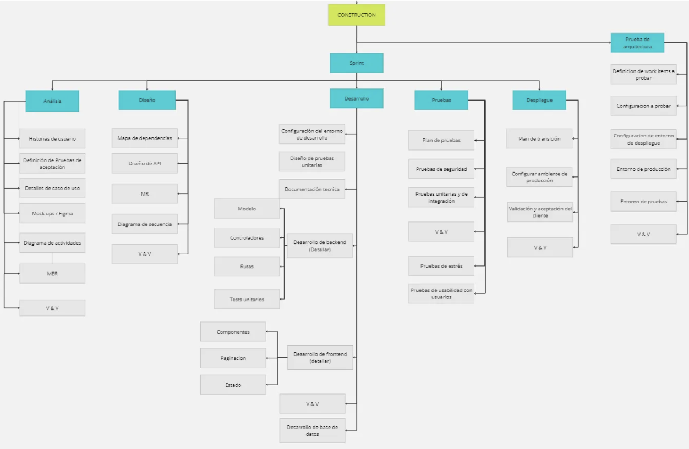

# Guía para elaborar un WBS

El objetivo de esta guía es proporcionar una comprensión clara sobre qué es y cómo crear un **Work Breakdown Structure (WBS)**, con el fin de estimar el **alcance del proyecto**, organizar los **paquetes de trabajo** en componentes manejables y facilitar la **planificación de recursos**.

# ¿Qué es un WBS?

El **WBS** es una herramienta de gestión de proyectos que organiza y descompone todo el trabajo del proyecto en **entregables jerárquicos**, desde lo general hasta lo más detallado. Sirve como base para **planificar, organizar y controlar** el esfuerzo del proyecto, ajustándose según sea necesario a medida que este progresa.

---

### Pasos para elaborar un WBS 

1. **Definir el alcance del proyecto**
- Consultar la [Especificación de requerimientos de software (SRS)](https://docs.google.com/document/d/1OWg8yaLw4GkswP0XC09DK0pY9ICuLIayXk5lSzIWzI4/edit?usp=sharing) correspondiente a cada proyecto. 
- En el caso del proyecto departamental, se debe contar con los **objetivos, actividades principales, y responsabilidades generales del equipo**. 
- En ambos casos asegurar que estén identificados:
    - Entregables esperados.
    - Productos y componentes por desarrollar o adquirir externamente.
    - Límites del proyecto (qué sí y qué no incluye).

2. **Identificar los entregables principales**
- Dividir el proyecto en grandes bloques de trabajo, fases o áreas funcionales.
- Ejemplos: Diseño, Desarrollo, Pruebas, Implementación, CMMI.

3. **Descomponer cada entregable en subentregables**
- Fragmenta cada bloque en componentes más pequeños y específicos. 
- Incluir tareas relacionadas con:
    - Entregables principales.
    - Actividades de soporte (calidad, documentación, configuración).
    - Mitigación de riesgos.
    - Capacitación o adquisición de habilidades.
    - Integración de elementos externos.

4. **Llegar a paquetes de trabajo**
- Cada paquete de trabajo de los entregables debe:
    - Poder estimarse en tiempo, costo y recursos.
    - Tener un responsable asignado.
    - Ser medible y controlable.

5. **Organizar de forma jerárquica**
- Usar una codificación estructurada para los paquetes de trabajo (ej. 1.0, 1.1, 1.1.1). 
- Nombrar cada uno de forma breve y descriptiva.

6. **Validar con las partes interesadas**
- Verificar que el WBS:
    - Cubre entregables y tareas clave.
    - Permite estimaciones realistas.
    - Es comprensible para todo el equipo.
- Recibir retroalimentación y hacer ajustes.

7. **Documentar y actualizar**
- Registrar el WBS en un formato claro (diagrama).
- Actualizarlo en caso de que cambien los entregables o el alcance.

### Ejemplo de WBS 

> 

_Imagen obtenida de [Departamento JEDI](https://jedi-software.notion.site/G18-Gu-a-para-elaborar-un-WBS-88d87f185b544d5995fa282d7230a7ca)._

---

## Historial de cambios

| **Tipo de versión** | **Descripción** | **Fecha**  | **Colaborador** |
| ------------------- | --------------- | ---------- | --------------- |
| **1.0** | Crear guía de WBS. | 14/05/2025 | Paola María Garrido Montes |