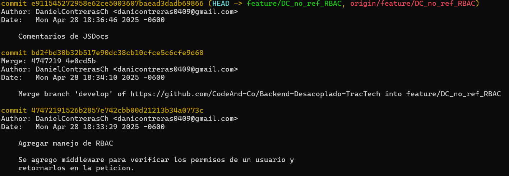

Esta es una guía para realizar un rollback de manera correcta en GitHub, útil para regresar un repositorio a una versión estable anterior cuando es necesario.

---

## Prerequisitos para realizar un rollback en GitHub

1. Asegurarse de tener acceso de escritura al repositorio y permisos para hacer push en la rama objetivo.
2. Tener configurado Git en tu computadora con las credenciales correctas.
3. Conocer el **commit hash** al cual deseas regresar.
4. En caso de usar flujos automáticos de despliegue (por ejemplo, GitHub Actions), asegurarse de coordinar o deshabilitar temporalmente los despliegues si es necesario.

---

## Opciones para hacer rollback

Dependiendo de la situación, puedes optar por distintas formas de hacer rollback:

### Opción 1: Revertir un commit

Ideal si deseas "deshacer" cambios pero mantener el historial de commits limpio.

```bash

# Ubícate en tu rama (por ejemplo, Master o Staging)
git checkout Master

# Revertir un commit específico
git revert <commit_hash>

# El comando abrirá un editor para escribir un mensaje de commit de reversión.
# Guarda y cierra el editor.

# Sube los cambios
git push origin Master

```

- **Importante**: Si después de hacer revert otros usuarios han hecho commits en la misma rama, puede ser necesario hacer un rebase para evitar conflictos y asegurar un historial ordenado.

```bash

git fetch origin
git rebase origin/Master


```

Si uno de los miembros del equipo está haciendo commits en una rama separada, pero al momento de hacer push a la rama en la que se hizo el revert, tiene problemas, sigue los siguientes pasos:

```bash

# Regresa a la rama dónde se hizo el revert
git checkout main

# Obtén la cabeza de la rama
git fetch origin

# Resetea tu rama local al estado de la rama remota
git reset --hard origin/main

# Cambia a tu rama feature/** donde tenías cambios que querías integrar
git checkout feature/**

# Reapuntar tu rama a la cabeza de la nueva versión de la rama a la que se le hizo revert
git rebase main

# Sólo si tienes errores, continuar con el rebase
git rebase --continuo

# Dar push de tus cambios junto con el rebase 
git push -f origin feature/**

```

### Opción 2: Reset duro a un commit anterior

Usar solo si necesitas que el historial de la rama cambie. Es destructivo si ya has compartido la rama.

```bash

# Ubícate en la rama
git checkout Master

# Resetear el estado del repositorio al commit deseado
git reset --hard <commit_hash>

# Forzar el push al repositorio remoto
git push origin Master --force

```

### Cómo encontrar el hash de un commit
El hash del commit es el identificador único de un commit dentro de un proyecto.

Para encontrar el hash del commit al que quieres hacer rollback:

```bash

# Obtener los logs de los commits realizados en la rama
git log

```
Este comando te mostrará la lista de commits recientes, por ejemplo:



### Consideraciones adicionales
- Comunicación: Antes de hacer rollback, informa a tu equipo para evitar conflictos.
- Backup: Si no estás seguro, crea una nueva rama antes de hacer cambios destructivos.

```bash

git checkout -b respaldo-antes-del-rollback

```
- Automatizaciones: Si tienes GitHub Actions configurados para desplegar automáticamente en push, el rollback puede disparar un despliegue automático. Verifica si es necesario desactivar temporalmente los workflows.

## Cómo hacer rollback de un ítem de la wiki

1. Crear una nueva rama que se identificará de la siguiente manera: `rollback/<iniciales del que hace rollback>_<item al que se le hará rollback>_<version a la que se regresará>`

Ejemplo: `rollback/DC_guia-de-rollback_v1.0`

2. Identificar el ítem del que harás rollback
3. Moverse hasta la parte de abajo del ítem, donde se encuentra la tabla de versionamiento e identificar la fecha de la versión a la que se quiere regresar.
4. Entrar a las Pull Request Cerradas del repositorio de Github.
5. Filtrar las Pull Request por fecha e introducir la fecha de la versión a la que se quiere regresar.
6. Buscar la Pull Request específica del ítem. La puedes identificar por el nombre de la rama.
7. Entrar a la Pull request y buscar el ítem en los archivos.
8. Copiar el contenido del ítem antiguo y pegarlo en el nuevo.
9. Borrar los registros posteriores a los de la versión a la que se le hizo rollback.
10. Guardar los cambios, hacer el commit y el push

---

## Historial de cambios

| **Tipo de versión** | **Descripción**                    | **Fecha** | **Colaborador**        |
|---------------------|------------------------------------| --------- | ---------------------- |
| 1.0 | Se creó la primera versión de la guía. | 28/04/2025 | Daniel Contreras Chávez |
| 1.1 | Se agregaron pasos para hacer rollback de ítems de la wiki. | 13/05/2025 | Daniel Contreras Chávez |