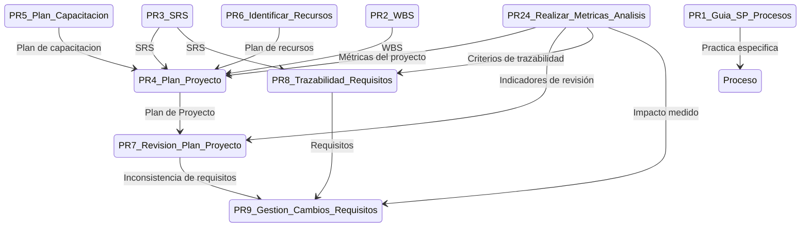

# Mapa de Procesos

---



## Markdown para edición en Mermaid

```markdown
stateDiagram
%% PR1 Guía de prácticas específicas del CMMI y generación de procesos
PR1_Guia_SP_Procesos
%% PR2 Estimación de alcance, esfuerzo y coste del proyecto (WBS)
PR2_WBS
%% PR3 Proceso de Definición de MVP
PR3_SRS
%% PR4 Guía de hacer un plan de proyecto
PR4_Plan_Proyecto

    %% PR5 Planes de Capacitación
    PR5_Plan_Capacitacion
    %% PR6 Proceso para identificar recursos
    PR6_Identificar_Recursos

    %% PR7 Revisión de Planes de Proyecto
    PR7_Revision_Plan_Proyecto

    %% PR8 Comprensión y trazabilidad de requisitos
    PR8_Trazabilidad_Requisitos
    %% PR9 Gestión de cambios de requisitos
    PR9_Gestion_Cambios_Requisitos

    %% PR10 Pruebas Unitarias
    PR10_Pruebas_Unitarias
    %% PR11 Cambio y migración de arquitectura
    PR11_Migracion_Arquitectura


    %% PR12 Justificación de Faltas
    PR12_Justificacion_Faltas
    %% PR13 Recuperar Asistencia
    PR13_Recuperar_Asistencia
    %% PR14 Resolución de conflictos
    PR14_Resolucion_Conflictos
    %% PR15 Juntas Grupales
    PR15_Juntas_Grupales

    Proceso

    PR1_Guia_SP_Procesos --> Proceso: Practica especifica

    PR4_Plan_Proyecto --> PR7_Revision_Plan_Proyecto: Plan de Proyecto
    PR5_Plan_Capacitacion --> PR4_Plan_Proyecto: Plan de capacitacion
    PR6_Identificar_Recursos --> PR4_Plan_Proyecto: Plan de recursos
    PR2_WBS --> PR4_Plan_Proyecto: WBS
    PR3_SRS --> PR4_Plan_Proyecto: SRS
    PR3_SRS --> PR8_Trazabilidad_Requisitos: SRS
    PR8_Trazabilidad_Requisitos --> PR9_Gestion_Cambios_Requisitos: Requisitos
    PR7_Revision_Plan_Proyecto --> PR9_Gestion_Cambios_Requisitos: Inconsistencia de requisitos
```

## Historial de Cambios

| **Tipo de Versión** | **Descripción**                               | **Fecha** | **Colaborador**                 |
| ------------------- | --------------------------------------------- | --------- | ------------------------------- |
| **1.0**             | Ahora abarca la obtención del SRS   | 7/3/2025  | Valeria Zuñiga y Angel Ramírez |
| **1.1**             | Añadir Proceso de Métricas y Análisis al Mapa de Procesos | 3/4/2025  | Rommel Toledo      |
