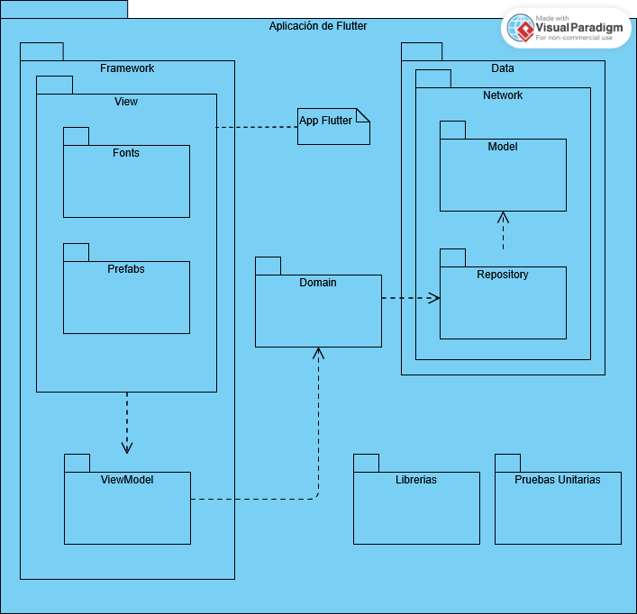

### Autores

| Nombre         | Rol   |
| -------------- | ----- |
| Juan Eduardo   | Autor |

---

# Estrategia tecnica

## Objetivo

Establecer lineamientos claros para el desarrollo, asegurando calidad y consistencia.

---

## Repositorios

Utilizaremos 2 repositorios separados, tanto para el backend como para el frontend de la aplicación, de esta manera nuestro sistema puede ser modular.

## Estrategia de Ramas

Utilizaremos 3 ramas principales:

- **Master**: Contiene el código que será desplegado en producción y sobre el que se maneja el versionamiento de la aplicación.
  - El código no debe tener problemas de integración o ejecución.
  - El código debe haber sido probado.
- **Staging**: Rama pre-productiva usada para preparar el release de las versiones y realizar pruebas de aceptación.
- **Develop**: Rama de desarrollo donde se mantiene la integración de todos los desarrollos del equipo.
- **Feature**: Ramas temporales destinadas para el código de uno o varios developers que trabajan en una característica.

---

## Gestión de Requerimientos

### Objetivo

Alinear las decisiones técnicas con los objetivos de negocio.

### Priorización basada en valor y riesgos

La priorización de requerimientos se puede encontrar aquí:

[***Priorización de requerimientos***](https://docs.google.com/spreadsheets/d/1E5J6ugtuWdjWGQqJeEW1vYByL9mUm9-9wHdZaO0a2zE/edit?gid=0#gid=0)

La especificación de historias de usuario se llevarán a cabo teniendo en cuenta la definición de [**Done**](./../../../../docs/definicion-de-done.md) y [**Ready**](./../../../../docs/definicion-de-ready.md) que se encuentran en este archivo:

---

## Gestión de Calidad y Pruebas

### Objetivo

Garantizar un software confiable a través de buenas prácticas de aseguramiento de calidad.

---

### Estrategia de Pruebas

La estrategia que se seguirá para las pruebas será la siguiente:

[***STP***](./plan-stp.md)

---

## Documentación del código

### Objetivo

Documentar claramente las funcionalidades y código del sistema para lectura en caso de confusiones.

**Ejemplo:**

- Se agregaron espacios alrededor de operadores y comas.
- Se agregan punto y coma al final de definiciones simples.
- Para documentar el código utilizaremos el estándar de documentación JS docs.
- El detalle del estándar de codificación se podrá ver en el siguiente documento: [**Estandar de codificación**](./../../../guias/standards/general.md).
- Adicionalmente usaremos el estándar de codificación para Flutter: [**Estándar de Flutter**](https://docs.google.com/document/d/1beTj1z5LRMbYtg2gzlaBTFU66nikZ-U8oWIscKtHk-c/edit?usp=sharing)

---

## Patrones de diseño y diagrama de paquetes

### Backend

Este diagrama de paquetes representa la organización de un backend. Se divide en varias secciones principales:

### 1. Módulos

Cada módulo contiene:

- **Data**: Gestión de la base de datos, incluyendo modelos y repositorios.
- **Controllers**: Manejo de solicitudes HTTP, estructurado en:
  - `RoutesIndexes`: Punto de entrada de las rutas.
  - `Routes`: Definición de rutas.
  - `Controllers`: Implementación de la lógica de negocio.

### 2. Util

- **Middlewares**: Funciones intermedias para procesar solicitudes.
- **Services**: Lógica reutilizable independiente de los controladores.

### 3. Views

Sección opcional para manejar vistas en caso de ser necesario.

### 4. Pruebas Unitarias

Cada módulo puede incluir pruebas unitarias para garantizar su correcto funcionamiento.

### 5. Archivos Principales

- app.js: Punto de entrada del servidor.
- node_modules: Dependencias del proyecto.

## Aplicación en Flutter

Este diagrama describe la distribución de paquetes de la aplicación en Flutter utilizando MVVM y Clean Architecture

### 1. Framework

Framework es un paquete que se encarga de la gestión de la vista de la presentación.
- **Views**: Contiene los elementos graficos de la aplicación, la UI.
  - **Fonts**: Fuentes de texto usadas en la aplicación.
  - **Prefabs**: Partes reutilizables como botones, tarjetas, etc.
- **ViewModel**: Paquete que maneja la lógica dentro de la vista de la aplicación. ViewModel se comunica con Domain para obtener información.

### 2. Data

Data maneja la adquisición de los datos.
- **Network**: Conexiones a internet y llamadas a APIs.
  - **Model**: Modelos de datos que representan la información obtenida por las APIs y bases de datos.
- **Repository**: Repositorios encargados de obtener los datos, remotos desde la red o locales.

### 3. Domain

Domain es la núcleo de la lógica dentro de la aplicación

### 4. Archivos importantes

**App flutter**: Punto de entrada de la aplicación.

### 5. Pruebas unitarias

Contiene todas las pruebas unitarias.
- **Data**: repositorios, APIs, modelos
- **Domain**: casos de uso
- **ViewModel**: validación de estados y lógica de presentación

### 6. Librerias

Almacena dependencias internas o librerias personalizadas que pueden ser reutilizadas en distintos módulos