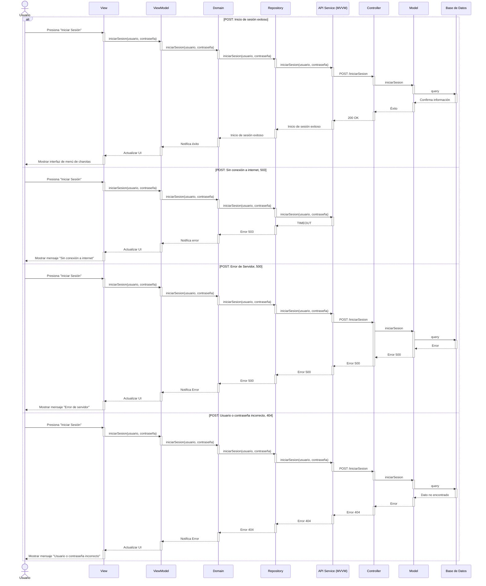

# RF1: Iniciar Sesión

### Historia de Usuario
Como usuario de la aplicación, quiero autenticarme en el sistema ingresando mi usuario y contraseña, para acceder de forma segura a la aplicación y utilizar sus funcionalidades sin restricciones.

  **Criterios de Aceptación:**
  - El sistema debe permitir al usuario ingresar su usuario y contraseña para autenticarse mediante una interfaz clara e intuitiva.
  - Si las credenciales son correctas, el usuario debe acceder a la aplicación y ser redirigido a la pantalla principal. 
  - Si las credenciales son incorrectas, el sistema debe mostrar un mensaje de error.
  - Si el usuario cierra sesión, el sistema debe invalidar la sesión activa y redirigirlo a la pantalla de inicio de sesión.
  - La autenticación debe ser segura y estar encriptada para proteger los datos de acceso de los usuarios.

---

### Diagrama de Actividades

<a href="https://drive.google.com/file/d/1Zql5LFEL76YKACtJoWMFsT_L4QYmpX8o/view?usp=sharing" target="_blank" rel="noopener noreferrer">Iniciar Sesión</a>

---

### Diagrama de Secuencia

---

### Mockup

---

# Historial de cambios
| **Tipo de Versión** | **Descripción**                      | **Fecha** | **Colaborador**   |
| ------------------- | ------------------------------------ | --------- | ----------------- |
| **1.0**             | Creacion de la historia de usuario   | 8/3/2025  | Armando Mendez    |
| **1.0**             | Verificación de los cambios          | 8/3/2025  | Miguel Angel      |
| **1.1**             | Creación del diagrama de secuencia   | 22/4/2025  | Emiliano Valdivia Lara  |
| **1.2**             | Se cambio el query del diagrama de secuencia   | 17/5/2025  | Mariana Juárez |
| **1.3**             | Diagramas de actividades   | 23/5/2025  | Juan Eduardo Rosas Cerón |