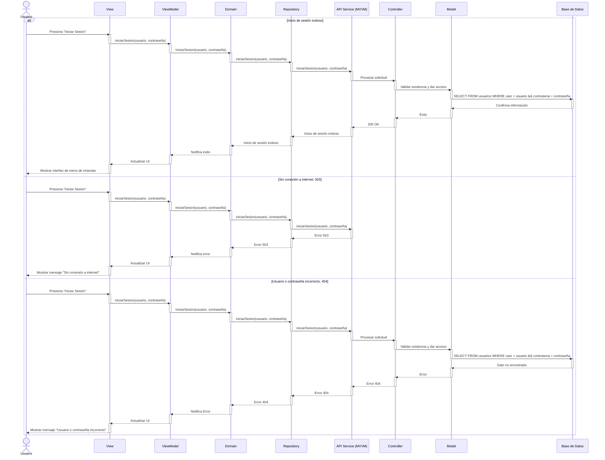
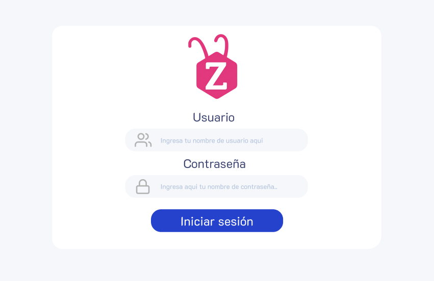

# RF1: Iniciar Sesión

### Historia de Usuario
Como usuario de la aplicación, quiero autenticarme en el sistema ingresando mi usuario y contraseña, para acceder de forma segura a la aplicación y utilizar sus funcionalidades sin restricciones.

  **Criterios de Aceptación:**
  - El sistema debe permitir al usuario ingresar su usuario y contraseña para autenticarse mediante una interfaz clara e intuitiva.
  - Si las credenciales son correctas, el usuario debe acceder a la aplicación y ser redirigido a la pantalla principal. 
  - Si las credenciales son incorrectas, el sistema debe mostrar un mensaje de error.
  - Si el usuario cierra sesión, el sistema debe invalidar la sesión activa y redirigirlo a la pantalla de inicio de sesión.
  - La autenticación debe ser segura y estar encriptada para proteger los datos de acceso de los usuarios.

---

### Diagrama de Secuencia

> *Descripción*: El diagrama de secuencia muestra cómo el Super Administrador interactúa con el sistema para crear un cliente, detallando los pasos de solicitud de datos, validación y confirmación.

---

### Mockup

> *Descripción*: El mockup representa la interfaz del sistema donde los usuarios pueden iniciar sesión.

### Pruebas Unitarias 
| ID Prueba  | Descripción                                             | Resultado Esperado  |
|------------|---------------------------------------------------------|---------------------|
| PU-RF1-01  | Inicio de sesión con credenciales válidas.              | El usuario es autenticado y redirigido a la pantalla principal. |
| PU-RF1-02  | Inicio de sesión con contraseña incorrecta.             | Se muestra un mensaje de error indicando que la contraseña es incorrecta. |
| PU-RF1-03  | Inicio de sesión con usuario no registrado.             | Se muestra un mensaje de error indicando que el usuario no existe. |
| PU-RF1-04  | Inicio de sesión con campos vacíos.                     | Se muestra un mensaje de error solicitando completar los campos. |
| PU-RF1-05  | Tiempo de sesión expira por inactividad.                | La sesión es invalidada y el usuario es redirigido a la pantalla de inicio de sesión. |

| **Tipo de Versión** | **Descripción**                      | **Fecha** | **Colaborador**   |
| ------------------- | ------------------------------------ | --------- | ----------------- |
| **1.0**             | Creacion de la historia de usuario   | 8/3/2025  | Armando Mendez    |
| **1.0**             | Verificación de los cambios          | 8/3/2025  | Miguel Angel      |
| **1.1**             | Creación del diagrama de secuencia   | 22/4/2025  | Emiliano Valdivia Lara      |