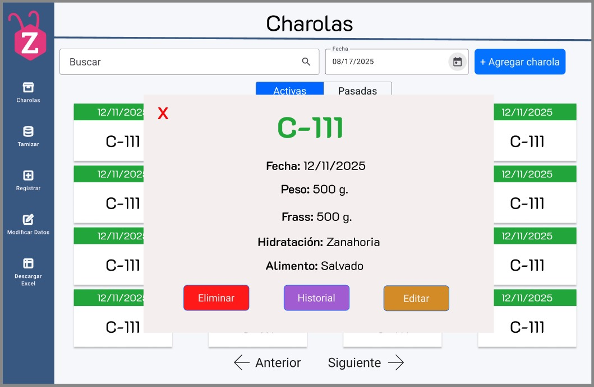

# RF10: Consultar información detallada de una charola

### Historia de Usuario
Como usuario del sistema, quiero consultar la información registrada de una charola en la base de datos, para acceder a detalles específicos como su estado, origen y registros asociados, y así mejorar la gestión de la producción.

  **Criterios de Aceptación:**
  - El sistema debe permitir seleccionar una charola y mostrar su información detallada.
  - Debe incluir datos como identificador, peso, fecha de creación y estado actual.
  - La información debe estar organizada y ser fácilmente comprensible.
  - La consulta debe ejecutarse rápidamente sin afectar el rendimiento del sistema.

---

### Diagrama de Actividades

<a href="https://drive.google.com/file/d/1x41zMABi58_W9ivown2a7HiopqKdf6S3/view?usp=sharing" target="_blank" rel="noopener noreferrer">RF10: Consultar información detallada de una charola</a>

---

### Diagrama de Secuencia

```mermaid
sequenceDiagram
    actor Usuario
    participant View as View
    participant ViewModel as ViewModel
    participant Domain as Domain
    participant Repository as Repository
    participant APIService as API Service (MVVM)
    participant Controller as Controller
    participant Model as Model
    participant Database as Base de Datos

    alt GET Consulta exitosa | 200 OK

        Usuario->>View: Selecciona consultar detalle charola
        activate View
        View->>ViewModel: consDetalleCharola(id)
        deactivate View

        activate ViewModel
        ViewModel->>Domain: consDetalleCharola(id)
        deactivate ViewModel

        activate Domain
        Domain->>Repository: consDetalleCharola(id)
        deactivate Domain

        activate Repository
        Repository->>APIService: consDetalleCharola(id)
        deactivate Repository

        activate APIService
        APIService->>Controller: GET /charola/{id}
        deactivate APIService

        activate Controller
        Controller->>Model: get_charola(id)
        deactivate Controller

        activate Model
        Model->>Database: query
        deactivate Model

        activate Database
        Database-->>Model: response: Datos de la charola
        deactivate Database

        activate Model
        Model-->>Controller: response: Datos de la charola
        deactivate Model

        activate Controller
        Controller-->>APIService: 200 OK [info]
        deactivate Controller

        activate APIService
        APIService-->>Repository: 200 OK [info]
        deactivate APIService

        activate Repository
        Repository-->>Domain: 200 OK [info]
        deactivate Repository

        activate Domain
        Domain-->>ViewModel: Notificar éxito
        deactivate Domain

        activate ViewModel
        ViewModel-->>View: Actualizar UI
        deactivate ViewModel

        activate View
        View-->>Usuario: response: Datos de la charola
        deactivate View
        activate APIService

    else Charola no encontrada | Error 404

        Usuario->>View: Selecciona consultar detalle charola
        activate View
        View->>ViewModel: consDetalleCharola(id)
        deactivate View
    
        activate ViewModel
        ViewModel->>Domain: consDetalleCharola(id)
        deactivate ViewModel
    
        activate Domain
        Domain->>Repository: consDetalleCharola(id)
        deactivate Domain
    
        activate Repository
        Repository->>APIService: consDetalleCharola(id)
        deactivate Repository

        activate APIService
        APIService->>Controller: GET /charola/{id}
        deactivate APIService

        activate Controller
        Controller->>Model: get_charola(id)
        deactivate Controller

        activate Model
        Model->>Database: query
        deactivate Model

        activate Database
        Database-->>Model: response: (sin resultados)
        deactivate Database

        activate Model
        Model-->>Controller: response: Charola no encontrada
        deactivate Model

        activate Controller
        Controller-->>APIService: Error 404
        deactivate Controller

        activate APIService
        APIService-->>Repository: Error 404
        deactivate APIService

        activate Repository
        Repository-->>Domain: Error 404
        deactivate Repository

        activate Domain
        Domain-->>ViewModel: Notificar del error
        deactivate Domain

        activate ViewModel
        ViewModel-->>View: Actualizar UI
        deactivate ViewModel

        activate View
        View-->>Usuario: response: Error "Charola no encontrada"
        deactivate View
        activate APIService

    else Error de red o sin conexión | Error 101

        Usuario->>View: Selecciona consultar detalle charola
        activate View
        View->>ViewModel: consDetalleCharola(id)
        deactivate View
    
        activate ViewModel
        ViewModel->>Domain: consDetalleCharola(id)
        deactivate ViewModel
    
        activate Domain
        Domain->>Repository: consDetalleCharola(id)
        deactivate Domain
    
        activate Repository
        Repository->>APIService: consDetalleCharola(id)
        deactivate Repository
        activate APIService     

        APIService-->>Repository: Error 101
        deactivate APIService

        activate Repository
        Repository-->>Domain: Error 101
        deactivate Repository

        activate Domain
        Domain-->>ViewModel: Notificar del error
        deactivate Domain

        activate ViewModel
        ViewModel-->>View: Actualizar UI
        deactivate ViewModel

        activate View
        View-->>Usuario: response: "Error"
        deactivate View

    else Error de servidor | Error 500

        Usuario->>View: Selecciona consultar detalle charola
        activate View
        View->>ViewModel: consDetalleCharola(id)
        deactivate View
    
        activate ViewModel
        ViewModel->>Domain: consDetalleCharola(id)
        deactivate ViewModel
    
        activate Domain
        Domain->>Repository: consDetalleCharola(id)
        deactivate Domain
    
        activate Repository
        Repository->>APIService: consDetalleCharola(id)
        deactivate Repository
        activate APIService

        APIService->>Controller: GET /charola/{id}
        deactivate APIService

        activate Controller
        Controller->>Model: get_charola(id)

        activate Model
        Model->>Database: query

        activate Database
        Database-->>Model: response: ERROR
        deactivate Database

        Model-->>Controller: response: ERROR
        deactivate Model

        Controller-->>APIService: Error 500
        deactivate Controller

        activate APIService
        APIService-->>Repository: Error 500
        deactivate APIService

        activate Repository
        Repository-->>Domain: Error 500
        deactivate Repository

        activate Domain
        Domain-->>ViewModel: Notificar del error
        deactivate Domain

        activate ViewModel
        ViewModel-->>View: Actualizar UI
        deactivate ViewModel

        activate View
        View-->>Usuario: response: Error "Error de servidor"
        deactivate View
        activate APIService

    else No hay sesión activa | Error 401

        Usuario->>View: Selecciona consultar detalle charola
        activate View
        View->>ViewModel: consDetalleCharola(id)
        deactivate View
    
        activate ViewModel
        ViewModel->>Domain: consDetalleCharola(id)
        deactivate ViewModel
    
        activate Domain
        Domain->>Repository: consDetalleCharola(id)
        deactivate Domain
    
        activate Repository
        Repository->>APIService: consDetalleCharola(id)
        deactivate Repository
        activate APIService

        APIService->>Controller: GET /charola/{id}
        deactivate APIService

        activate Controller
        deactivate Controller

        activate Controller
        Controller-->>APIService: Error 401
        deactivate Controller

        activate APIService
        APIService-->>Repository: Error 401
        deactivate APIService

        activate Repository
        Repository-->>Domain: Error 401
        deactivate Repository

        activate Domain
        Domain-->>ViewModel: Notificar del error
        deactivate Domain

        activate ViewModel
        ViewModel-->>View: Actualizar UI
        deactivate ViewModel

        activate View
        View-->>Usuario: response: Error "Sesión no activa"
        deactivate View
        activate APIService

    end
```

---

### Mockup

## Historial de cambios

| **Tipo de Versión** | **Descripción**                      | **Fecha**  | **Colaborador**   |
| ------------------- | ------------------------------------ | ---------- | ----------------- |
| **1.0**             | Creacion de la historia de usuario   | 8/3/2025   | Armando Mendez    |
| **1.0**             | Verificación de los cambios          | 8/3/2025   | Miguel Angel      |
| **1.1**             | Creación del diagrama de secuencia   | 15/4/2025  | Sofía Osorio      |
| **1.2**             | Actualización de diagrama de secuencia y subir mockup  | 18/4/2025  | Sofía Osorio      |
| **1.3**             | Modificar diagrama de secuencia | 24/4/2025  | Sofía Osorio      |
| **1.4**             | Modificar query del diagrama de secuencia | 17/5/2025  | Mariana Juárez |
| **1.5**             | Diagramas de actividades   | 23/5/2025  | Juan Eduardo Rosas Cerón |