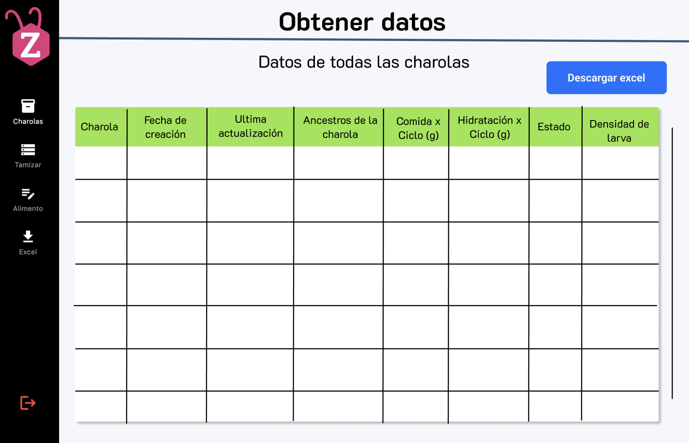

# RF11: Descargar reportes

### Historia de Usuario

Como administrador del sistema, quiero descargar un archivo en formato Excel con un rango de consulta de las charolas, para analizar los datos de producción de manera más detallada y compartir la información con otros miembros del equipo.

**Criterios de Aceptación:**

- La información debe exportarse en formato Excel (.xlsx) de manera organizada y legible.
- El archivo debe contener detalles relevantes:
  - Charola
  - Fecha de creación
  - Última actualización
  - Ancestros de la charola
  - Comida x Ciclo (g)
  - Hidratación x Ciclo (g)
  - Estado
  - Densidad de Larva
- La descarga debe completarse en un tiempo razonable menor a 4 segundos sin afectar el rendimiento del sistema.

---

### Diagrama de Actividades

<a href="https://drive.google.com/file/d/1_EQcc5r3Z3ERiaRkRpXYJKAiDTBzEWdY/view?usp=sharing" target="_blank" rel="noopener noreferrer">Descargar reportes</a>

---

### Diagrama de Secuencia

```mermaid
sequenceDiagram
    actor Usuario
    participant View as View
    participant ViewModel as ViewModel
    participant Domain as Domain
    participant Repository as Repository
    participant APIService as API Service (MVVM)
    participant Controller as Controller
    participant Model as Model
    participant Database as Base de Datos

    alt GET Datos tabla, 200
        Usuario->>+View: Entra a la interfaz
        View->>-ViewModel: getTabla()
        activate ViewModel
        ViewModel->>Domain: getTabla()
        deactivate ViewModel
        activate Domain
        Domain->>Repository: getTabla()
        deactivate Domain
        activate Repository
        Repository->>APIService: getTabla()
        deactivate Repository
        activate APIService
        APIService->>Controller: GET /getTablaCharolas
        deactivate APIService
        activate Controller
        Controller->>Model: getTablaCharolas
        deactivate Controller
        activate Model
        Model->>Database: query
        deactivate Model
        activate Database

        Database-->>Model: Informacion
        deactivate Database
        activate Model
        Model-->>Controller: Éxito [Info]
        deactivate Model
        activate Controller
        Controller-->>APIService: 200 OK [Info]
        deactivate Controller
        activate APIService
        APIService-->>Repository: [Info]
        deactivate APIService
        activate Repository
        Repository-->>Domain: [Info]
        deactivate Repository
        activate Domain
        Domain-->>ViewModel: Cargar informacion
        deactivate Domain
        activate ViewModel
        ViewModel-->>View: Actualizar UI
        deactivate ViewModel
        activate View
        View-->>Usuario: Mostrar interfaz de tabla de charolas
        deactivate View

    else GET No se encontraron datos, 200
        Usuario->>+View: Entra a la interfaz
        View->>-ViewModel: getTabla()
        activate ViewModel
        ViewModel->>Domain: getTabla()
        deactivate ViewModel
        activate Domain
        Domain->>Repository: getTabla()
        deactivate Domain
        activate Repository
        Repository->>APIService: getTabla()
        deactivate Repository
        activate APIService
        APIService->>Controller: GET /getTablaCharolas
        deactivate APIService
        activate Controller
        Controller->>Model: getTablaCharolas
        deactivate Controller
        activate Model
        Model->>Database: query
        deactivate Model
        activate Database

        Database-->>Model: [ ]
        deactivate Database
        activate Model
        Model-->>Controller: Éxito [ ]
        deactivate Model
        activate Controller
        Controller-->>APIService: 200 OK [ ]
        deactivate Controller
        activate APIService
        APIService-->>Repository: [ ]
        deactivate APIService
        activate Repository
        Repository-->>Domain: [ ]
        deactivate Repository
        activate Domain
        Domain-->>ViewModel: Informacion vacia
        deactivate Domain
        activate ViewModel
        ViewModel-->>View: Actualizar UI
        deactivate ViewModel
        activate View
        View-->>Usuario: Mostrar mensaje no hay charolas registradas
        deactivate View

    else GET Error de servidor, 500
        Usuario->>+View: Entra a la interfaz
        View->>-ViewModel: getTabla()
        activate ViewModel
        ViewModel->>Domain: getTabla()
        deactivate ViewModel
        activate Domain
        Domain->>Repository: getTabla()
        deactivate Domain
        activate Repository
        Repository->>APIService: getTabla()
        deactivate Repository
        activate APIService
        APIService->>Controller: GET /getTablaCharolas
        deactivate APIService
        activate Controller
        Controller->>Model: getTablaCharolas
        activate Model
        Model->>Database: query
        activate Database

        Database-->>Model: Error 500
        deactivate Database
        Model-->>Controller: Error 500
        deactivate Model
        Controller-->>APIService: Error 500
        deactivate Controller
        activate APIService
        APIService-->>Repository: Error 500
        deactivate APIService
        activate Repository
        Repository-->>Domain: Error 500
        deactivate Repository
        activate Domain
        Domain-->>ViewModel: Error del servidor
        deactivate Domain
        activate ViewModel
        ViewModel-->>View: Actualizar UI
        deactivate ViewModel
        activate View
        View-->>Usuario: Mostrar mensaje Error de servidor
        deactivate View

    else GET No hay inicio de sesión, 401
        Usuario->>+View: Entra a la interfaz
        View->>-ViewModel: getTabla()
        activate ViewModel
        ViewModel->>Domain: getTabla()
        deactivate ViewModel
        activate Domain
        Domain->>Repository: getTabla()
        deactivate Domain
        activate Repository
        Repository->>APIService: getTabla()
        deactivate Repository
        activate APIService
        APIService->>Controller: GET /getTablaCharolas
        deactivate APIService
        activate Controller

        Controller-->>APIService: 401 No Autorizado
        deactivate Controller
        activate APIService
        APIService-->>Repository: 401 No Autorizado
        deactivate APIService
        activate Repository
        Repository-->>Domain: 401 No Autorizado
        deactivate Repository
        activate Domain
        Domain-->>ViewModel: 401 No Autorizado
        deactivate Domain
        activate ViewModel
        ViewModel-->>View: Notificar falta de Inicio de sesión
        deactivate ViewModel
        activate View
        View-->>Usuario: Regresar al View de Inicio de sesión
        deactivate View

    else GET No hay permiso de acceso, 403
        Usuario->>+View: Entra a la interfaz
        View->>-ViewModel: getTabla()
        activate ViewModel
        ViewModel->>Domain: getTabla()
        deactivate ViewModel
        activate Domain
        Domain->>Repository: getTabla()
        deactivate Domain
        activate Repository
        Repository->>APIService: getTabla()
        deactivate Repository
        activate APIService
        APIService->>Controller: GET /getTablaCharolas
        deactivate APIService
        activate Controller

        Controller-->>APIService: 403 No Autorizado, permisos insuficientes
        deactivate Controller
        activate APIService
        APIService-->>Repository: 403 No Autorizado, permisos insuficientes
        deactivate APIService
        activate Repository
        Repository-->>Domain: 403 No Autorizado, permisos insuficientes
        deactivate Repository
        activate Domain
        Domain-->>ViewModel: 403 No Autorizado, permisos insuficientes
        deactivate Domain
        activate ViewModel
        ViewModel-->>View: Notificar falta de Inicio de sesión
        deactivate ViewModel
        activate View
        View-->>Usuario: Regresar al View de Inicio de sesión
        deactivate View

    else GET Sin conexión a internet, 101
        Usuario->>+View: Entra a la interfaz
        View->>-ViewModel: getTabla()
        activate ViewModel
        ViewModel->>Domain: getTabla()
        deactivate ViewModel
        activate Domain
        Domain->>Repository: getTabla()
        deactivate Domain
        activate Repository
        Repository->>APIService: getTabla()
        deactivate Repository
        activate APIService

        APIService-->>Repository: TIMEOUT
        deactivate APIService
        activate Repository
        Repository-->>Domain: Error 101
        deactivate Repository
        activate Domain
        Domain-->>ViewModel: Notifica error
        deactivate Domain
        activate ViewModel
        ViewModel-->>View: Actualizar UI
        deactivate ViewModel
        activate View
        View-->>Usuario: Mostrar mensaje "Sin conexión a internet"
        deactivate View

      alt POST Descargar datos tabla, 200
        Usuario-->>View: Boton de descargar
        activate View
        View-->>ViewModel: Notificar la descarga del archivo
        deactivate View
        activate ViewModel
        ViewModel-->>Domain: postDescargarArchivo()
        deactivate ViewModel
        activate Domain
        Domain-->>Repository: postDescargarArchivo()
        deactivate Domain
        activate Repository
        Repository-->>APIService: postDescargarArchivo()
        deactivate Repository
        activate APIService
        APIService-->>Controller: POST /postArchivoExcel
        deactivate APIService
        activate Controller
        Controller-->>Model: postDescargarExcel()
        deactivate Controller
        activate Model
        Model-->>Database: query
        deactivate Model
        activate Database

        Database-->>Model: Información
        deactivate Database
        activate Model
        Model-->>Controller: Éxito [Info]
        deactivate Model
        activate Controller
        Controller-->>APIService: 200 OK [Archivo]
        deactivate Controller
        activate APIService
        APIService-->>Repository: [Archivo]
        deactivate APIService
        activate Repository
        Repository-->>Domain: [Archivo]
        deactivate Repository
        activate Domain
        Domain-->>ViewModel: [Archivo]
        deactivate Domain
        activate ViewModel
        ViewModel-->>View: Notificar finalización de la descarga
        deactivate ViewModel
        activate View
        View-->>Usuario: Descargar archivo
        deactivate View

      else POST No se encontraron datos, 200
        Usuario-->>View: Boton de descargar
        activate View
        View-->>ViewModel: Notificar la descarga del archivo
        deactivate View
        activate ViewModel
        ViewModel-->>Domain: postDescargarArchivo()
        deactivate ViewModel
        activate Domain
        Domain-->>Repository: postDescargarArchivo()
        deactivate Domain
        activate Repository
        Repository-->>APIService: postDescargarArchivo()
        deactivate Repository
        activate APIService
        APIService-->>Controller: POST /postArchivoExcel
        deactivate APIService
        activate Controller
        Controller-->>Model: postDescargarExcel()
        deactivate Controller
        activate Model
        Model-->>Database: query
        deactivate Model
        activate Database

        Database-->>Model: [ ]
        deactivate Database
        activate Model
        Model-->>Controller: Éxito [ ]
        deactivate Model
        activate Controller
        Controller-->>APIService: 200 OK [ ]
        deactivate Controller
        activate APIService
        APIService-->>Repository: [ ]
        deactivate APIService
        activate Repository
        Repository-->>Domain: [ ]
        deactivate Repository
        activate Domain
        Domain-->>ViewModel: Informacion vacia
        deactivate Domain
        activate ViewModel
        ViewModel-->>View: Actualizar UI
        deactivate ViewModel
        activate View
        View-->>Usuario: Mostrar mensaje no hay charolas registradas
        deactivate View

      else POST No hay inicio de sesión, 401
        Usuario-->>View: Boton de descargar
        activate View
        View-->>ViewModel: Notificar la descarga del archivo
        deactivate View
        activate ViewModel
        ViewModel-->>Domain: postDescargarArchivo()
        deactivate ViewModel
        activate Domain
        Domain-->>Repository: postDescargarArchivo()
        deactivate Domain
        activate Repository
        Repository-->>APIService: postDescargarArchivo()
        deactivate Repository
        activate APIService
        APIService-->>Controller: POST /postArchivoExcel
        deactivate APIService
        activate Controller

        Controller-->>APIService: 401 No Autorizado
        deactivate Controller
        activate APIService
        APIService-->>Repository: 401 No Autorizado
        deactivate APIService
        activate Repository
        Repository-->>Domain: 401 No Autorizado
        deactivate Repository
        activate Domain
        Domain-->>ViewModel: 401 No Autorizado
        deactivate Domain
        activate ViewModel
        ViewModel-->>View: Notificar falta de Inicio de sesión
        deactivate ViewModel
        activate View
        View-->>Usuario: Regresar al View de Inicio de sesión
        deactivate View

      else POST No hay permiso de acceso, 403
        Usuario-->>View: Boton de descargar
        activate View
        View-->>ViewModel: Notificar la descarga del archivo
        deactivate View
        activate ViewModel
        ViewModel-->>Domain: postDescargarArchivo()
        deactivate ViewModel
        activate Domain
        Domain-->>Repository: postDescargarArchivo()
        deactivate Domain
        activate Repository
        Repository-->>APIService: postDescargarArchivo()
        deactivate Repository
        activate APIService
        APIService-->>Controller: POST /postArchivoExcel
        deactivate APIService
        activate Controller

        Controller-->>APIService: 403 No Autorizado, permisos insuficientes
        deactivate Controller
        activate APIService
        APIService-->>Repository: 403 No Autorizado, permisos insuficientes
        deactivate APIService
        activate Repository
        Repository-->>Domain: 403 No Autorizado, permisos insuficientes
        deactivate Repository
        activate Domain
        Domain-->>ViewModel: 403 No Autorizado, permisos insuficientes
        deactivate Domain
        activate ViewModel
        ViewModel-->>View: Notificar falta de Inicio de sesión
        deactivate ViewModel
        activate View
        View-->>Usuario: Regresar al View de Inicio de sesión
        deactivate View

      else POST Error de servidor, 500
        Usuario-->>View: Boton de descargar
        activate View
        View-->>ViewModel: Notificar la descarga del archivo
        deactivate View
        activate ViewModel
        ViewModel-->>Domain: postDescargarArchivo()
        deactivate ViewModel
        activate Domain
        Domain-->>Repository: postDescargarArchivo()
        deactivate Domain
        activate Repository
        Repository-->>APIService: postDescargarArchivo()
        deactivate Repository
        activate APIService
        APIService-->>Controller: POST /postArchivoExcel
        deactivate APIService
        activate Controller
        Controller-->>Model: postDescargarExcel()
        activate Model
        Model-->>Database: query
        activate Database

        Database-->>Model: Error 500
        deactivate Database
        Model-->>Controller: Error 500
        deactivate Model
        Controller-->>APIService: Error 500
        deactivate Controller
        activate APIService
        APIService-->>Repository: Error 500
        deactivate APIService
        activate Repository
        Repository-->>Domain: Error 500
        deactivate Repository
        activate Domain
        Domain-->>ViewModel: Error del servidor
        deactivate Domain
        activate ViewModel
        ViewModel-->>View: Actualizar UI
        deactivate ViewModel
        activate View
        View-->>Usuario: Mostrar mensaje Error de servidor
        deactivate View

      else POST Sin conexión a internet, 101
        Usuario-->>View: Boton de descargar
        activate View
        View-->>ViewModel: Notificar la descarga del archivo
        deactivate View
        activate ViewModel
        ViewModel-->>Domain: postDescargarArchivo()
        deactivate ViewModel
        activate Domain
        Domain-->>Repository: postDescargarArchivo()
        deactivate Domain
        activate Repository
        Repository-->>APIService: postDescargarArchivo()
        deactivate Repository
        activate APIService

        APIService-->>Repository: TIMEOUT
        deactivate APIService
        activate Repository
        Repository-->>Domain: Error 101
        deactivate Repository
        activate Domain
        Domain-->>ViewModel: Notifica error
        deactivate Domain
        activate ViewModel
        ViewModel-->>View: Actualizar UI
        deactivate ViewModel
        activate View
        View-->>Usuario: Mostrar mensaje "Sin conexión a internet"
        deactivate View
      end
    end


```

---

### Pull Request

<a href="https://github.com/CodeAnd-Co/TECH-NEBRIOS-BACKEND/pull/6" target="_blank" rel="noopener noreferrer"> PR de Descargar reportes Backend</a>

<a href="https://github.com/CodeAnd-Co/TECH-NEBRIOS-FLUTTER/pull/4" target="_blank" rel="noopener noreferrer"> PR de Descargar reportes Frontend</a>

---

### Mockup



---

### Historial de Versiones

| **Tipo de Versión** | **Descripción**                                                | **Fecha** | **Colaborador**          |
| ------------------- | -------------------------------------------------------------- | --------- | ------------------------ |
| **1.0**             | Creacion de la historia de usuario                             | 8/3/2025  | Armando Mendez           |
| **1.0**             | Verificación de los cambios                                    | 8/3/2025  | Miguel Angel             |
| **2.0**             | Creación del diagrama de secuencia, mockup y pruebas unitarias | 22/4/2025 | Miguel Angel             |
| **2.1**             | Modificación del query en el diagrama de secuencia             | 17/5/2025 | Mariana Juárez           |
| **2.2**             | Diagramas de actividades                                       | 23/5/2025 | Juan Eduardo Rosas Cerón |
| **2.3**             | Se corrigió mockup                                             | 29/5/2025 | Mariana Juárez           |
| **2.4**             | Se agregaron los pull request de front y back                  | 29/5/2025 | Sofía Osorio             |
