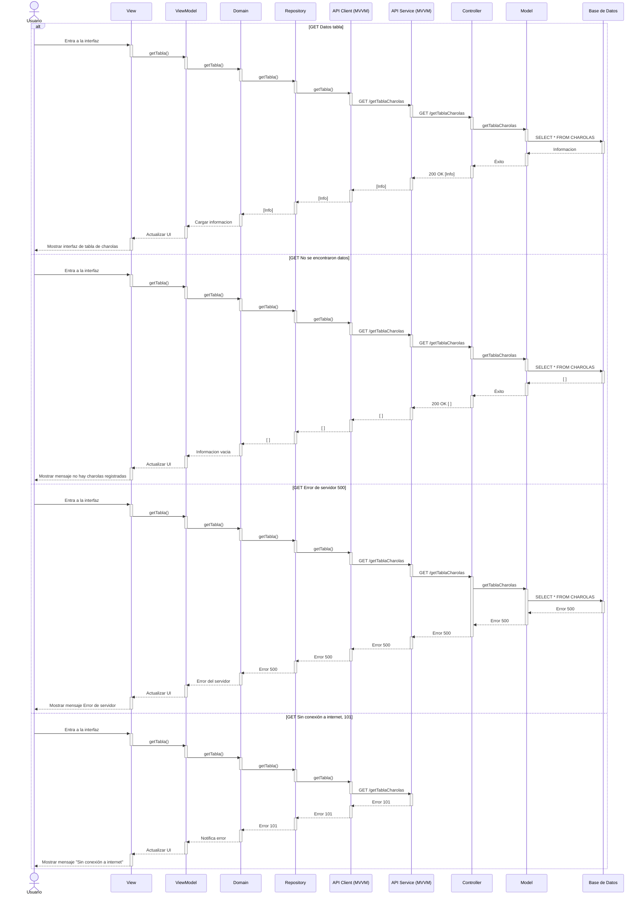

# RF11: Descargar reportes

**Última actualización:** 08 de marzo de 2025

### Historia de Usuario
Como administrador del sistema, quiero descargar un archivo en formato Excel con un rango de consulta de las charolas, para analizar los datos de producción de manera más detallada y compartir la información con otros miembros del equipo.

  **Criterios de Aceptación:**
  - El sistema debe permitir seleccionar un rango de fechas o parámetros para generar el reporte.
  - La información debe exportarse en formato Excel (.xlsx) de manera organizada y legible.
  - El archivo debe contener detalles relevantes como identificador de la charola, peso, fecha de creación y estado.
  - La descarga debe completarse en un tiempo razonable sin afectar el rendimiento del sistema.

---

### Diagrama de Secuencia

> *Descripción*: El diagrama de secuencia muestra el flujo del proceso de creación de un grupo de empleados, donde el Super Administrador ingresa los datos del grupo y el sistema lo crea.

---

### Mockup

> *Descripción*: El mockup muestra la interfaz donde el Super Administrador ingresa los datos del grupo, incluyendo nombre, descripción y empleados asignados.
