# RF13: Registrar usuario

### Historia de Usuario
Como administrador del sistema, quiero registrar nuevos usuarios en la aplicación, para gestionar el acceso al sistema y asignar los roles adecuados a cada usuario.

  **Criterios de Aceptación:**
  - El sistema debe permitir al administrador ingresar los datos del nuevo usuario.
  - Solo los administradores pueden editar la informacion de los usuarios.
  - Solo los administradores pueden eliminar la informacion de los usuarios.
  - Todos los campos de texto estarán limitados a 20 caracteres.
  - Los campos de Nombre, Apellido Paterno, Nombre de Usuario y Contraseña son obligatorios
  - Si se ingresa un usuario duplicado enviar una alerta. 
  - Un administrador no podra eliminarse a si mismo.

---

### Diagrama de Secuencia

```mermaid
sequenceDiagram
  actor Usuario 
  participant View as View
  participant ViewModel as ViewModel
  participant Domain as Domain
  participant Repository as Repository
  participant APIService as API Service (MVVM)
  participant Controller as Controller
  participant Model as Model
  participant Database as Base de Datos

  alt GET Obtener los usuarios, 200
    Usuario->>View: Entra a la interfaz
    activate View
    View->>ViewModel: obtenerUsuarios()
    deactivate View
    activate ViewModel
    ViewModel->>Domain: obtenerUsuarios()
    deactivate ViewModel
    activate Domain
    Domain->>Repository: obtenerUsuarios()
    deactivate Domain
    activate Repository
    Repository->>APIService: obtenerUsuarios()
    deactivate Repository
    activate APIService
    APIService->>Controller: GET /usuario/obtenerUsuarios
    deactivate APIService
    activate Controller
    Controller->>Model: obtenerUsuarios()
    deactivate Controller
    activate Model
    Model->>Database: QUERY
    deactivate Model
    activate Database

    Database->>Model: Información
    deactivate Database
    activate Model
    Model->>Controller: Éxito [Info]
    deactivate Model
    activate Controller
    Controller->>APIService: 200 OK [Info]
    deactivate Controller
    activate APIService
    APIService->>Repository: 200 [info]
    deactivate APIService
    activate Repository
    Repository->>Domain: 200 [Info]
    deactivate Repository
    activate Domain
    Domain->>ViewModel: Cargar información
    deactivate Domain
    activate ViewModel
    ViewModel->>View: Actualizar UI
    deactivate ViewModel
    activate View
    View->>Usuario: Cargar la tabla de datos de usuario
    deactivate View

  else GET Error de servidor, 500
    Usuario->>View: Entra a la interfaz
    activate View
    View->>ViewModel: obtenerUsuarios()
    deactivate View
    activate ViewModel 
    ViewModel->>Domain: obtenerUsuarios()
    deactivate ViewModel 
    activate Domain
    Domain->>Repository: obtenerUsuarios()
    deactivate Domain
    activate Repository
    Repository->>APIService: obtenerUsuarios()
    deactivate Repository
    activate APIService
    APIService->>Controller: GET /usuario/obtenerUsuarios
    deactivate APIService
    activate Controller
    Controller->>Model: obtenerUsuarios()
    activate Model
    Model->>Database: QUERY
    activate Database

    Database-->>Model: Error 500
    deactivate Database
    Model-->>Controller: Error 500
    deactivate Model
    Controller-->>APIService: Error 500
    deactivate Controller
    activate APIService
    APIService-->>Repository: Error 500
    deactivate APIService
    activate Repository
    Repository-->>Domain: Error 500
    deactivate Repository
    activate Domain
    Domain-->>ViewModel: Error del servidor
    deactivate Domain
    activate ViewModel
    ViewModel-->>View: Actualizar UI
    deactivate ViewModel
    activate View
    View-->>Usuario: Mostrar mensaje Error de servidor
    deactivate View

  else GET No hay inicio de sesión, 401
    Usuario->>+View: Entra a la interfaz
    View->>-ViewModel: obtenerUsuarios()
    activate ViewModel 
    ViewModel->>Domain: obtenerUsuarios()
    deactivate ViewModel 
    activate Domain
    Domain->>Repository: obtenerUsuarios()
    deactivate Domain
    activate Repository
    Repository->>APIService: obtenerUsuarios()
    deactivate Repository
    activate APIService
    APIService->>Controller: GET /usuario/obtenerUsuarios
    deactivate APIService
    activate Controller

    Controller-->>APIService: 401 No Autorizado
    deactivate Controller
    activate APIService
    APIService-->>Repository: 401 No Autorizado
    deactivate APIService
    activate Repository
    Repository-->>Domain: 401 No Autorizado
    deactivate Repository
    activate Domain
    Domain-->>ViewModel: 401 No Autorizado
    deactivate Domain
    activate ViewModel
    ViewModel-->>View: Notificar falta de Inicio de sesión
    deactivate ViewModel
    activate View
    View-->>Usuario: Mostrar alerta
    deactivate View
  end

  alt POST Registrar un usuario nuevo, 200
    Usuario->>View: Manda la información desde el pop up
    activate View
    View->>ViewModel: registrarUsuario()
    deactivate View
    activate ViewModel
    ViewModel->>Domain: registrarUsuario(usuario) 
    deactivate ViewModel
    activate Domain
    Domain->>Repository: registrarUsuario(usuario)
    deactivate Domain
    activate Repository
    Repository->>APIService: registrarUsuario(usuario)
    deactivate Repository
    activate APIService
    APIService->>Controller: POST /usuario/registrarUsuario
    deactivate APIService
    activate Controller
    Controller->>Model: registrarUsuario(usuario)
    deactivate Controller
    activate Model
    Model->>Database: QUERY
    deactivate Model
    activate Database

    Database->>Model: Éxito
    deactivate Database 
    activate Model
    Model->>Controller: 200 OK
    deactivate Model
    activate Controller
    Controller->>APIService: 200 OK
    deactivate Controller
    activate APIService
    APIService->>Repository: 200 OK
    deactivate APIService
    activate Repository
    Repository->>Domain: 200 OK
    deactivate Repository
    activate Domain
    Domain->>ViewModel: 200 OK
    deactivate Domain
    activate ViewModel
    ViewModel->>View: Recargar View de usuarios
    deactivate ViewModel
    activate View
    View->>Usuario: Mostrar mensaje de éxito
    deactivate View

  else POST Error de servidor, 500
    Usuario->>View: Entra a la interfaz
    activate View
    View->>ViewModel: registrarUsuario()
    deactivate View
    activate ViewModel 
    ViewModel->>Domain: registrarUsuario()
    deactivate ViewModel 
    activate Domain
    Domain->>Repository: registrarUsuario()
    deactivate Domain
    activate Repository
    Repository->>APIService: registrarUsuario()
    deactivate Repository
    activate APIService
    APIService->>Controller: POST /usuario/registrarUsuario
    deactivate APIService
    activate Controller
    Controller->>Model: registrarUsuario()
    activate Model
    Model->>Database: QUERY
    activate Database

    Database-->>Model: Error 500
    deactivate Database
    Model-->>Controller: Error 500
    deactivate Model
    Controller-->>APIService: Error 500
    deactivate Controller
    activate APIService
    APIService-->>Repository: Error 500
    deactivate APIService
    activate Repository
    Repository-->>Domain: Error 500
    deactivate Repository
    activate Domain
    Domain-->>ViewModel: Error del servidor
    deactivate Domain
    activate ViewModel
    ViewModel-->>View: Actualizar UI
    deactivate ViewModel
    activate View
    View-->>Usuario: Mostrar mensaje Error de servidor
    deactivate View

  else POST No hay inicio de sesión, 401
    Usuario->>+View: Entra a la interfaz
    View->>-ViewModel: registrarUsuario()
    activate ViewModel 
    ViewModel->>Domain: registrarUsuario()
    deactivate ViewModel 
    activate Domain
    Domain->>Repository: registrarUsuario()
    deactivate Domain
    activate Repository
    Repository->>APIService: registrarUsuario()
    deactivate Repository
    activate APIService
    APIService->>Controller: POST /usuario/registrarUsuario
    deactivate APIService
    activate Controller

    Controller-->>APIService: 401 No Autorizado
    deactivate Controller
    activate APIService
    APIService-->>Repository: 401 No Autorizado
    deactivate APIService
    activate Repository
    Repository-->>Domain: 401 No Autorizado
    deactivate Repository
    activate Domain
    Domain-->>ViewModel: 401 No Autorizado
    deactivate Domain
    activate ViewModel
    ViewModel-->>View: Notificar falta de Inicio de sesión
    deactivate ViewModel
    activate View
    View-->>Usuario: Mostrar alerta
    deactivate View
  
  else 
  end
```

---

### Mockup

## Historial de cambios

| **Tipo de Versión** | **Descripción**                            | **Fecha** | **Colaborador**         |
| ------------------- | ------------------------------------------ | --------- | ----------------------- |
| **1.0**             | Creacion de la historia de usuario         | 8/3/2025  | Armando Mendez          |
| **1.1**             | Modificar historial de cambio              | 17/05/2025| Mariana Juárez           |
| **2.0**             | Diagrama de secuencia, criterios de aceptacion y mockup | 3/06/2025| Miguel Angel Uribe           |
| **2.1**             | Actualizados criterios de aceptación | 6/06/2025| Emiliano Valdivia           |

