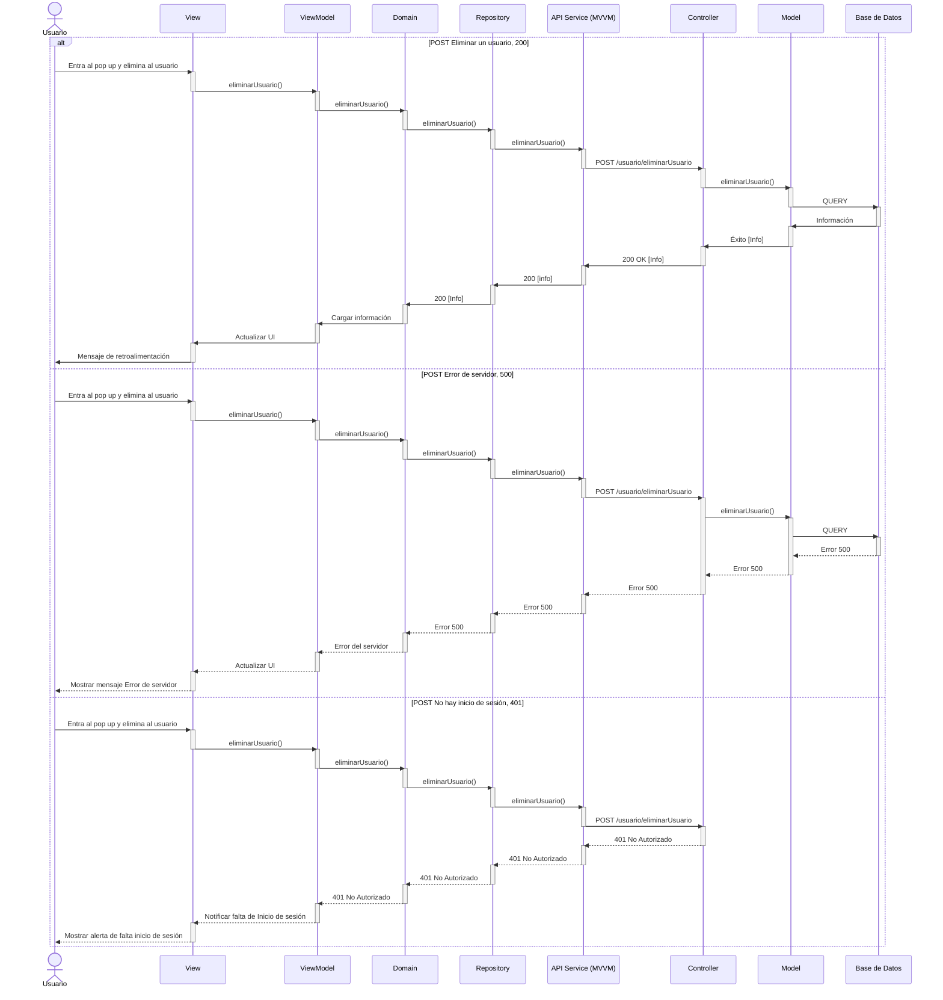
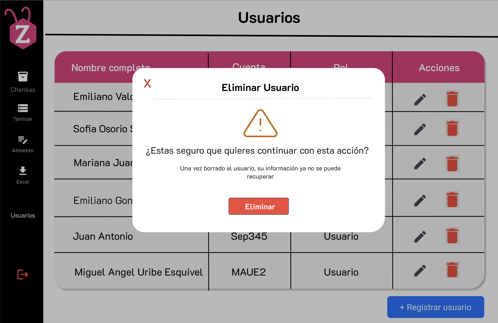

# RF14: Borrar usuario

### Historia de Usuario

Como administrador, quiero eliminar usuarios del sistema, para gestionar el acceso y remover cuentas que ya no deben tener permisos en la plataforma.

**Criterios de Aceptación:**

- El sistema debe permitir al administrador eliminar un usuario.
- Antes de la eliminación, se debe mostrar una advertencia de confirmación.
- Solo los administradores deben tener permisos para eliminar usuarios.
- Los usuarios eliminados no deben poder acceder nuevamente al sistema.
- Al eliminar un usuario se debe mostrar un mensaje de que se borro con éxito.
- Al eliminar un usuario se debe mostrar un mensaje de error al borrar usuario.

---

### Diagrama de Secuencia

---

### Pull Request

<a href="https://github.com/CodeAnd-Co/TECH-NEBRIOS-BACKEND/pull/63" target="_blank" rel="noopener noreferrer"> PR de Borrar usuario Backend</a>

<a href="https://github.com/CodeAnd-Co/TECH-NEBRIOS-FLUTTER/pull/100" target="_blank" rel="noopener noreferrer"> PR de Borrar usuario Frontend</a>

---

### Mockup

## Historial de cambios

| **Tipo de Versión** | **Descripción**                                        | **Fecha**  | **Colaborador**    |
| ------------------- | ------------------------------------------------------ | ---------- | ------------------ |
| **1.0**             | Creacion de la historia de usuario                     | 5/3/2025   | Armando Mendez     |
| **1.1**             | Modificar historial de cambio                          | 17/05/2025 | Mariana Juárez     |
| **2.0**             | Diagrma de secuencia, criterios de aceptacion y mockup | 3/06/2025  | Miguel Angel Uribe |
