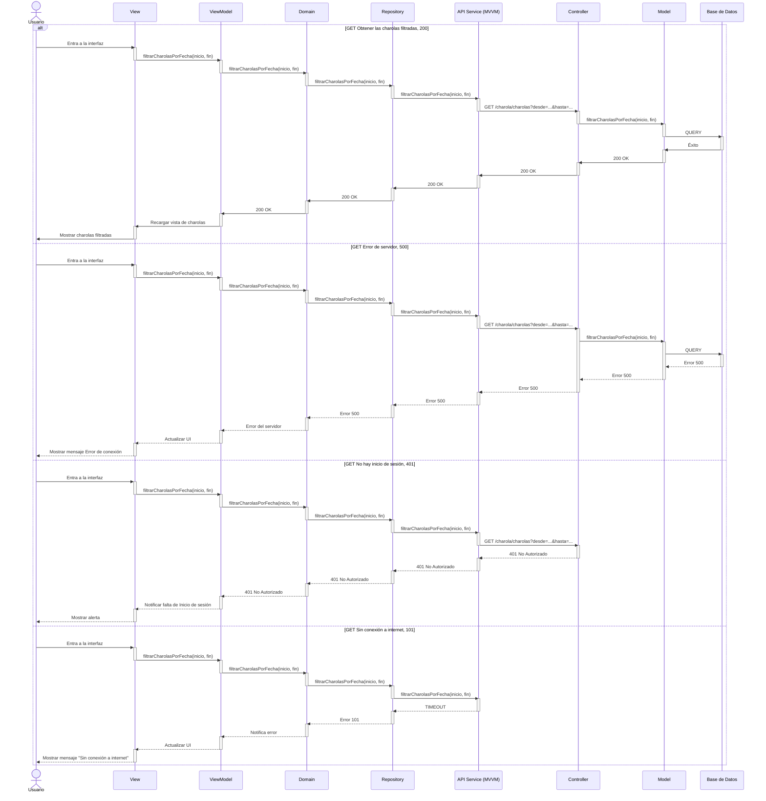

# RF15: Filtrar charola por fecha

### Historia de Usuario
 Yo como usuario, quiero poder filtrar las charolas por rango de fechas, para visualizar solo aquellas que pertenecen a un periodo determinado y facilitar el análisis

  **Criterios de Aceptación:**
  - Se debe mostrar un selector de fecha inicial y final
  - Al aplicar el filtro, solo se mostrarán las charolas dentro del rango seleccionado.
  - Si no se selecciona una fecha, se deben mostrar todas por defecto.
  - El filtrado debe ejecutarse de manera eficiente sin afectar el rendimiento del sistema.
  - El filtro debe poder limpiarse fácilmente para volver a ver todas.

---

### Diagrama de Actividades

<a href="https://drive.google.com/file/d/1nrSQ-8GnPNeflYgQqckkyoSgE_YmDGht/view?usp=share_link" target="_blank" rel="noopener noreferrer">Filtrar charolas</a>

---

### Diagrama de Secuencia

---

### Mockup

## Historial de cambios

| **Tipo de Versión** | **Descripción**                            | **Fecha** | **Colaborador**         |
| ------------------- | ------------------------------------------ | --------- | ----------------------- |
| **1.0**             | Creacion de la historia de usuario         | 8/3/2025  | Armando Mendez          |
| **2.0**             | Se modificó la US, criterios de acptación. | 17/05/2025| Mariana Juárez          |
| **3.0**             | Se agregó mockup, diagrama de secuencia y diagrama de actividad. | 6/06/2025| Mariana Juárez   |

