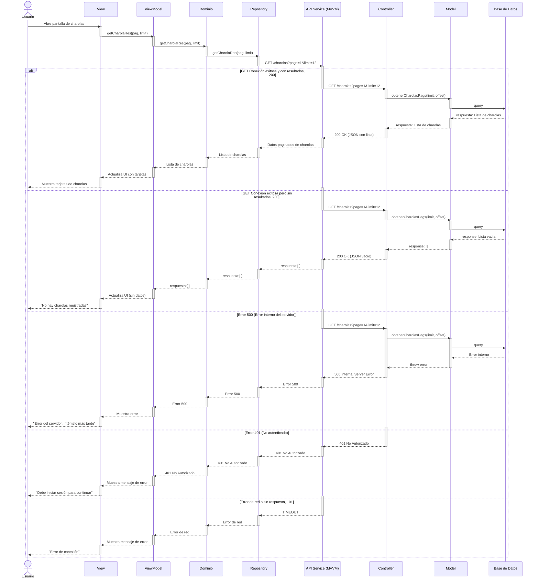

# RF16: Visualizar todas las charolas registradas en el sistema

### Historia de Usuario
Como usuario, quiero consultar todas las charolas registradas en el sistema, para tener un control completo sobre el inventario de charolas y su estado dentro del proceso de producción.

  **Criterios de Aceptación:**
  - El sistema debe mostrar una lista de todas las charolas registradas.
  - La visualización debe ser clara y permitir una navegación fluida.
  - Los datos deben actualizarse en tiempo real conforme se registran nuevas charolas.

---

### Diagrama de Actividades

<a href="https://drive.google.com/file/d/1h0qfOgoFKyDF1h_Eqhu__rSFu-eziAFj/view?usp=sharing" target="_blank" rel="noopener noreferrer">Visualizar todas las charolas registradas en el sistema</a>

---

### Diagrama de Secuencia

---
### Pull Request

<a href="https://github.com/CodeAnd-Co/TECH-NEBRIOS-BACKEND/pull/13" target="_blank" rel="noopener noreferrer"> PR de Visualizar todas las charolas registradas en el sistema Backend</a>

<a href="https://github.com/CodeAnd-Co/TECH-NEBRIOS-FLUTTER/pull/8" target="_blank" rel="noopener noreferrer"> PR de Visualizar todas las charolas registradas en el sistema Frontend</a>

---

### Mockup

---

## Historial de cambios

| **Tipo de Versión** | **Descripción**                      | **Fecha** | **Colaborador**   |
| ------------------- | ------------------------------------ | --------- | ----------------- |
| **1.0**             | Creacion de la historia de usuario   | 8/3/2025  | Armando Mendez    |
| **1.0**             | Verificación de los cambios          | 8/3/2025  | Miguel Angel      |
| **1.1**             | Creación del diagrama de secuencia y agregar mockup   | 20/4/2025  | Sofía Osorio      |
| **1.2**             | Modificar el diseño del mockup   | 21/4/2025  | Sofía Osorio      |
| **1.3**             | Modificar el diagrama de secuencia  | 25/4/2025  | Sofía Osorio      |
| **1.4**             | Se eliminó pruebas unitarias   | 5/5/2025  | Mariana Juárez      |
| **1.5**             | Diagramas de actividades   | 23/5/2025  | Juan Eduardo Rosas Cerón |
| **1.6**             | Se corrigió mockup  | 29/5/2025  | Mariana Juárez |
| **1.7**             | Se agregaron los pull request de front y back | 29/5/2025  | Sofía Osorio |