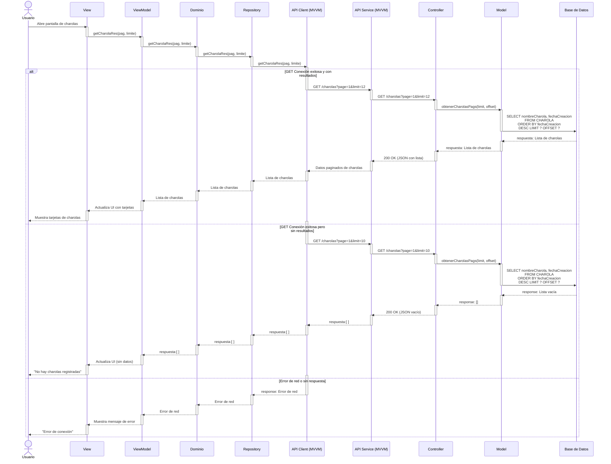
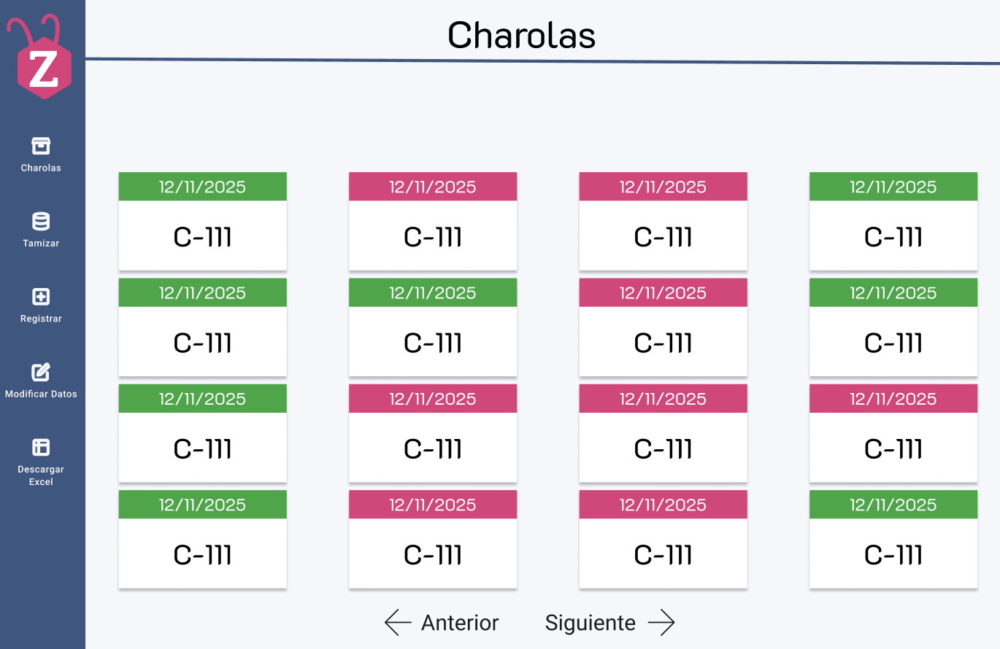

# RF16: Visualizar todas las charolas registradas en el sistema

### Historia de Usuario
Como usuario, quiero consultar todas las charolas registradas en el sistema, para tener un control completo sobre el inventario de charolas y su estado dentro del proceso de producción.

  **Criterios de Aceptación:**
  - El sistema debe mostrar una lista de todas las charolas registradas.
  - La visualización debe ser clara y permitir una navegación fluida.
  - Los datos deben actualizarse en tiempo real conforme se registran nuevas charolas.

---

### Diagrama de Secuencia

> *Descripción*: El diagrama de secuencia muestra los casos que los usuarios pueden tener al interactuar con el menú de charolas

---

### Mockup

> *Descripción*: El mockup muestra la interfaz donde se visualizan las charolas a través de tarjetas haciendo referencia a que cada tarjeta es una charola identificada paor un color dependiendo del tipo de charola que sea. 

### Pruebas Unitarias 
| ID Prueba  | Descripción                                               | Resultado Esperado  |
|------------|-----------------------------------------------------------|---------------------|
| PU-RF16-01 | Consultar la lista de todas las charolas registradas.     | El sistema muestra correctamente la lista completa de charolas registradas. |
| PU-RF16-02 | Verificar que los datos mostrados sean los mismos que los almacenados en la base de datos. | La información de la lista coincide con los datos almacenados. |
| PU-RF16-03 | Validar que la lista se actualiza en tiempo real al registrar nuevas charolas. | Al agregar una nueva charola, la lista se actualiza automáticamente sin recargar la página. |
| PU-RF16-04 | Intentar consultar la lista cuando no hay charolas registradas. | El sistema muestra un mensaje indicando que no hay registros disponibles. |
| PU-RF16-05 | Evaluar el tiempo de carga de la lista con un gran número de charolas. | La consulta se ejecuta en un tiempo aceptable sin afectar el rendimiento. |

## Historial de cambios

| **Tipo de Versión** | **Descripción**                      | **Fecha** | **Colaborador**   |
| ------------------- | ------------------------------------ | --------- | ----------------- |
| **1.0**             | Creacion de la historia de usuario   | 8/3/2025  | Armando Mendez    |
| **1.0**             | Verificación de los cambios          | 8/3/2025  | Miguel Angel      |
| **1.1**             | Creación del diagrama de secuencia y agregar mockup   | 20/4/2025  | Sofía Osorio      |
| **1.2**             | Modificar el diseño del mockup   | 21/4/2025  | Sofía Osorio      |
| **1.3**             | Modificar el bloque de secuencia del diagrama de secuencia  | 22/4/2025  | Sofía Osorio      |
| **1.4**             | Modificar el dato que se obtiene del diagrama de secuencia  | 23/4/2025  | Sofía Osorio      |