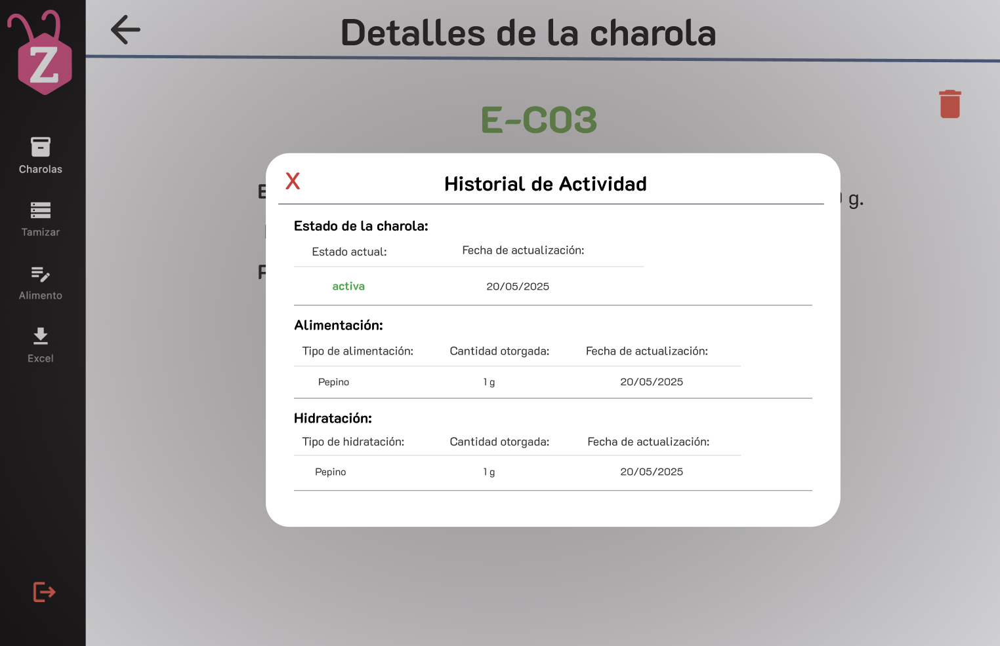

# RF18: Historial de actividad de charola

### Historia de Usuario
Como usuario, quiero consultar las especificaciones y los cuidados que ha tenido una charola a lo largo del tiempo, para llevar un seguimiento detallado del manejo y condiciones de la charola.

  **Criterios de Aceptación:**
  - El sistema debe permitir visualizar un historial con las actividades realizadas en la charola.
  - La información debe incluir cambios de estado, alimentación e hidratación.
  - Los datos deben mostrarse en orden cronológico.
  - El historial debe actualizarse en tiempo real conforme se registren nuevas actividades.
  - Se debe mostrar la fecha de actualización.

---

### Diagrama de Secuencia

```mermaid
sequenceDiagram
    actor Usuario 
    participant View as View
    participant ViewModel as ViewModel
    participant Domain as Domain
    participant Repository as Repository
    participant APIService as API Service (MVVM)
    participant Controller as Controller
    participant Model as Model
    participant Database as Base de Datos

    alt GET Historial de actividad, 200
        Usuario->>+View: Entra al pop up
        View->>-ViewModel: historialActividad(charolaId)
        activate ViewModel 
        ViewModel->>Domain: historialActividad(charolaId)
        deactivate ViewModel 
        activate Domain
        Domain->>Repository: historialActividad(charolaId)
        deactivate Domain
        activate Repository
        Repository->>APIService: historialActividad(charolaId)
        deactivate Repository
        activate APIService
        APIService->>Controller: GET /obtenerHistorialActividad
        deactivate APIService
        activate Controller
        Controller->>Model: obtenerHistorialActividad
        deactivate Controller
        activate Model
        Model->>Database: QUERY
        deactivate Model
        activate Database

        Database-->>Model: Informacion
        deactivate Database
        activate Model
        Model-->>Controller: Éxito [Info]
        deactivate Model
        activate Controller
        Controller-->>APIService: 200 OK [Info]
        deactivate Controller
        activate APIService
        APIService-->>Repository: [Info]
        deactivate APIService
        activate Repository
        Repository-->>Domain: [Info]
        deactivate Repository
        activate Domain
        Domain-->>ViewModel: Cargar informacion
        deactivate Domain
        activate ViewModel
        ViewModel-->>View: Actualizar UI
        deactivate ViewModel
        activate View
        View-->>Usuario: Mostrar pop up de historial de actividad
        deactivate View
    
    else GET No se encontraron datos, 201
        Usuario->>+View: Entra al pop up
        View->>-ViewModel: historialActividad(charolaId)
        activate ViewModel 
        ViewModel->>Domain: historialActividad(charolaId)
        deactivate ViewModel 
        activate Domain
        Domain->>Repository: historialActividad(charolaId)
        deactivate Domain
        activate Repository
        Repository->>APIService: historialActividad(charolaId)
        deactivate Repository
        activate APIService
        APIService->>Controller: GET /obtenerHistorialActividad
        deactivate APIService
        activate Controller
        Controller->>Model: obtenerHistorialActividad
        deactivate Controller
        activate Model
        Model->>Database: QUERY
        deactivate Model
        activate Database

        Database-->>Model: [ ]
        deactivate Database
        activate Model
        Model-->>Controller: Éxito [ ]
        deactivate Model
        activate Controller
        Controller-->>APIService: 201 OK [ ]
        deactivate Controller
        activate APIService
        APIService-->>Repository: [ ]
        deactivate APIService
        activate Repository
        Repository-->>Domain: [ ]
        deactivate Repository
        activate Domain
        Domain-->>ViewModel: Informacion vacia
        deactivate Domain
        activate ViewModel
        ViewModel-->>View: Actualizar UI
        deactivate ViewModel
        activate View
        View-->>Usuario: Mostrar mensaje no hay actividad reciente
        deactivate View

    else GET Error de servidor, 500
        Usuario->>+View: Entra al pop up
        View->>-ViewModel: historialActividad(charolaId)
        activate ViewModel 
        ViewModel->>Domain: historialActividad(charolaId)
        deactivate ViewModel 
        activate Domain
        Domain->>Repository: historialActividad(charolaId)
        deactivate Domain
        activate Repository
        Repository->>APIService: historialActividad(charolaId)
        deactivate Repository
        activate APIService
        APIService->>Controller: GET /obtenerHistorialActividad
        deactivate APIService
        activate Controller
        Controller->>Model: obtenerHistorialActividad
        activate Model
        Model->>Database: QUERY
        activate Database

        Database-->>Model: Error 500
        deactivate Database
        Model-->>Controller: Error 500
        deactivate Model
        Controller-->>APIService: Error 500
        deactivate Controller
        activate APIService
        APIService-->>Repository: Error 500
        deactivate APIService
        activate Repository
        Repository-->>Domain: Error 500
        deactivate Repository
        activate Domain
        Domain-->>ViewModel: Error del servidor
        deactivate Domain
        activate ViewModel
        ViewModel-->>View: Actualizar UI
        deactivate ViewModel
        activate View
        View-->>Usuario: Mostrar mensaje Error de servidor
        deactivate View

    else GET No hay inicio de sesión, 401
        Usuario->>+View: Entra al pop up
        View->>-ViewModel: historialActividad(charolaId)
        activate ViewModel 
        ViewModel->>Domain: historialActividad(charolaId)
        deactivate ViewModel 
        activate Domain
        Domain->>Repository: historialActividad(charolaId)
        deactivate Domain
        activate Repository
        Repository->>APIService: historialActividad(charolaId)
        deactivate Repository
        activate APIService
        APIService->>Controller: GET /obtenerHistorialActividad
        deactivate APIService
        activate Controller

        Controller-->>APIService: 401 No Autorizado
        deactivate Controller
        activate APIService
        APIService-->>Repository: 401 No Autorizado
        deactivate APIService
        activate Repository
        Repository-->>Domain: 401 No Autorizado
        deactivate Repository
        activate Domain
        Domain-->>ViewModel: 401 No Autorizado
        deactivate Domain
        activate ViewModel
        ViewModel-->>View: Notificar falta de Inicio de sesión
        deactivate ViewModel
        activate View
        View-->>Usuario: Regresar al View de Inicio de sesión
        deactivate View

    else GET Sin conexión a internet, 101
        Usuario->>+View: Entra al pop up
        View->>-ViewModel: historialActividad(charolaId)
        activate ViewModel 
        ViewModel->>Domain: historialActividad(charolaId)
        deactivate ViewModel 
        activate Domain
        Domain->>Repository: historialActividad(charolaId)
        deactivate Domain
        activate Repository
        Repository->>APIService: historialActividad(charolaId)
        deactivate Repository
        activate APIService

        APIService-->>Repository: TIMEOUT
        deactivate APIService
        activate Repository
        Repository-->>Domain: Error 101
        deactivate Repository
        activate Domain
        Domain-->>ViewModel: Notifica error
        deactivate Domain
        activate ViewModel
        ViewModel-->>View: Actualizar UI
        deactivate ViewModel
        activate View
        View-->>Usuario: Mostrar mensaje "Sin conexión a internet"
        deactivate View
      end
    
```

---

### Pull Request

<a href="https://github.com/CodeAnd-Co/TECH-NEBRIOS-BACKEND/pull/19" target="_blank" rel="noopener noreferrer"> PR de Historial de actividad de Charola Backend</a>

<a href="https://github.com/CodeAnd-Co/TECH-NEBRIOS-FLUTTER/pull/14" target="_blank" rel="noopener noreferrer"> PR de Historial de actividad de Charola Frontend</a>

---

### Mockup

---

### Pruebas

[Matriz de pruebas de funcionamiento](https://docs.google.com/spreadsheets/d/1-EwSa6HMrU9eqEvx9wWw8HCH9tba0EpWPCBFGSmpnu4/edit?gid=1958497626#gid=1958497626)

---

### Historial de Versiones

| **Tipo de Versión** | **Descripción**                      | **Fecha** | **Colaborador**   |
| ------------------- | ------------------------------------ | --------- | ----------------- |
| **1.0**             | Creacion de la historia de usuario   | 8/3/2025  | Armando Mendez    |
| **1.1**             | Verificación de los cambios          | 8/3/2025  | Miguel Angel      |
| **2.0**             | Creación del diagrama de secuencia y mockup   | 9/5/2025  | Miguel Angel      |
| **2.1**             | Se eliminó pruebas unitarias   | 5/5/2025  | Mariana Juárez      |
| **2.2**             | Se corrigió mockup  | 29/5/2025  | Mariana Juárez |
| **2.3**             | Se agregaron los pull request de front y back | 29/5/2025  | Sofía Osorio |
| **2.4**             | Se modificaron los criterios de aceptación   | 2/6/2025  | Mariana Juárez      |
| **2.5**             | Agregado enlace de pruebas                          | 06/6/2025 | Emiliano Valdivia Lara  |
