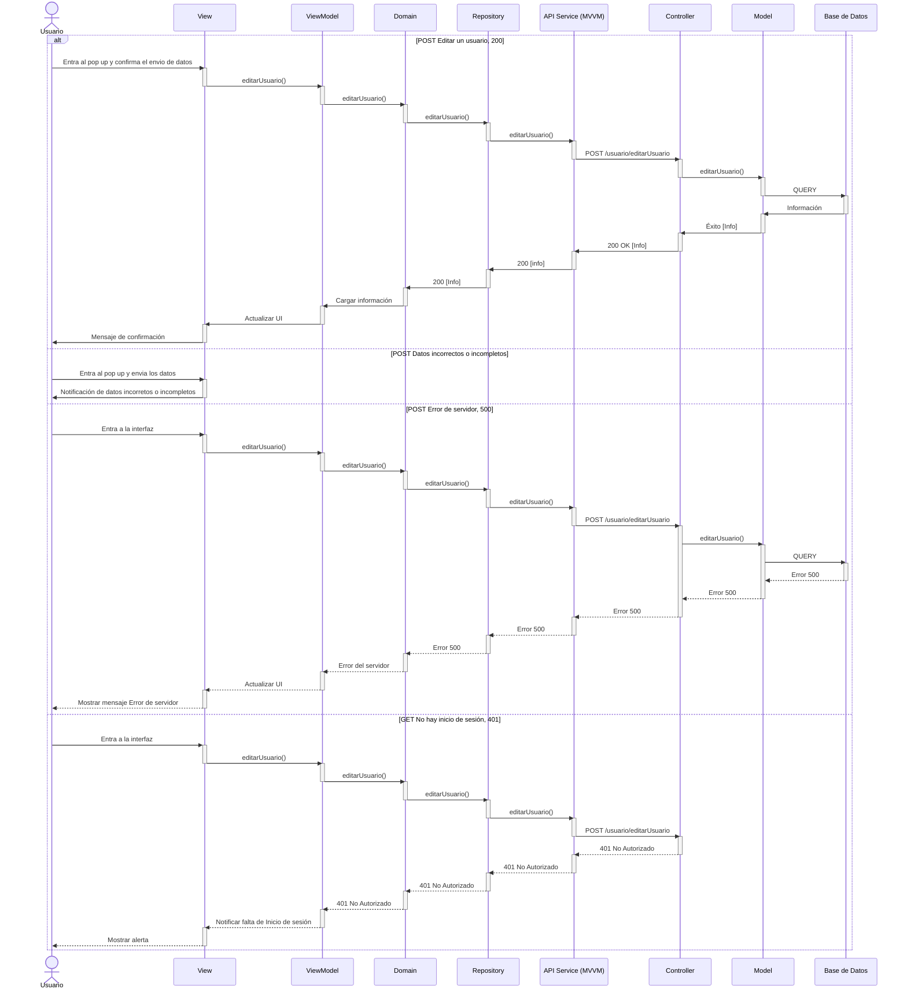
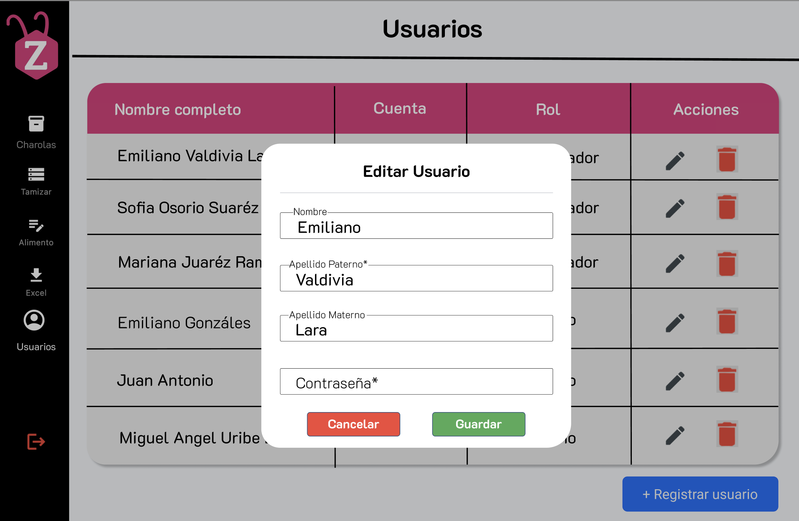

# RF19: Editar Usuario

### Historia de Usuario

Como administrador, quiero modificar la información de los usuarios para mantener actualizados sus datos y asegurar que su perfil es correcto.

  **Criterios de Aceptación:**
  - El sistema debe permitir al administrador seleccionar un usuario y modificar su información.
  - Solo los administradores deben tener permisos para editar datos de otros usuarios.
  - La contraseña del usuario podra ser editable, pero no se podra editar la contraseña anterior.
  - Los campos de Nombre, Apellido Paterno, Nombre de usuario y Contraseña no pueden quedar vacios
  - Al editar el adminstrador debe mandar un mensaje de retroalimentación de que se editó con éxito.
  - Al editar el adminstrador debe mandar un mensaje de retroalimentación de que hubo error al editar.

---
### Diseño de algoritmo

[Pseudocódigo de la HU](https://docs.google.com/document/d/1rAAtMofB0CweF5ou_PKxykuWDmM1gShZG-QMrqfH7v8/edit?usp=sharing)

---

### Diagrama de Secuencia

---

### Pull Request

<a href="https://github.com/CodeAnd-Co/TECH-NEBRIOS-BACKEND/pull/60" target="_blank" rel="noopener noreferrer"> PR de Editar Usuario Backend</a>

<a href="https://github.com/CodeAnd-Co/TECH-NEBRIOS-FLUTTER/pull/98" target="_blank" rel="noopener noreferrer"> PR de Editar Usuario Frontend</a>

---

### Mockup

---

| **Tipo de Versión** | **Descripción**                      | **Fecha** | **Colaborador**   |
| ------------------- | ------------------------------------ | --------- | ----------------- |
| **1.0**             | Creacion de la historia de usuario   | 8/3/2025  | Armando Mendez    |
| **1.1**             | Modificar historial de cambio        | 17/05/2025| Mariana Juárez    |
| **2.0**             | Diagrama de secuencia, criterios de aceptación y mockup       | 4/06/2025 | Miguel Angel      |
| **2.1**             | Ampliados criterios de aceptación       | 6/06/2025 | Emiliano Valdivia      |
