# RF20: Seleccionar charolas para tamizar

### Historia de Usuario
Como usuario del sistema, quiero seleccionar las charolas a tamizar y registrar sus datos, para tener un registro y hacer analisis de datos

  **Criterios de Aceptación:**
  - El sistema debe permitir seleccionar las charolas a tamizar
  - El sistema debe permitir registarr los datos de las charolas a tamizar
  - El sistema debe de mostrar los datos en tiempo real

---

### Diagrama de Secuencia

> *Descripción*: El diagrama de secuencia muestra diferentes casos para cuando el usuario registra un tamizado.

```mermaid
sequenceDiagram
    actor Usuario 
    participant View as View
    participant ViewModel as ViewModel
    participant Domain as Domain
    participant Repository as Repository
    participant APIService as API Service (MVVM)
    participant Controller as Controller
    participant Model as Model
    participant Database as Base de Datos

    alt GET Comida (200)
    Usuario->>View: Carga la interfaz
    activate View
    View->>ViewModel: cargarAlimentos()
    deactivate View
    activate ViewModel
    ViewModel->>Domain: getAlimentos()
    deactivate ViewModel
    activate Domain
    Domain->>Repository: getAlimentos()
    deactivate Domain
    activate Repository
    Repository->>APIService: getAlimentos()
    deactivate Repository
    activate APIService
    APIService->>Controller: GET("/comida/obtener-comida")
    deactivate APIService
    activate Controller
    Controller->>Controller: obtenerComida()
    Controller->>Model: obtenerComida()
    deactivate Controller
    activate Model
    Model->>Database: QUERY 
    deactivate Model
    activate Database
    Database-->>Model: listaComidas
    deactivate Database
    activate Model
    Model-->>Controller: listaComidas
    deactivate Model
    activate Controller
    Controller-->>APIService: listaComidas
    deactivate Controller
    activate APIService
    APIService-->>Repository: listaComidas
    deactivate APIService
    activate Repository
    Repository-->>Domain: listaComidas
    deactivate Repository
    activate Domain
    Domain-->>ViewModel: listaComidas
    deactivate Domain
    activate ViewModel
    ViewModel-->>View: listaComidas
    deactivate ViewModel
    activate View
    View-->>Usuario: Mostrar lista de comidas
    deactivate View
    end

    alt ERROR al obtener comida (500)
    Usuario->>View: (GET) do Obtener Comida
    activate View
    View->>ViewModel: cargarAlimentos()
    deactivate View
    activate ViewModel
    ViewModel->>Domain: getAlimentos()
    deactivate ViewModel
    activate Domain
    Domain->>Repository: getAlimentos()
    deactivate Domain
    activate Repository
    Repository->>APIService: getAlimentos()
    deactivate Repository
    activate APIService
    APIService->>Controller: GET("/comida/obtener-comida")
    deactivate APIService
    activate Controller
    Controller->>Model: obtenerComida()
    deactivate Controller
    activate Model
    Model->>Database: obtenerComidas(query)
    deactivate Model
    activate Database
    Database--XModel: Error al consultar comidas
    deactivate Database
    activate Model
    Model--XController: Error inesperado en DB de comidas
    deactivate Model
    activate Controller
    Controller-->>APIService: 500 Error obteniendo comida
    deactivate Controller
    activate APIService
    APIService-->>Repository: 500 Error obteniendo comida
    deactivate APIService
    activate Repository
    Repository-->>Domain: 500 Error obteniendo comida
    deactivate Repository
    activate Domain
    Domain-->>ViewModel: Error al obtener comida
    deactivate Domain
    activate ViewModel
    ViewModel-->>View: No se pudo cargar la comida. Intenta más tarde.
    deactivate ViewModel
    activate View
    View-->>Usuario: Error al obtener la lista de comidas.
    deactivate View
    end

    alt ERROR al obtener hidratación (500)
    Usuario->>View: (GET) do Obtener Hidratación
    activate View
    View->>ViewModel: cargarHidratacion()
    deactivate View
    activate ViewModel
    ViewModel->>Domain: getHidratacion()
    deactivate ViewModel
    activate Domain
    Domain->>Repository: getHidratacion()
    deactivate Domain
    activate Repository
    Repository->>APIService: getHidratacion()
    deactivate Repository
    activate APIService
    APIService->>Controller: GET("/hidratacion/obtener-hidratacion")
    deactivate APIService
    activate Controller
    Controller->>Model: obtenerHidratacion()
    deactivate Controller
    activate Model
    Model->>Database: QUERY
    deactivate Model
    activate Database
    Database--XModel: Error al consultar hidratación
    deactivate Database
    activate Model
    Model--XController: Error inesperado en DB de hidratación
    deactivate Model
    activate Controller
    Controller-->>APIService: 500 Error obteniendo hidratación
    deactivate Controller
    activate APIService
    APIService-->>Repository: 500 Error obteniendo hidratación
    deactivate APIService
    activate Repository
    Repository-->>Domain: 500 Error obteniendo hidratación
    deactivate Repository
    activate Domain
    Domain-->>ViewModel: Error al obtener hidratación
    deactivate Domain
    activate ViewModel
    ViewModel-->>View: No se pudo cargar la hidratación. Intenta más tarde.
    deactivate ViewModel
    activate View
    View-->>Usuario: Error al obtener la lista de hidrataciones.
    deactivate View
    end

    alt GET Hidratacion (200)
    Usuario->>View: (GET) do Obtener Hidratación
    activate View
    View->>ViewModel: cargarHidratacion()
    deactivate View
    activate ViewModel
    ViewModel->>Domain: getHidratacion()
    deactivate ViewModel
    activate Domain
    Domain->>Repository: getHidratacion()
    deactivate Domain
    activate Repository
    Repository->>APIService: getHidratacion()
    deactivate Repository
    activate APIService
    APIService->>Controller: GET("/hidratacion/obtener-hidratacion")
    deactivate APIService
    activate Controller
    Controller->>Controller: obtenerHidratacion()
    Controller->>Model: obtenerHidratacion()
    deactivate Controller
    activate Model
    Model->>Database: QUERY
    deactivate Model
    activate Database
    Database-->>Model: listaHidratacion
    deactivate Database
    activate Model
    Model-->>Controller: listaHidratacion
    deactivate Model
    activate Controller
    Controller-->>APIService: listaHidratacion
    deactivate Controller
    activate APIService
    APIService-->>Repository: listaHidratacion
    deactivate APIService
    activate Repository
    Repository-->>Domain: listaHidratacion
    deactivate Repository
    activate Domain
    Domain-->>ViewModel: listaHidratacion
    deactivate Domain
    activate ViewModel
    ViewModel-->>View: listaHidratacion
    deactivate ViewModel
    activate View
    View-->>Usuario: Mostrar lista de hidrataciones
    deactivate View
    end

    alt POST: Tamizado de una charola
        Usuario->>View: Presiona "Finalizar"
        activate View

        View->>ViewModel: tamizarCharola()
        deactivate View
        activate ViewModel

        ViewModel->>Domain: tamizarCharola(charolasParaTamizar, frass, pupa, alimentoTipo, alimentoCantidad, hidratacionTipo, hidratacionCantidad, nuevasCharolas)
        deactivate ViewModel
        activate Domain

        Domain->>Repository: tamizarCharola(charolasParaTamizar, frass, pupa, alimentoTipo, alimentoCantidad, hidratacionTipo, hidratacionCantidad, nuevasCharolas)
        deactivate Domain
        activate Repository

        Repository->>APIService: tamizarCharola(charolasParaTamizar, frass, pupa, alimentoTipo, alimentoCantidad, hidratacionTipo, hidratacionCantidad, nuevasCharolas)
        deactivate Repository
        activate APIService

        APIService->>Controller: POST /tamizadoIndividual
        deactivate APIService
        activate Controller

        Controller->>Model: tamizarCharola
        deactivate Controller
        activate Model

        Model->>Database: QUERY
        deactivate Model
        activate Database

        Database-->>Model: Confirma información
        deactivate Database
        activate Model

        Model-->>Controller: Éxito
        deactivate Model
        activate Controller

        Controller-->>APIService: 200 OK
        deactivate Controller
        activate APIService

        APIService-->>Repository: Tamizado exitoso
        deactivate APIService
        activate Repository

        Repository-->>Domain: Tamizado exitoso
        deactivate Repository
        activate Domain

        Domain-->>ViewModel: Notifica éxito
        deactivate Domain
        activate ViewModel

        ViewModel-->>View: Actualizar UI
        deactivate ViewModel
        activate View

        View-->>Usuario: Mostrar interfaz de menú de charolas
        deactivate View
    else POST: Sin conexión a internet, 503
        Usuario->>View: Presiona "Finalizar"
        activate View

        View->>ViewModel: tamizarCharola()
        deactivate View
        activate ViewModel

        ViewModel->>Domain: tamizarCharola(charolasParaTamizar, frass, pupa, alimentoTipo, alimentoCantidad, hidratacionTipo, hidratacionCantidad, nuevasCharolas)
        deactivate ViewModel
        activate Domain

        Domain->>Repository: tamizarCharola(charolasParaTamizar, frass, pupa, alimentoTipo, alimentoCantidad, hidratacionTipo, hidratacionCantidad, nuevasCharolas)
        deactivate Domain
        activate Repository

        Repository->>APIService: tamizarCharola(charolasParaTamizar, frass, pupa, alimentoTipo, alimentoCantidad, hidratacionTipo, hidratacionCantidad, nuevasCharolas)
        deactivate Repository
        activate APIService

        APIService-->>Repository: TIMEOUT
        deactivate APIService
        activate Repository

        Repository-->>Domain: Error 503
        deactivate Repository
        activate Domain

        Domain-->>ViewModel: Notifica error
        deactivate Domain
        activate ViewModel

        ViewModel-->>View: Actualizar UI
        deactivate ViewModel
        activate View

        View-->>Usuario: Mostrar mensaje "Sin conexión a internet"
        deactivate View
        
    else POST: Error de Autenticación, 401
        Usuario->>View: Presiona "Finalizar"
        activate View

        View->>ViewModel: tamizarCharola()
        deactivate View
        activate ViewModel

        ViewModel->>Domain: tamizarCharola(charolasParaTamizar, frass, pupa, alimentoTipo, alimentoCantidad, hidratacionTipo, hidratacionCantidad, nuevasCharolas)
        deactivate ViewModel
        activate Domain

        Domain->>Repository: tamizarCharola(charolasParaTamizar, frass, pupa, alimentoTipo, alimentoCantidad, hidratacionTipo, hidratacionCantidad, nuevasCharolas)
        deactivate Domain
        activate Repository

        Repository->>APIService: tamizarCharola(charolasParaTamizar, frass, pupa, alimentoTipo, alimentoCantidad, hidratacionTipo, hidratacionCantidad, nuevasCharolas)
        deactivate Repository
        activate APIService

        APIService->>Controller: POST /tamizadoIndividual
        deactivate APIService
        activate Controller

        Controller-->>APIService: Error 401
        deactivate Controller
        activate APIService

        APIService-->>Repository: Error 401
        deactivate APIService
        activate Repository

        Repository-->>Domain: Error 401
        deactivate Repository
        activate Domain

        Domain-->>ViewModel: Notifica Error
        deactivate Domain
        activate ViewModel

        ViewModel-->>View: Actualizar UI
        deactivate ViewModel
        activate View

        View-->>Usuario: Mostrar mensaje "Error de autenticación"
        deactivate View

        else POST: Error de Servidor, 500
        Usuario->>View: Presiona "Finalizar"
        activate View

        View->>ViewModel: tamizarCharola()
        deactivate View
        activate ViewModel

        ViewModel->>Domain: tamizarCharola(charolasParaTamizar, frass, pupa, alimentoTipo, alimentoCantidad, hidratacionTipo, hidratacionCantidad, nuevasCharolas)
        deactivate ViewModel
        activate Domain

        Domain->>Repository: tamizarCharola(charolasParaTamizar, frass, pupa, alimentoTipo, alimentoCantidad, hidratacionTipo, hidratacionCantidad, nuevasCharolas)
        deactivate Domain
        activate Repository

        Repository->>APIService: tamizarCharola(charolasParaTamizar, frass, pupa, alimentoTipo, alimentoCantidad, hidratacionTipo, hidratacionCantidad, nuevasCharolas)
        deactivate Repository
        activate APIService

        APIService->>Controller: POST /tamizadoIndividual
        deactivate APIService
        activate Controller

        Controller->>Model: tamizarCharola(charolasParaTamizar, frass, pupa, alimentoTipo, alimentoCantidad, hidratacionTipo, hidratacionCantidad, nuevasCharolas)
        activate Model

        Model->>Database: QUERY
        activate Database

        Database-->>Model: Error
        deactivate Database

        Model-->>Controller: Error 500
        deactivate Model

        Controller-->>APIService: Error 500
        deactivate Controller
        activate APIService

        APIService-->>Repository: Error 500
        deactivate APIService
        activate Repository

        Repository-->>Domain: Error 500
        deactivate Repository
        activate Domain

        Domain-->>ViewModel: Notifica Error
        deactivate Domain
        activate ViewModel

        ViewModel-->>View: Actualizar UI
        deactivate ViewModel
        activate View

        View-->>Usuario: Mostrar mensaje "Error de servidor"
        deactivate View
  end
```

---

### Pull Request

<a href="https://github.com/CodeAnd-Co/TECH-NEBRIOS-BACKEND/pull/33" target="_blank" rel="noopener noreferrer"> PR de Seleccionar charolas para tamizar Backend</a>
<a href="https://github.com/CodeAnd-Co/TECH-NEBRIOS-BACKEND/pull/47" target="_blank" rel="noopener noreferrer"> PR de Seleccionar charolas para tamizar Backend 2</a>

<a href="https://github.com/CodeAnd-Co/TECH-NEBRIOS-FLUTTER/pull/38" target="_blank" rel="noopener noreferrer"> PR de Seleccionar charolas para tamizar Frontend</a>
<a href="https://github.com/CodeAnd-Co/TECH-NEBRIOS-FLUTTER/pull/58" target="_blank" rel="noopener noreferrer"> PR de Seleccionar charolas para tamizar Frontend 2</a>

---

### Mockup

> *Descripción*: Los mockups muestra la interfaz donde se seleccionan las charolas a tamizar y donde se toman los datos. Se toman en cuenta los casos donde se selecciona una charola o más de una.

### Pruebas

---

# Historial de cambios
| **Tipo de Versión** | **Descripción**                      | **Fecha** | **Colaborador**   |
| ------------------- | ------------------------------------ | --------- | ----------------- |
| **1.0**             | Se agregó historia de usuario        | 7/05/2025 | Juan Eduardo      |
| **1.1**             | Modificar historial de cambio        | 17/05/2025| Mariana Juárez    |
| **2.0**             | Agregados diagrama de secuencia y mockups        | 25/05/2025| Emiliano Valdivia    |
| **2.1**             | Se agregaron los pull request de front y back | 29/5/2025  | Sofía Osorio |