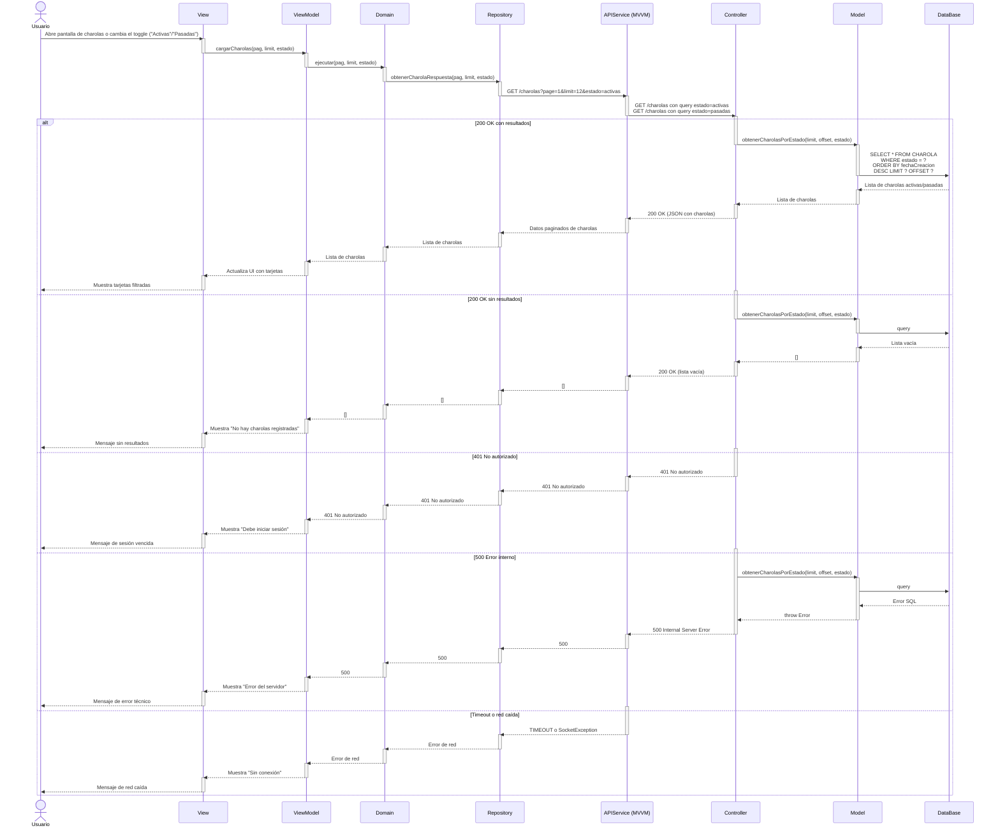

# RF21: Consultar charolas en base a su estatus

### Historia de Usuario
Como usuario, quiero visualizar las charolas que están en estado activo o pasado, para tener una mejor organización de las charolas que se están trabajando y las que ya no existen.

  **Criterios de Aceptación:**
  - El sistema debe permitir consultar charolas activas que son las actuales y las antiguas que son aquellas que ya han pasado por un cambio.
  - Las tarjetas deben mostrarse en orden cronológico, es decir, de las fechas más recientes a las más antiguas.
  - Debe tener la paginación para cada estado.

---

### Diagrama de Secuencia

---

### Pull Request

<a href="https://github.com/CodeAnd-Co/TECH-NEBRIOS-BACKEND/pull/13" target="_blank" rel="noopener noreferrer"> PR de Consultar Charolas en base a su estatus Backend</a>  

<a href="https://github.com/CodeAnd-Co/TECH-NEBRIOS-FLUTTER/pull/16" target="_blank" rel="noopener noreferrer"> PR de Consultar Charolas en base a su estatus Frontend</a>

---

### Mockup

---

## Historial de cambios

| **Tipo de Versión** | **Descripción**                      | **Fecha** | **Colaborador**   |
| ------------------- | ------------------------------------ | --------- | ----------------- |
| **1.0**             | Creacion de la historia de usuario   | 8/3/2025  | Armando Mendez    |
| **1.0**             | Verificación de los cambios          | 8/3/2025  | Miguel Angel      |
| **1.1**             | Creación del diagrama de secuencia y agregar mockup   | 07/5/2025  | Sofía Osorio      |
| **1.2**             | Se eliminó pruebas unitarias y se cambió el nombre de la US   | 17/5/2025  | Mariana Juárez      |
| **1.3**             | Se corrigió mockup  | 29/5/2025  | Mariana Juárez |
| **1.4**             | Se agregaron los pull request de front y back | 29/5/2025  | Sofía Osorio |
| **2.0**             | Actualizar los criterios de aceptación | 2/5/2025  | Sofía Osorio |

