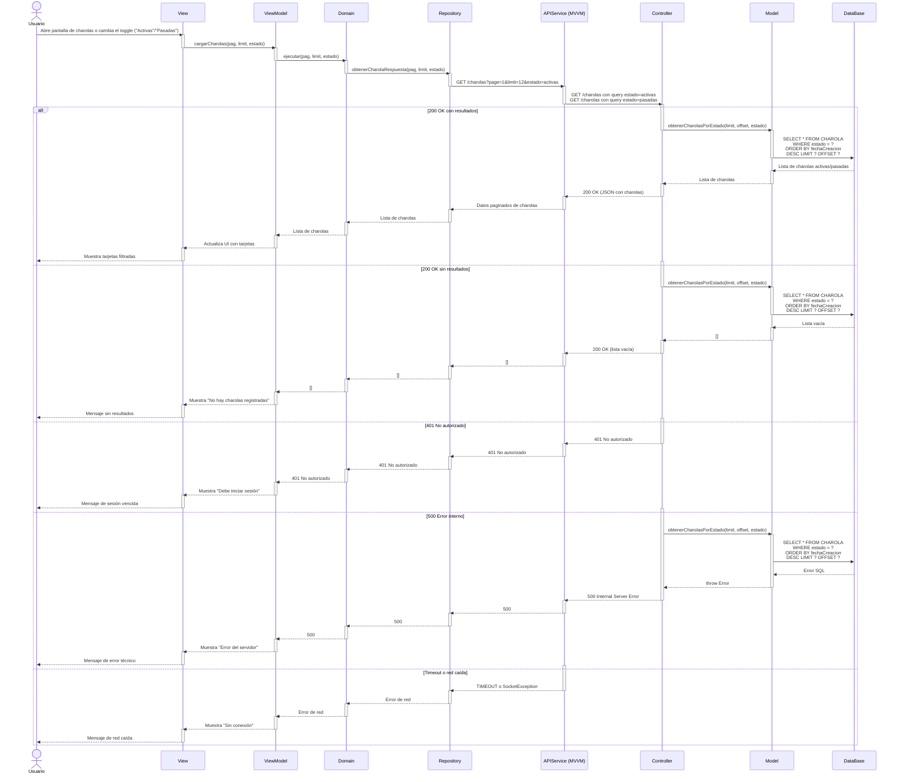
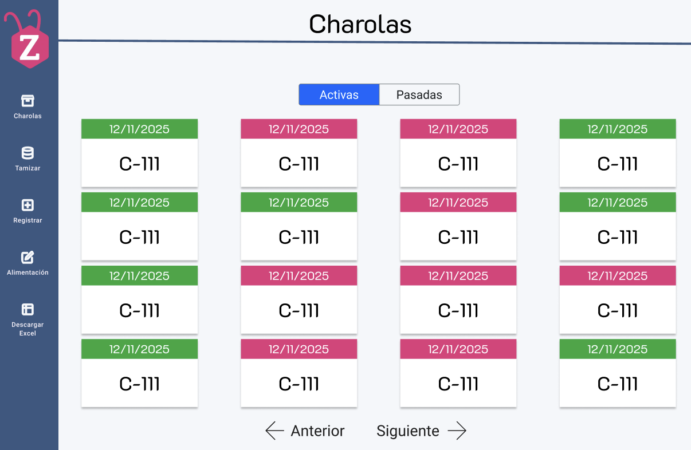

# RF21: Consultar charolas de cambios pasados

### Historia de Usuario
Como usuario del sistema, quiero visualizar las charolas con cambios pasados de escarabajos, para tener acceso al historial completo de cambios y analizar la evolución de la producción.

  **Criterios de Aceptación:**
  - El sistema debe permitir consultar charolas de escarabajo que ya han pasado por un cambio.
  - La información debe incluir el identificador, fecha de cambio y estado en cada fase.
  - Los datos deben mostrarse en orden cronológico y ser accesibles mediante una opción de consulta.
  - Solo los usuarios autorizados deben tener acceso a esta información histórica.

---

### Diagrama de Secuencia

---

### Mockup

> *Descripción*: El mockup muestra la interfaz donde se muestra el menú de charolas con un Toggle Button para poder navergar entre charolas activas y pasadas.

### Pruebas Unitarias 
| ID Prueba  | Descripción                                               | Resultado Esperado  |
|------------|-----------------------------------------------------------|---------------------|
| PU-RF21-01 | Consultar el historial de cambios de una charola existente. | El sistema muestra los cambios registrados para la charola seleccionada. |
| PU-RF21-02 | Intentar consultar el historial de una charola sin cambios registrados. | El sistema informa que no hay cambios históricos disponibles. |
| PU-RF21-03 | Verificar que la información mostrada incluya identificador, fecha de cambio y estado en cada fase. | La consulta presenta todos los datos requeridos correctamente. |
| PU-RF21-04 | Validar que los datos se muestren en orden cronológico. | Los cambios aparecen organizados por fecha, mostrando la evolución del proceso. |
| PU-RF21-05 | Evaluar el rendimiento del sistema al consultar un historial con múltiples registros. | La consulta se ejecuta en un tiempo adecuado sin afectar el rendimiento. |

## Historial de cambios

| **Tipo de Versión** | **Descripción**                      | **Fecha** | **Colaborador**   |
| ------------------- | ------------------------------------ | --------- | ----------------- |
| **1.0**             | Creacion de la historia de usuario   | 8/3/2025  | Armando Mendez    |
| **1.0**             | Verificación de los cambios          | 8/3/2025  | Miguel Angel      |
| **1.1**             | Creación del diagrama de secuencia y agregar mockup   | 07/5/2025  | Sofía Osorio      |

