# RF23: Registrar un nuevo tipo de comida en el sistema

### Historia de Usuario
Como usuario, quiero agregar un nuevo tipo de comida en el sistema, para actualizar y mejorar la alimentación de las larvas y escarabajos según sea necesario.

  **Criterios de Aceptación:**
  - El sistema debe permitir ingresar un nuevo tipo de comida respectiva descripción y cantidad recomendada.
  - Solo los administradores deben tener permisos para registrar nuevos tipos de comida.
  - La nueva comida debe estar disponible en la lista de opciones de alimentación.

---

### Diagrama de Secuencia

> *Descripción*: El diagrama de secuencia muestra cómo el Super Administrador selecciona un archivo de productos para importar y el sistema procesa la importación.

```mermaid
sequenceDiagram
    actor Usuario 
    participant View as View
    participant ViewModel as ViewModel
    participant Domain as Domain
    participant Repository as Repository
    participant APIService as API Service (MVVM)
    participant Controller as Controller
    participant Model as Model
    participant Database as Base de Datos

     alt GET Muestra datos tabla, 200
        Usuario->>+View: Entra a la interfaz
        View->>-ViewModel: getTablaComida()
        activate ViewModel 
        ViewModel->>Domain: getTablaComida()
        deactivate ViewModel 
        activate Domain
        Domain->>Repository: getTablaComida()
        deactivate Domain
        activate Repository
        Repository->>APIService: getTablaComida()
        deactivate Repository
        activate APIService
        APIService->>Controller: GET /getInfoComida
        deactivate APIService
        activate Controller
        Controller->>Model: getInfoComida
        deactivate Controller
        activate Model
        Model->>Database: SELECT * FROM COMIDA
        deactivate Model
        activate Database

        Database-->>Model: Información
        deactivate Database
        activate Model
        Model-->>Controller: Éxito [Info]
        deactivate Model
        activate Controller
        Controller-->>APIService: 200 OK [Info]
        deactivate Controller
        activate APIService
        APIService-->>Repository: [Info]
        deactivate APIService
        activate Repository
        Repository-->>Domain: [Info]
        deactivate Repository
        activate Domain
        Domain-->>ViewModel: Cargar información
        deactivate Domain
        activate ViewModel
        ViewModel-->>View: Actualizar UI
        deactivate ViewModel
        activate View
        View-->>Usuario: Mostrar interfaz de Alimentación
        deactivate View
    
    else GET No se encontraron datos, 200
        Usuario->>+View: Entra a la interfaz
        View->>-ViewModel: getTablaComida()
        activate ViewModel 
        ViewModel->>Domain: getTablaComida()
        deactivate ViewModel 
        activate Domain
        Domain->>Repository: getTablaComida()
        deactivate Domain
        activate Repository
        Repository->>APIService: getTablaComida()
        deactivate Repository
        activate APIService
        APIService->>Controller: GET /getInfoComida
        deactivate APIService
        activate Controller
        Controller->>Model: getInfoComida
        deactivate Controller
        activate Model
        Model->>Database: SELECT * FROM COMIDA
        deactivate Model
        activate Database

        Database-->>Model: [ ]
        deactivate Database
        activate Model
        Model-->>Controller: Éxito [ ]
        deactivate Model
        activate Controller
        Controller-->>APIService: 200 OK [ ]
        deactivate Controller
        activate APIService
        APIService-->>Repository: [ ]
        deactivate APIService
        activate Repository
        Repository-->>Domain: [ ]
        deactivate Repository
        activate Domain
        Domain-->>ViewModel: Informacion vacia
        deactivate Domain
        activate ViewModel
        ViewModel-->>View: Actualizar UI
        deactivate ViewModel
        activate View
        View-->>Usuario: Mostrar mensaje no hay comida registrada
        deactivate View 

        else GET Error de servidor, 500
        Usuario->>+View: Entra a la interfaz
        View->>-ViewModel: getTablaComida()
        activate ViewModel 
        ViewModel->>Domain: getTablaComida()
        deactivate ViewModel 
        activate Domain
        Domain->>Repository: getTablaComida()
        deactivate Domain
        activate Repository
        Repository->>APIService: getTablaComida()
        deactivate Repository
        activate APIService
        APIService->>Controller: GET /getInfoComida
        deactivate APIService
        activate Controller
        Controller->>Model: getInfoComida
        activate Model
        Model->>Database: SELECT * FROM COMIDA
        activate Database

        Database-->>Model: Error 500
        deactivate Database
        Model-->>Controller: Error 500
        deactivate Model
        Controller-->>APIService: Error 500
        deactivate Controller
        activate APIService
        APIService-->>Repository: Error 500
        deactivate APIService
        activate Repository
        Repository-->>Domain: Error 500
        deactivate Repository
        activate Domain
        Domain-->>ViewModel: Error del servidor
        deactivate Domain
        activate ViewModel
        ViewModel-->>View: Actualizar UI
        deactivate ViewModel
        activate View
        View-->>Usuario: Mostrar mensaje Error de servidor
        deactivate View

    else GET No hay inicio de sesión, 401
        Usuario->>+View: Entra a la interfaz
        View->>-ViewModel: getTablaComida()
        activate ViewModel 
        ViewModel->>Domain: getTablaComida()
        deactivate ViewModel 
        activate Domain
        Domain->>Repository: getTablaComida()
        deactivate Domain
        activate Repository
        Repository->>APIService: getTablaComida()
        deactivate Repository
        activate APIService
        APIService->>Controller: GET /getInfoComida
        deactivate APIService
        activate Controller

        Controller-->>APIService: 401 No Autorizado
        deactivate Controller
        activate APIService
        APIService-->>Repository: 401 No Autorizado
        deactivate APIService
        activate Repository
        Repository-->>Domain: 401 No Autorizado
        deactivate Repository
        activate Domain
        Domain-->>ViewModel: 401 No Autorizado
        deactivate Domain
        activate ViewModel
        ViewModel-->>View: Notificar falta de Inicio de sesión
        deactivate ViewModel
        activate View
        View-->>Usuario: Regresar al View de Inicio de sesión
        deactivate View

    else GET Sin conexión a internet, 101
        Usuario->>+View: Entra a la interfaz
        View->>-ViewModel: getTablaComida()
        activate ViewModel 
        ViewModel->>Domain: getTablaComida()
        deactivate ViewModel 
        activate Domain
        Domain->>Repository: getTablaComida()
        deactivate Domain
        activate Repository
        Repository->>APIService: getTablaComida()
        deactivate Repository
        activate APIService

        APIService-->>Repository: TIMEOUT
        deactivate APIService
        activate Repository
        Repository-->>Domain: Error 101
        deactivate Repository
        activate Domain
        Domain-->>ViewModel: Notifica error
        deactivate Domain
        activate ViewModel
        ViewModel-->>View: Actualizar UI
        deactivate ViewModel
        activate View
        View-->>Usuario: Mostrar mensaje "Sin conexión a internet"
        deactivate View
      
      end
    

    alt POST: Inserción de alimentación exitoso
        Usuario->>View: Presiona icono " + "
        activate View

        View->>ViewModel: postRegistrarAlimento(nombre, descripcion)
        deactivate View
        activate ViewModel

        ViewModel->>Domain: postRegistrarAlimento(nombre, descripcion)
        deactivate ViewModel
        activate Domain

        Domain->>Repository: postRegistrarAlimento(nombre, descripcion)
        deactivate Domain
        activate Repository

        Repository->>APIService: postRegistrarAlimento(nombre, descripcion)
        deactivate Repository
        activate APIService

        APIService->>Controller: POST / postDatosComida
        deactivate APIService
        activate Controller

        Controller->>Model: postDatosComida
        deactivate Controller
        activate Model

        Model->>Database: INSERT INTO COMIDA(nombre, descripcion) VALUES ('nombre','descripcion')   
        deactivate Model
        activate Database

        Database-->>Model: Confirma información
        deactivate Database
        activate Model

        Model-->>Controller: Éxito
        deactivate Model
        activate Controller

        Controller-->>APIService: 200 OK
        deactivate Controller
        activate APIService

        APIService-->>Repository: Inserción del alimento exitoso
        deactivate APIService
        activate Repository

        Repository-->>Domain: Inserción del alimento exitoso
        deactivate Repository
        activate Domain

        Domain-->>ViewModel: Notifica éxito
        deactivate Domain
        activate ViewModel

        ViewModel-->>View: Actualizar UI
        deactivate ViewModel
        activate View

        View-->>Usuario: Mostrar interfaz de Alimentación
        deactivate View
    
            else POST: Datos no válidos, 400
        Usuario->>View: Presiona icono " + "
        activate View

        View->>ViewModel: postRegistrarAlimento(nombre, descripcion)
        deactivate View
        activate ViewModel

        ViewModel-->>View: Actualizar UI
        deactivate ViewModel
        activate View

        View-->>Usuario: Mostrar mensaje "Datos no válidos"
        deactivate View


    else POST: Sin conexión a internet, 101
        Usuario->>View: Presiona icono " + "
        activate View

        View->>ViewModel: postRegistrarAlimento(nombre, descripcion)
        deactivate View
        activate ViewModel

        ViewModel->>Domain: postRegistrarAlimento(nombre, descripcion)
        deactivate ViewModel
        activate Domain

        Domain->>Repository: postRegistrarAlimento(nombre, descripcion)
        deactivate Domain
        activate Repository

        Repository->>APIService: postRegistrarAlimento(nombre, descripcion)
        deactivate Repository
        activate APIService

        APIService-->>Repository: TIMEOUT
        deactivate APIService
        activate Repository

        Repository-->>Domain: Error 101
        deactivate Repository
        activate Domain

        Domain-->>ViewModel: Notifica error
        deactivate Domain
        activate ViewModel

        ViewModel-->>View: Actualizar UI
        deactivate ViewModel
        activate View

        View-->>Usuario: Mostrar mensaje "Sin conexión a internet"
        deactivate View
        
    else POST: Error de seridor, 500
        Usuario->>View: Presiona icono " + "
        activate View

        View->>ViewModel: postRegistrarAlimento(nombre, descripcion)
        deactivate View
        activate ViewModel

        ViewModel->>Domain: postRegistrarAlimento(nombre, descripcion)
        deactivate ViewModel
        activate Domain

        Domain->>Repository: postRegistrarAlimento(nombre, descripcion)
        deactivate Domain
        activate Repository

        Repository->>APIService: postRegistrarAlimento(nombre, descripcion)
        deactivate Repository
        activate APIService

        APIService->>Controller: POST / postDatosComida
        deactivate APIService
        activate Controller

        Controller->>Model: postDatosComida
        
        activate Model

        Model->>Database: INSERT INTO COMIDA(nombre, descripcion) VALUES ('nombre','descripcion')   
     
        activate Database

        Database->>Model: Error 500  
        deactivate Database
        

        Model-->>Controller: Error 500
        deactivate Model
        

        Controller-->>APIService: Error 500
        deactivate Controller
        activate APIService

        APIService-->>Repository: Error 500
        deactivate APIService
        activate Repository

        Repository-->>Domain: Error 500
        deactivate Repository
        activate Domain

        Domain-->>ViewModel: Notifica Error
        deactivate Domain
        activate ViewModel

        ViewModel-->>View: Actualizar UI
        deactivate ViewModel
        activate View

        View-->>Usuario: Mostrar mensaje "Base de datos no disponible "
        deactivate View

    end

```

---

### Mockup

> *Descripción*: El mockup muestra la interfaz donde los usuarios pueden visualizar los diferentes tipos de Alimentación.

---

## Pruebas Unitarias

| ID Prueba       | Descripción                                                              | Resultado Esperado                                                                 |
|------------------|---------------------------------------------------------------------------|--------------------------------------------------------------------------------------|
| PU-RF11-01      | Cargar interfaz con información                                            | La pantalla renderiza correctamente la tabla con toda la información de la base de datos. |
| PU-RF11-02      | Presionar botón "+" para abrir formulario                                 | Se abre un modal con los campos "Nombre" y "Descripción".                           |
| PU-RF11-03      | Ingresar nombre vacío y presionar guardar                                 | Se muestra un mensaje de error: "Nombre y descripción no pueden estar vacíos."      |
| PU-RF11-04      | Ingresar números en el nombre y presionar guardar                         | Se muestra un mensaje de error: "El nombre no debe contener números."               |
| PU-RF11-05      | Ingresar texto válido en ambos campos y guardar                           | El alimento se guarda, el modal se cierra y la lista se actualiza automáticamente.  |
| PU-RF11-06      | Campo de descripción con texto largo                                       | El texto se acomoda correctamente en múltiples líneas sin salirse del cuadro.       |
| PU-RF11-07      | Cancelar registro de alimento                                              | Se cierra el modal sin modificar la lista de alimentos.                             |

---

## Historial de Cambios

| **Tipo de Versión** | **Descripción**                               | **Fecha** | **Colaborador**                 |
| ------------------- | --------------------------------------------- | --------- | ------------------------------- |
| **1.0**             | Redactar requerimiento funcional y pruebas unitarias  | 8/03/2025 | Armando Méndez|
| **2.0**             | Añadir diagrama de secuencia post y get y mockup | 25/04/2025  | Mariana Juárez |

