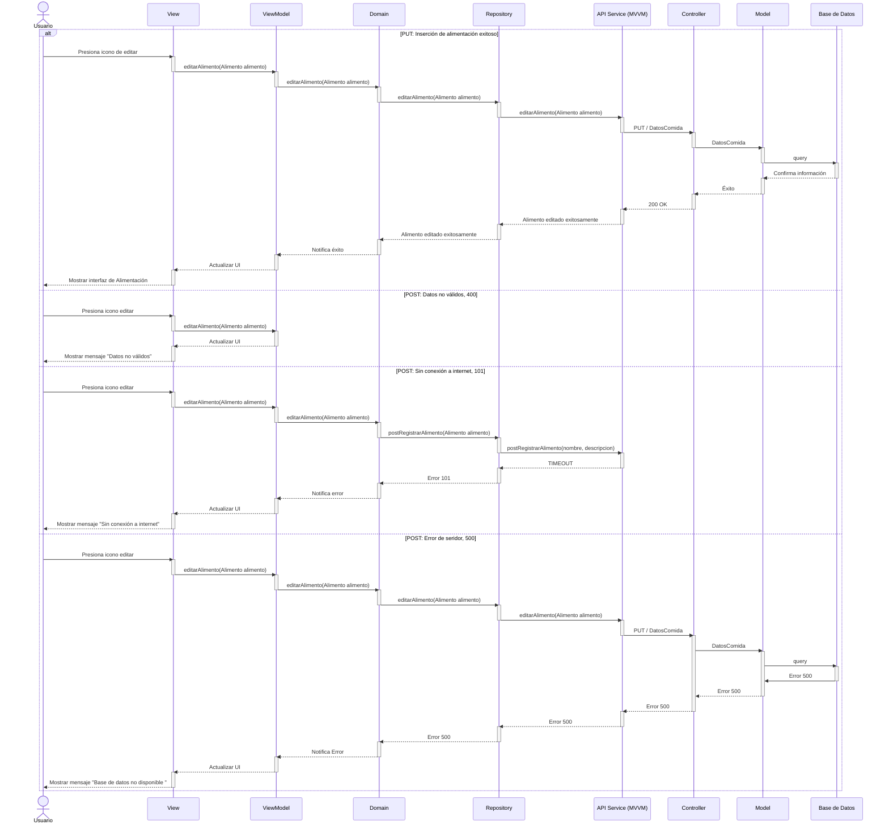

# RF24: Editar un tipo de comida en el sistema

### Historia de Usuario
Como administrador del sistema, quiero editar la información general de un tipo de comida registrado en el sistema, para actualizar sus características, cantidades recomendadas o cualquier ajuste necesario en la alimentación.

  **Criterios de Aceptación:**
  - El sistema debe permitir modificar los datos de un tipo de hidratación previamente registrado.
  - Los cambios deben reflejarse de inmediato y actualizarse en los registros históricos.

---

### Diagrama de Actividades

<a href="https://drive.google.com/file/d/1c2dwLIIvUtN2LMG7rnC1qapJ0Orykrxr/view?usp=sharing" target="_blank" rel="noopener noreferrer">Editar un nuevo tipo de comida en el sistema</a>

---

### Diagrama de Secuencia

---

### Mockup

---

## Historial de Cambios

| **Tipo de Versión** | **Descripción**                               | **Fecha** | **Colaborador**                 |
| ------------------- | --------------------------------------------- | --------- | ------------------------------- |
| **1.0**             | Redactar requerimiento funcional y pruebas unitarias  | 8/03/2025 | Armando Méndez|
| **2.0**             | Añadir diagrama de secuencia put y mockup | 28/04/2025  | Antonio Landeros |
| **2.1**             | Diagramas de actividades   | 23/5/2025  | Juan Eduardo Rosas Cerón |