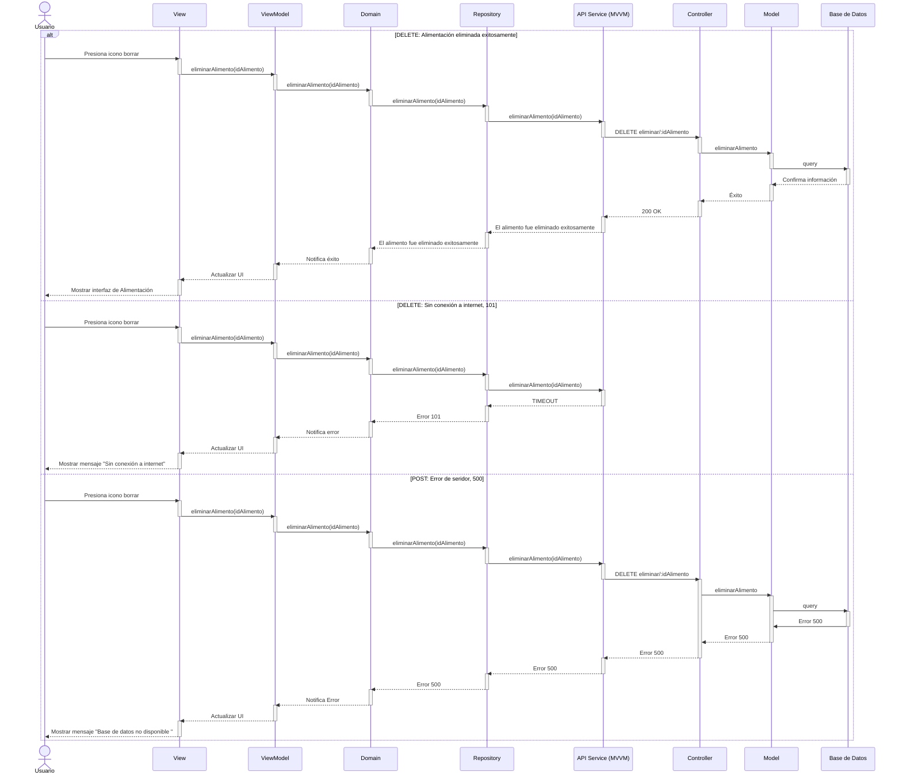

# RF25: Eliminar un tipo de comida 

### Historia de Usuario
Como administrador del sistema, quiero eliminar la información de un tipo de comida registrado en el sistema, para depurar la base de datos y mantener solo los tipos de comida que realmente se utilizan.

  **Criterios de Aceptación:**
  - El sistema debe permitir eliminar un tipo de comida de la lista de registros.
  - Antes de eliminar, se debe mostrar una advertencia de confirmación.
  - La eliminación no debe afectar registros históricos donde se haya utilizado ese tipo de comida.
  
---

### Diagrama de Actividades

<a href="https://drive.google.com/file/d/1tJtklg8l7llueGMtv_O4ge13xw2nTME6/view?usp=sharing" target="_blank" rel="noopener noreferrer">Eliminar un tipo de comida</a>

---

### Diagrama de Secuencia

---

### Pull Request

<a href="https://github.com/CodeAnd-Co/TECH-NEBRIOS-BACKEND/pull/16" target="_blank" rel="noopener noreferrer"> PR de Eliminar un tipo de comida en el sistema Backend</a>

<a href="https://github.com/CodeAnd-Co/TECH-NEBRIOS-FLUTTER/pull/24" target="_blank" rel="noopener noreferrer"> PR de Eliminar un tipo de comida en el sistema Frontend</a>

---

### Mockup

---

## Historial de Cambios

| **Tipo de Versión** | **Descripción**                               | **Fecha** | **Colaborador**                 |
| ------------------- | --------------------------------------------- | --------- | ------------------------------- |
| **1.0**             | Redactar requerimiento funcional y pruebas unitarias  | 8/03/2025 | Armando Méndez|
| **2.0**             | Añadir diagrama de secuencia delete y mockup | 28/04/2025  | Antonio Landeros |
| **2.1**             | Diagramas de actividades   | 23/5/2025  | Juan Eduardo Rosas Cerón |
| **2.2**             | Se corrigió mockup  | 29/5/2025  | Mariana Juárez |