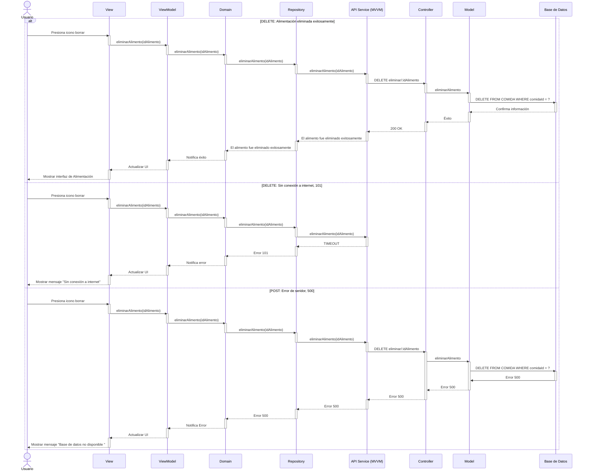

# RF25: Eliminar un tipo de comida 

**Última actualización:** 08 de marzo de 2025

### Historia de Usuario
Como administrador del sistema, quiero eliminar la información de un tipo de comida registrado en el sistema, para depurar la base de datos y mantener solo los tipos de comida que realmente se utilizan.

  **Criterios de Aceptación:**
  - El sistema debe permitir eliminar un tipo de comida de la lista de registros.
  - Solo los administradores deben tener permisos para eliminar un tipo de comida.
  - Antes de eliminar, se debe mostrar una advertencia de confirmación.
  - La eliminación no debe afectar registros históricos donde se haya utilizado ese tipo de comida.
  
---

### Diagrama de Secuencia

> *Descripción*: El diagrama de secuencia muestra cómo el Super Administrador crea un grupo de productos, asigna productos a dicho grupo y guarda la información.

---

### Mockup

> *Descripción*: El mockup muestra la interfaz donde los usuarios pueden visualizar los diferentes tipos de Alimentación.

---

## Historial de Cambios

| **Tipo de Versión** | **Descripción**                               | **Fecha** | **Colaborador**                 |
| ------------------- | --------------------------------------------- | --------- | ------------------------------- |
| **1.0**             | Redactar requerimiento funcional y pruebas unitarias  | 8/03/2025 | Armando Méndez|
| **2.0**             | Añadir diagrama de secuencia delete y mockup | 28/04/2025  | Antonio Landeros |