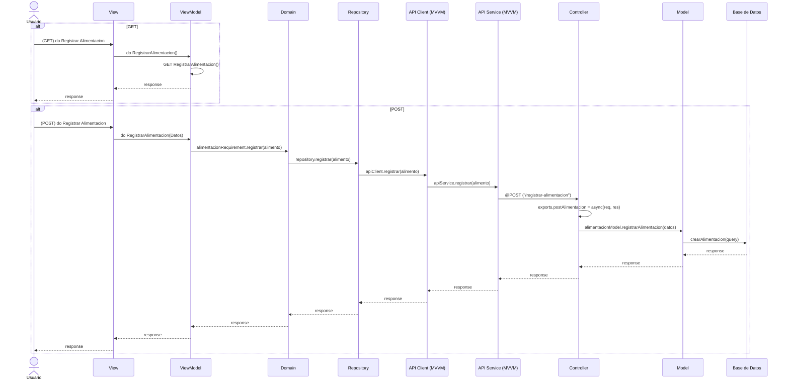

# RF26: Registrar la alimentación de la charola

**Última actualización:** 08 de marzo de 2025

### Historia de Usuario
Como usuario, quiero registrar la alimentación que se le da a una charola, incluyendo el tipo de alimento e hidratación proporcionada, para llevar un control detallado de la nutrición y el bienestar de las larvas y escarabajos.

  **Criterios de Aceptación:**
  - El sistema debe permitir ingresar el tipo y cantidad de alimento e hidratación proporcionada.
  - La información ingresada debe actualizarse en el historial de la charola.
  - Solo los usuarios autorizados deben poder registrar alimentación.

---

### Diagrama de Secuencia

> *Descripción*: El diagrama de secuencia muestra el flujo del proceso de creación de un nuevo empleado, con la interacción entre el Super Administrador, el formulario de ingreso y la base de datos.

---

### Mockup

> *Descripción*: El mockup muestra la interfaz donde el Super Administrador o Cliente pueden ver los grupos de productos y los productos dentro de cada grupo.

### Pruebas Unitarias 
| ID Prueba  | Descripción                                               | Resultado Esperado  |
|------------|-----------------------------------------------------------|---------------------|
| PU-RF26-01 | Registrar alimentación de una charola con datos válidos.  | El sistema guarda correctamente la información y confirma el registro. |
| PU-RF26-02 | Verificar que la información ingresada se actualiza en el historial de la charola. | El sistema refleja los cambios en el historial sin necesidad de recarga. |
| PU-RF26-03 | Intentar registrar alimentación sin especificar tipo o cantidad. | El sistema muestra un mensaje de error indicando que los datos son obligatorios. |
| PU-RF26-04 | Validar que los registros de alimentación sean accesibles en consultas futuras. | La información almacenada puede ser consultada posteriormente sin inconsistencias. |
| PU-RF26-05 | Evaluar el tiempo de respuesta al registrar múltiples entradas de alimentación. | El sistema procesa correctamente la operación sin afectar el rendimiento. |
