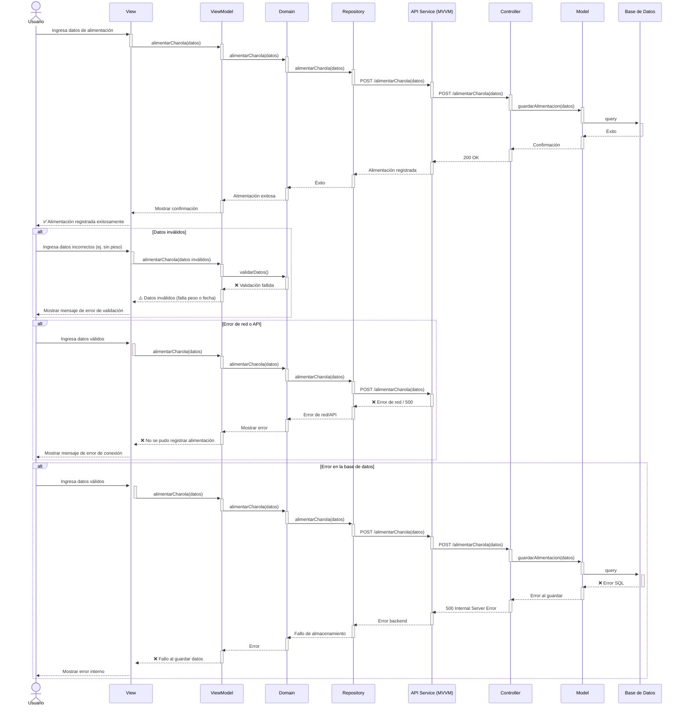

# RF26: Registrar la alimentación de la charola

### Historia de Usuario
Como usuario, quiero registrar la alimentación que se le da a una charola, incluyendo el tipo de alimento y la cantidad. Para llevar un control detallado de la nutrición de las larvas y escarabajos.

  **Criterios de Aceptación:**
  - El sistema debe permitir ingresar el tipo y cantidad de alimento proporcionada.
  - Se debe actualizar la cantidad total de alimento otorgado a la charola
  - La información ingresada debe actualizarse en el historial de la charola.

---

### Diagrama de Secuencia

> *Descripción*: El diagrama de secuencia muestra cómo los usuarios pueden ingresar alimentación a una charola.

---

### Mockup

> *Descripción*: El mockup muestra la interfaz donde se puede registrar la alimentación de una charola

---

### Pull Request

<a href="https://github.com/CodeAnd-Co/TECH-NEBRIOS-BACKEND/pull/35" target="_blank" rel="noopener noreferrer"> PR de Registrar la alimentación de la charola Backend</a>

<a href="https://github.com/CodeAnd-Co/TECH-NEBRIOS-FLUTTER/pull/36" target="_blank" rel="noopener noreferrer"> PR de Registrar la alimentación de la charola Frontend</a>

---
| **Tipo de Versión** | **Descripción**                               | **Fecha**  | **Colaborador**          |
| ------------------- | --------------------------------------------- | ---------- | ------------------------ |
| **1.0**             | Redactar requerimiento funcional              | 20/3/2025  | Armando Méndez           |
| **1.1**             | Modificar historial de cambio                 | 17/05/2025 | Mariana Juárez           |
| **1.2**             | Diagramas de actividades                      | 23/5/2025  | Juan Eduardo Rosas Cerón |
| **1.3**             | Se agregaron los pull request de front y back | 29/5/2025  | Sofía Osorio             |
| **1.4**             | Diagramas de secuencia y mockups              | 29/5/2025  | Juan Eduardo Rosas Cerón |
| **1.5**             | Correcciones a la documentación              | 02/06/2025  | Emiliano Valdivia Lara |