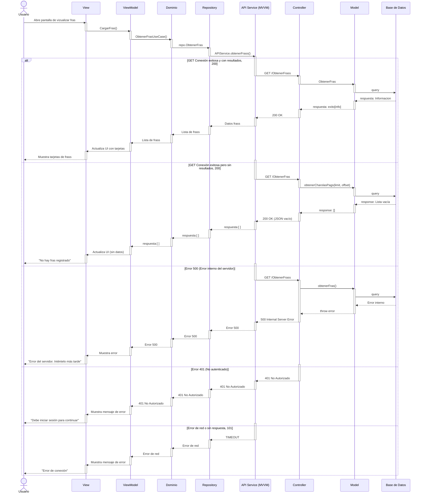

# RF29: Visualizar la información del Frass obtenido

### Historia de Usuario
Como usuario, quiero visualizar la cantidad de frass que se obtuvo después de la tamización, para llevar un control preciso de la producción de frass y optimizar su aprovechamiento.

  **Criterios de Aceptación:**
  - El sistema debe permitir visualizar la cantidad de frass recolectado tras la tamización.
  - Los datos deben actualizarse en tiempo real y ser accesibles para consultas posteriores.

---

### Diseño de algoritmo

<a href="" target="_blank" rel="noopener noreferrer">Visualizar frass</a>

---

### Diagrama de Secuencia

---

### Diagrama de Actividades

<a href="https://drive.google.com/drive/folders/1HYIlTqvObGpABNrKWm7bECPmWNJp0cBq" target="_blank" rel="noopener noreferrer">Visualizar fras</a>

### Mockup

---

# Historial de cambios
| **Tipo de Versión** | **Descripción**                      | **Fecha** | **Colaborador**   |
| ------------------- | ------------------------------------ | --------- | ----------------- |
| **1.0**             | Se agregó historia de usuario        |           | Armando mendez    |
| **2.0**             | Se refactorizó la historia           | 7/05/2025 | Juan Eduardo      |
| **2.1**             | Modificar historial de cambio        | 17/05/2025| Mariana Juárez    |
