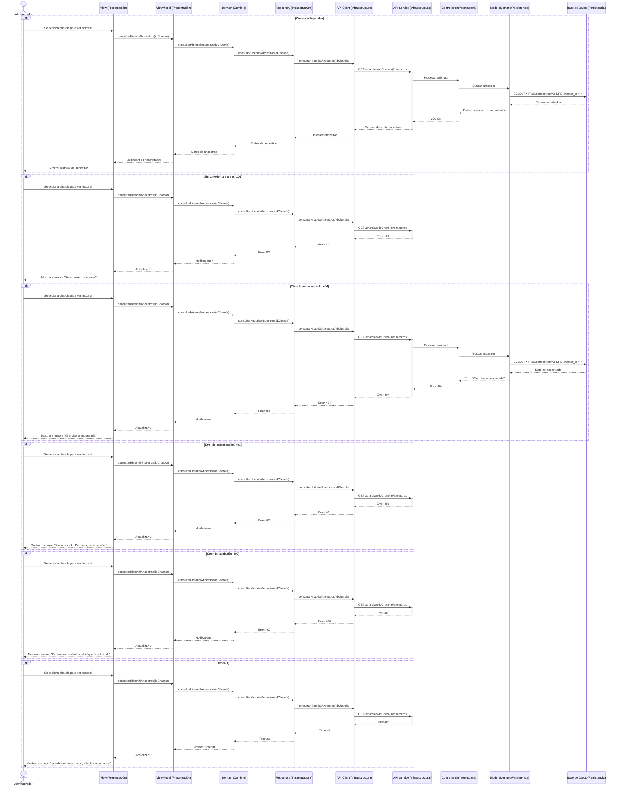

# RF3: Consultar historial de ancestros de una charola

**Última actualización:** 08 de marzo de 2025

### Historia de Usuario
Como usuario del sistema, quiero consultar el historial de ancestros de una charola específica dentro del sistema, para rastrear su origen y evolución, asegurando un mejor control sobre la producción.

  **Criterios de Aceptación:**
  - El sistema debe permitir al administrador seleccionar una charola específica.
  - Se debe mostrar el historial completo de la charola, incluyendo las charolas de las que proviene.
  - La información debe presentarse de manera clara y organizada, utilizando una estructura visual intuitiva que facilite la vista de los datos.
  - La visualización del historial debe actualizarse en tiempo real conforme se registren nuevos datos.
  - La interfaz debe permitir la navegación entre generaciones de charolas para rastrear su evolución y procedencia de manera eficiente.

---

### Diagrama de Secuencia

> El diagrama de secuencia ilustra cómo un Administrador interactúa con el sistema para consultar el historial de ancestros de una charola. La interacción comienza cuando el Administrador selecciona la charola en la interfaz (View). Esta acción se propaga al ViewModel y luego al Domain, que se encarga de la lógica del negocio. Desde allí, la solicitud se dirige al Repository y continúa a través del APIClient y APIService, llegando finalmente al Controller y al Model, que consulta la base de datos para obtener los datos requeridos. Una vez recuperados, la información se retorna siguiendo la misma cadena hasta actualizar la interfaz y mostrar el historial. 

# Consultar historial de ancestros de una charola

---

### Mockup

> *Descripción*: El mockup muestra la pantalla donde el Super Administrador puede eliminar un cliente, con la opción de confirmación antes de ejecutar la acción.

### Pruebas Unitarias 
| ID Prueba  | Descripción                                               | Resultado Esperado  |
|------------|-----------------------------------------------------------|---------------------|
| PU-RF3-01  | Consultar el historial de una charola que tiene ancestros registrados. | El sistema muestra correctamente todas las charolas de las que proviene la charola seleccionada. |
| PU-RF3-02  | Consultar el historial de una charola sin ancestros registrados. | El sistema indica que no hay datos disponibles sin generar errores. |
| PU-RF3-03  | Verificar la actualización del historial en tiempo real. | Si se registra un nuevo ancestro, el historial se actualiza automáticamente sin necesidad de recargar la página. |
| PU-RF3-04  | Buscar una charola inexistente. | El sistema muestra un mensaje de error indicando que la charola no existe. |
| PU-RF3-05  | Validar la navegación entre generaciones de charolas. | El sistema permite desplazarse entre diferentes niveles de ancestros sin fallos. |
