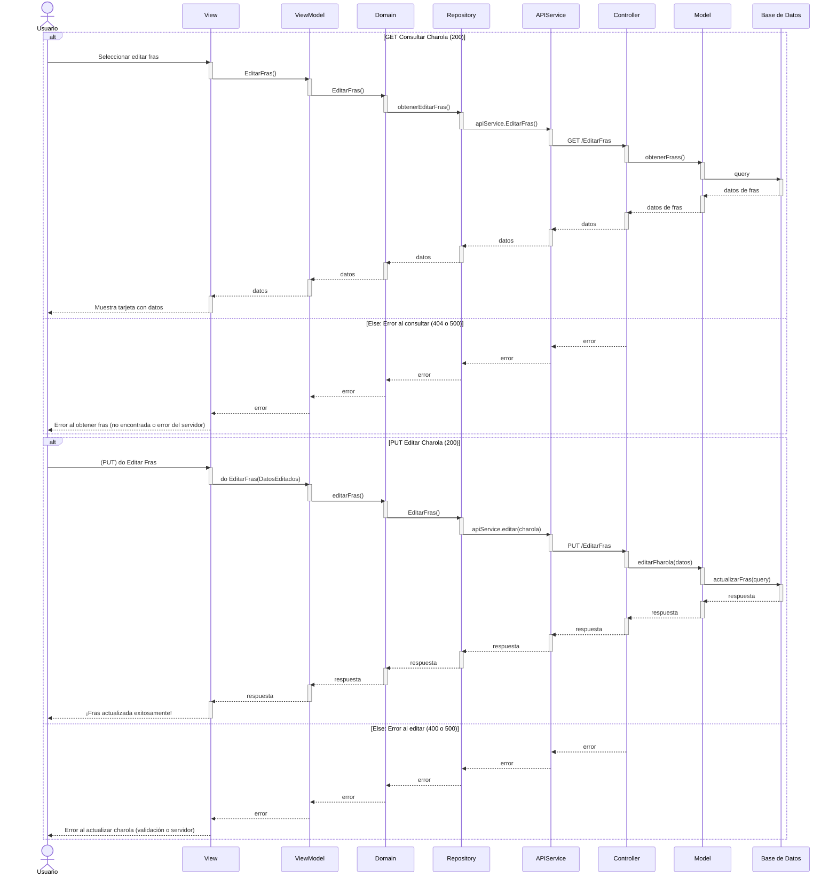

# RF30: Editar la información del Frass obtenido

### Historia de Usuario
Como usuario, quiero editar el registro del frass que se obtuvo después de la tamización, para corregir errores o actualizar la cantidad de frass recolectado y mantener un control preciso.

  **Criterios de Aceptación:**
  - El sistema debe permitir modificar la cantidad de frass registrada en el sistema.
  - Los cambios deben reflejarse de inmediato en la base de datos.

---

### Diagrama de Secuencia

### Diagrama de Actividades

<a href="https://drive.google.com/file/d/1wXjZdrIQDi6V7yPiISQ4ynHQe9EMbDED/view?usp=sharing" target="_blank" rel="noopener noreferrer">Editar la información del Frass obtenido</a>

---

### Diagrama de Secuencia

---

### Mockup

---
# Historial de cambios
| **Tipo de Versión** | **Descripción**                      | **Fecha** | **Colaborador**   |
| ------------------- | ------------------------------------ | --------- | ----------------- |
| **1.0**             | Se agregó historia de usuario        | 5/03/25   | Armando mendez    |
| **1.2**             | Modificar historial de cambio        | 17/05/2025| Mariana Juárez    |
| **1.3**             | Diagramas de actividades   | 23/5/2025  | Juan Eduardo Rosas Cerón |
