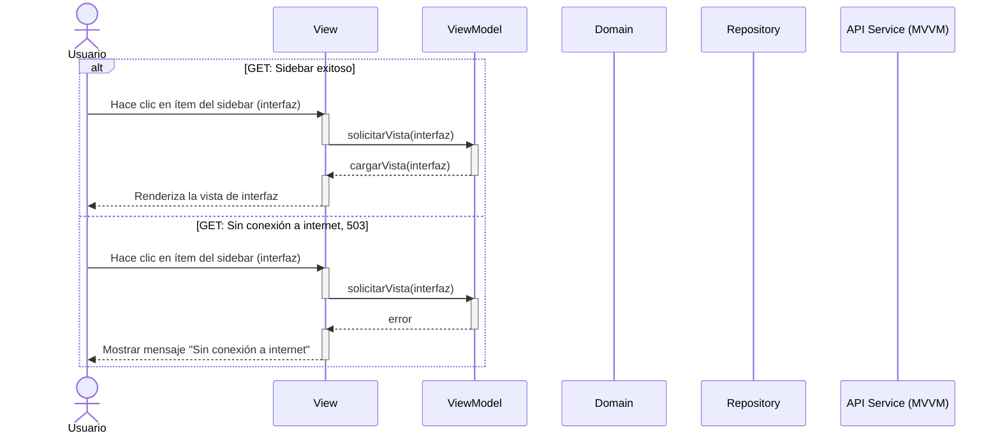

# RF34: Sidebar

### Historia de Usuario
Como usuario del sistema, quiero acceder a las diferentes interfaces a través del sidebar, para encontrar de manera más fácil todas las funcionalidades del sistema.

  **Criterios de Aceptación:**
  - El sidebar debe estar visible en todas las pantallas principales del sistema.
  - El sidebar debe contener enlaces a todas las interfaces principales del sistema 
  - Cada ítem del sidebar debe ser identificable con un ícono y un texto descriptivo.

---

### Diagrama de Actividades

<a href="https://drive.google.com/file/d/1BmNvFYGEb3QUwJI_yTZkxFBEh8wpzNWe/view?usp=sharing" target="_blank" rel="noopener noreferrer">SideBar</a>

---

### Diagrama de Secuencia

---

### Mockup

---
# Historial de cambios
| **Tipo de Versión** | **Descripción**                      | **Fecha** | **Colaborador**   |
| ------------------- | ------------------------------------ | --------- | ----------------- |
| **1.0**             | Se agregó historia de usuario        | 7/05/2025 | Mariana Juárez    |
| **1.1**             | Se agregó diagrama de secuencia      | 7/05/2025 | Mariana Juárez    |
| **1.2**             | Se agregó mockup                     | 7/05/2025 | Mariana Juárez    |
| **1.2**             | Diagramas de actividades   | 23/5/2025  | Juan Eduardo Rosas Cerón |
| **1.3**             | Se corrigió mockup  | 29/5/2025  | Mariana Juárez |