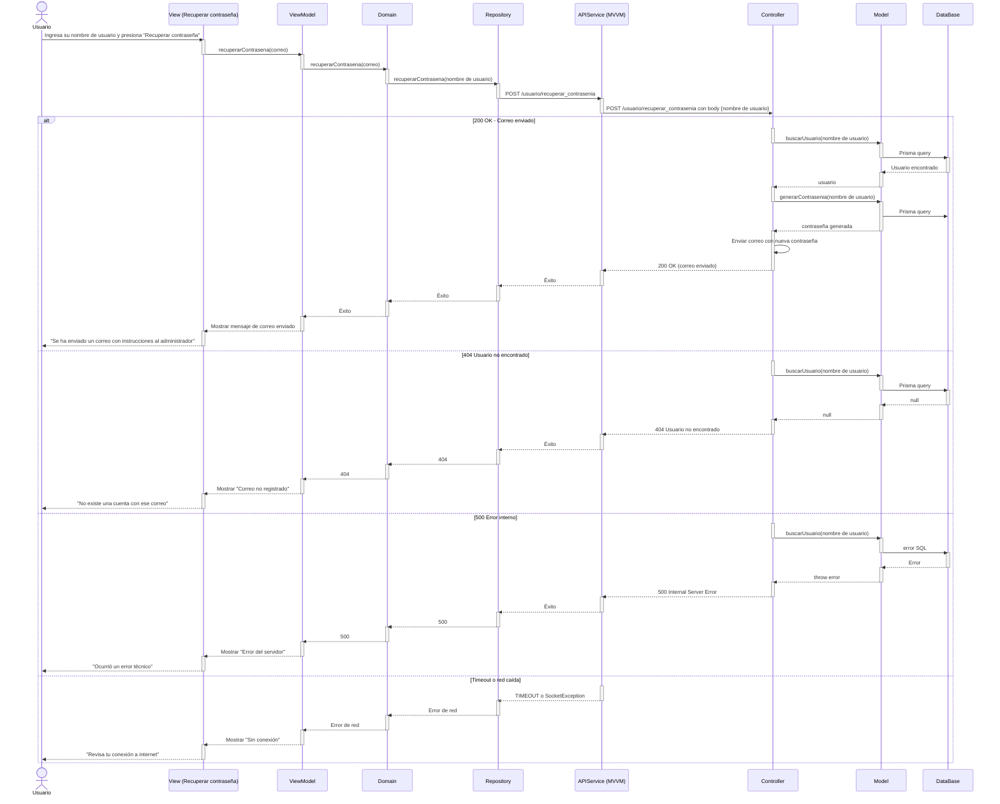
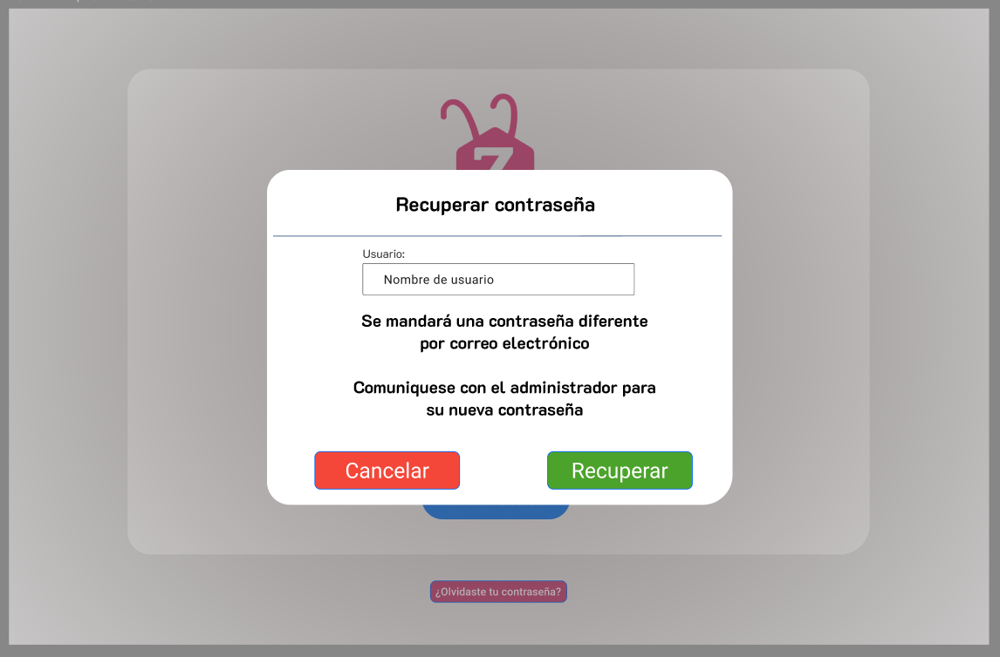

# RF35: Recuperar contraseña

### Historia de Usuario

Como usuario del sistema, quiero poder recuperar mi contraseña, para que en el caso de haberla perdido u olvidado ser aún capaz de acceder

**Criterios de Aceptación:**

- El sistema debe de mandar un correo de cambio de contraseña
- El sistema debe de aceptar la nueva contraseña despues de cambiarla
- El sistema manda mensajes de error en el caso de mandar un correo nulo, error al mandar la contraseña, correo no encontrado.
- El sistema manda mensajes de éxito en el caso de mandar un correo válido, éxito al mandar la contraseña.
- El sistema pone un límite de 50 carácteres para ingresar un correo.

---

### Diseño de algoritmos

<a class="button button--primary" href="https://docs.google.com/document/d/1Fw-wAR6QRUfFv-DvijpQHjCaDIcgDKM7RmQ0RLOr6tU/edit?tab=t.0">
  Diseño de algoritmos
</a>

### Diagrama de Secuencia

---

### Mockup

---

# Historial de cambios

| **Tipo de Versión** | **Descripción**                              | **Fecha**  | **Colaborador** |
| ------------------- | -------------------------------------------- | ---------- | --------------- |
| **1.0**             | Se agregó historia de usuario                | 7/05/2025  | Juan Eduardo    |
| **1.1**             | Modificar historial de cambio                | 18/05/2025 | Mariana Juárez  |
| **1.2**             | Mockup y criterios de aceptación             | 3/06/2025  | Juan Eduardo    |
| **1.3**             | Diagrama de secuencia y diseño de algoritmos | 6/06/2025  | Juan Eduardo    |
