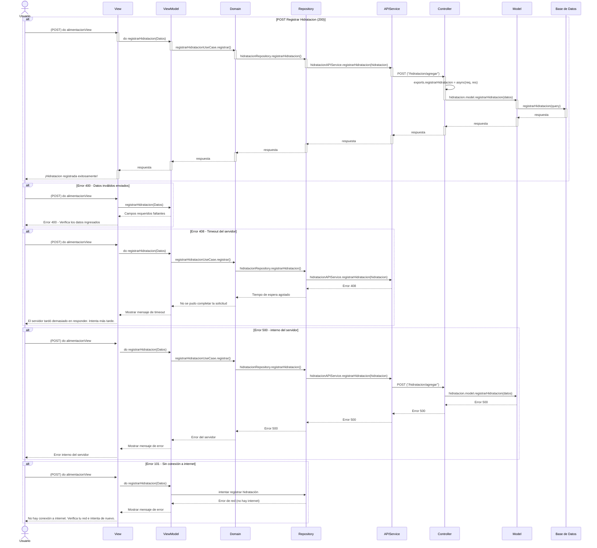
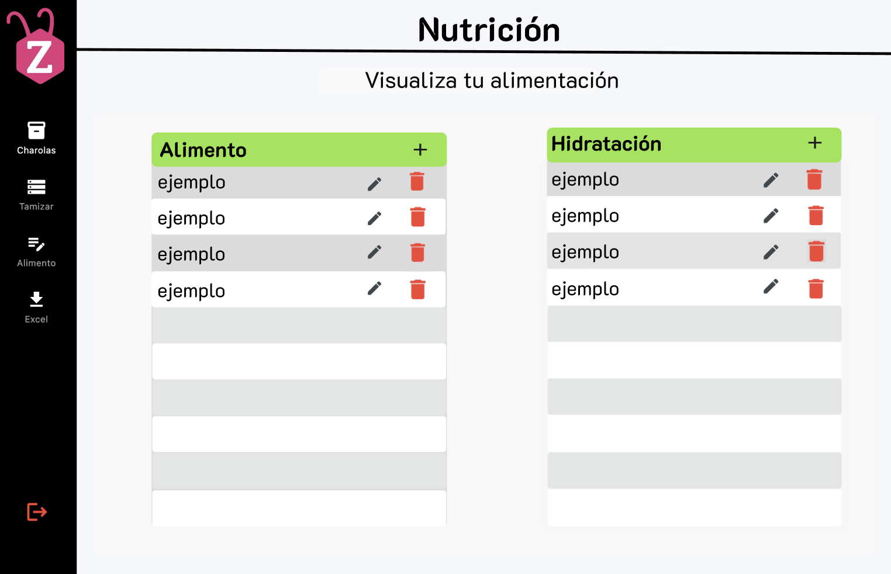

# RF36: Registrar un nuevo tipo de hidratación al sistema

### Historia de Usuario

Como usuario, quiero registar un nuevo tipo de hidratación, agregando nombre de la hidratación y una descripción, para poder registrarlo y analizar cual es la mejor hidratación para las charolas.

**Criterios de Aceptación:**

- El sistema debe permitir registrar un nuevo tipo de hidratación
- Los datos deben actualizarse en tiempo real
- Debe existir mensajes de retroalimentación al usuario para:
  - Registro éxitoso
  - Cuando no se llenan los campos necesarios
  - Cuando ingresa caracteres no permitidos
  - Cuando no hay conexión con el backend
- Entradas esperadas:
  - Nombre: Solo letras y un máximo de 25 caracteres
  - Descripción: Menor a 200 caracteres
  - Ambos campos son obligatorios
- Entradas NO esperada:
  - Nombre: Numeros
  - Descripción: Supera el numero de 200 carácter

---

### Diagrama de Actividades

<a href="https://drive.google.com/file/d/1I72-aFnFG6rUJyzqU8MgSBDYk7jxT_KW/view?usp=sharing" target="_blank" rel="noopener noreferrer">Registrar un nuevo tipo de hidratación al sistema</a>

---

### Diseño de Algoritmos

[Diseño de Algoritmos - Registrar un nuevo tipo de hidratación](https://docs.google.com/document/d/17ykginPOOZBEts4rG-DLyCS-9LmCjrU1EDdOP4TaqO4/edit?usp=drive_link)

---

### Diagrama de Secuencia

> _Descripción_:

---

### Pull Request

---

### Mockup

# Historial de cambios

| **Tipo de Versión** | **Descripción**                                       | **Fecha**  | **Colaborador**          |
| ------------------- | ----------------------------------------------------- | ---------- | ------------------------ |
| **1.0**             | Se agregó historia de usuario                         | 7/05/2025  | Juan Eduardo             |
| **1.1**             | Modificar historial de cambio                         | 17/05/2025 | Mariana Juárez           |
| **1.2**             | Agrega Diagrama de Secuencia y Mockup                 | 19/05/2025 | Emiliano Gomez Gonzalez  |
| **1.2**             | Diagramas de actividades                              | 23/5/2025  | Juan Eduardo Rosas Cerón |
| **1.3**             | Se corrigió mockup                                    | 29/5/2025  | Mariana Juárez           |
| **1.4**             | Correcciones de criterios de aceptación y descripción | 02/06/2025 | Emiliano Gomez Gonzalez  |
| **1.5**             | Agrega Diseño de Algoritmo                            | 02/06/2025 | Emiliano Gomez Gonzalez  |
