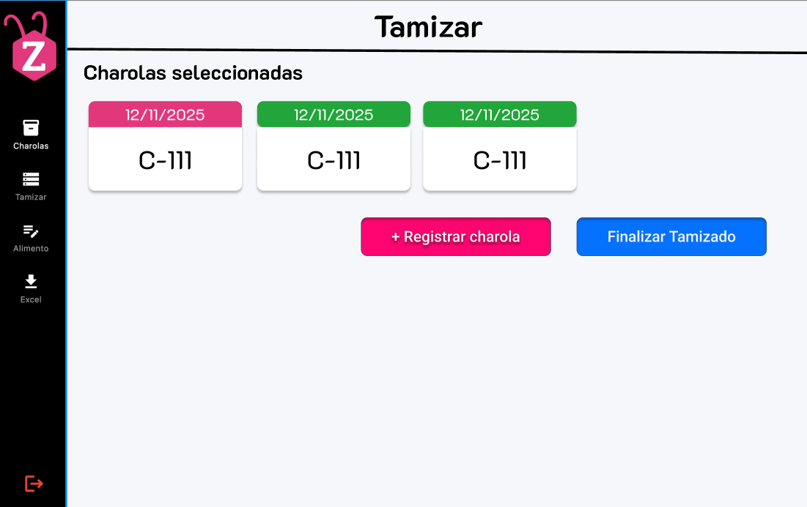

# RF38: Registrar nuevas charolas del tamizado

### Historia de Usuario
Como usuario del sistema, quiero registrar nuevas charolas resultado del tamizado, para hacer seguimiendo de las charolas hijas y de sus datos

  **Criterios de Aceptación:**
  - El sistema debe permitir registrar charolas nuevas generadas apartir del tamizado
  - El sistema debe de actualizar los datos en tiempo real

---

### Diagrama de Actividades

<a href="https://drive.google.com/drive/folders/1sjulVfzuByaacpwpCluRtI-HbuReOk_b" target="_blank" rel="noopener noreferrer">Registrar nuevas charolas del tamizado</a>

---

### Diagrama de Secuencia

```mermaid
sequenceDiagram
    actor Usuario 
    participant View as View
    participant ViewModel as ViewModel
    participant Domain as Domain
    participant Repository as Repository
    participant APIService as API Service (MVVM)
    participant Controller as Controller
    participant Model as Model
    participant Database as Base de Datos




    alt GET Historial ancestros, 200
        Usuario->>+View: Clic en botón "Historial"
        View->>-ViewModel: obtenerAncestros(charolaId)
        activate ViewModel 
        ViewModel->>Domain: obtenerAncestros(charolaId)
        deactivate ViewModel 
        activate Domain
        Domain->>Repository: obtenerAncestros(charolaId)
        deactivate Domain
        activate Repository
        Repository->>APIService: obtenerAncestros(charolaId)
        deactivate Repository
        activate APIService
        APIService->>Controller: GET /:charolaId/historial
        deactivate APIService
        activate Controller
        Controller->>Model: obtenerHistorialAncestros()
        deactivate Controller
        activate Model
        Model->>Database: Query
        deactivate Model
        activate Database

        Database-->>Model: Informacion
        deactivate Database
        activate Model
        Model-->>Controller: Éxito [Info]
        deactivate Model
        activate Controller
        Controller-->>APIService: 200 OK [Info]
        deactivate Controller
        activate APIService
        APIService-->>Repository: [Info]
        deactivate APIService
        activate Repository
        Repository-->>Domain: [Info]
        deactivate Repository
        activate Domain
        Domain-->>ViewModel: Cargar informacion
        deactivate Domain
        activate ViewModel
        ViewModel-->>View: Actualizar UI
        deactivate ViewModel
        activate View
        View-->>Usuario: Mostrar interfaz de historial de ancestros
        deactivate View
    
    else GET No se encontraron datos, 200
        Usuario->>+View: Clic en botón "Historial"
        View->>-ViewModel: obtenerAncestros(charolaId)
        activate ViewModel 
        ViewModel->>Domain: obtenerAncestros(charolaId)
        deactivate ViewModel 
        activate Domain
        Domain->>Repository: obtenerAncestros(charolaId)
        deactivate Domain
        activate Repository
        Repository->>APIService: obtenerAncestros(charolaId)
        deactivate Repository
        activate APIService
        APIService->>Controller: GET /:charolaId/historial
        deactivate APIService
        activate Controller
        Controller->>Model: obtenerHistorialAncestros()
        deactivate Controller
        activate Model
        Model->>Database: Query
        deactivate Model
        activate Database

        Database-->>Model: [ ]
        deactivate Database
        activate Model
        Model-->>Controller: Éxito [ ]
        deactivate Model
        activate Controller
        Controller-->>APIService: 200 OK [ ]
        deactivate Controller
        activate APIService
        APIService-->>Repository: [ ]
        deactivate APIService
        activate Repository
        Repository-->>Domain: [ ]
        deactivate Repository
        activate Domain
        Domain-->>ViewModel: Informacion vacia
        deactivate Domain
        activate ViewModel
        ViewModel-->>View: Actualizar UI
        deactivate ViewModel
        activate View
        View-->>Usuario: Mostrar mensaje no hay ancestros
        deactivate View

    else GET Error de servidor, 500
        Usuario->>+View: Clic en botón "Historial"
        View->>-ViewModel: obtenerAncestros(charolaId)
        activate ViewModel 
        ViewModel->>Domain: obtenerAncestros(charolaId)
        deactivate ViewModel 
        activate Domain
        Domain->>Repository: obtenerAncestros(charolaId)
        deactivate Domain
        activate Repository
        Repository->>APIService: obtenerAncestros(charolaId)
        deactivate Repository
        activate APIService
        APIService->>Controller: GET /:charolaId/historial
        deactivate APIService
        activate Controller
        Controller->>Model: obtenerHistorialAncestros()
        activate Model
        Model->>Database: Query
        activate Database

        Database-->>Model: Error 500
        deactivate Database
        Model-->>Controller: Error 500
        deactivate Model
        Controller-->>APIService: Error 500
        deactivate Controller
        activate APIService
        APIService-->>Repository: Error 500
        deactivate APIService
        activate Repository
        Repository-->>Domain: Error 500
        deactivate Repository
        activate Domain
        Domain-->>ViewModel: Error del servidor
        deactivate Domain
        activate ViewModel
        ViewModel-->>View: Actualizar UI
        deactivate ViewModel
        activate View
        View-->>Usuario: Mostrar mensaje Error de servidor
        deactivate View

    else GET No hay inicio de sesión, 401
        Usuario->>+View: Clic en botón "Historial"
        View->>-ViewModel: obtenerAncestros(charolaId)
        activate ViewModel 
        ViewModel->>Domain: obtenerAncestros(charolaId)
        deactivate ViewModel 
        activate Domain
        Domain->>Repository: obtenerAncestros(charolaId)
        deactivate Domain
        activate Repository
        Repository->>APIService: obtenerAncestros(charolaId)
        deactivate Repository
        activate APIService
        APIService->>Controller: GET /:charolaId/historial
        deactivate APIService
        activate Controller

        Controller-->>APIService: 401 No Autorizado
        deactivate Controller
        activate APIService
        APIService-->>Repository: 401 No Autorizado
        deactivate APIService
        activate Repository
        Repository-->>Domain: 401 No Autorizado
        deactivate Repository
        activate Domain
        Domain-->>ViewModel: 401 No Autorizado
        deactivate Domain
        activate ViewModel
        ViewModel-->>View: Notificar falta de Inicio de sesión
        deactivate ViewModel
        activate View
        View-->>Usuario: Regresar al View de Inicio de sesión
        deactivate View

    else GET Sin conexión a internet, 101
        Usuario->>+View: Clic en botón "Historial"
        View->>-ViewModel: obtenerAncestros(charolaId)
        activate ViewModel 
        ViewModel->>Domain: obtenerAncestros(charolaId)
        deactivate ViewModel 
        activate Domain
        Domain->>Repository: obtenerAncestros(charolaId)
        deactivate Domain
        activate Repository
        Repository->>APIService: obtenerAncestros(charolaId)
        deactivate Repository
        activate APIService

        APIService-->>Repository: TIMEOUT
        deactivate APIService
        activate Repository
        Repository-->>Domain: Error 101
        deactivate Repository
        activate Domain
        Domain-->>ViewModel: Notifica error
        deactivate Domain
        activate ViewModel
        ViewModel-->>View: Actualizar UI
        deactivate ViewModel
        activate View
        View-->>Usuario: Mostrar mensaje "Sin conexión a internet"
        deactivate View
    end
```

---

### Mockup

---
### Pull Request

<a href="https://github.com/CodeAnd-Co/TECH-NEBRIOS-BACKEND/pull/39" target="_blank" rel="noopener noreferrer"> PR de Registrar nuevas charolas del tamizado Backend</a>

<a href="https://github.com/CodeAnd-Co/TECH-NEBRIOS-FLUTTER/pull/44" target="_blank" rel="noopener noreferrer"> PR de Registrar nuevas charolas del tamizado Frontend</a>

---

# Historial de cambios
| **Tipo de Versión** | **Descripción**                      | **Fecha** | **Colaborador**   |
| ------------------- | ------------------------------------ | --------- | ----------------- |
| **1.0**             | Se agregó historia de usuario        | 7/05/2025 | Juan Eduardo      |
| **1.1**             | Modificar historial de cambio        | 17/05/2025| Mariana Juárez    |
| **1.2**             | Se agregaron los pull request de front y back | 29/5/2025  | Sofía Osorio |