# RF39: Visualizar charolas eliminadas

### Historia de Usuario
Como usuario del sistema, quiero visualizar las charolas que han sido eliminadas, para conocer los motivos por los cuales ya no están disponibles y tener un mejor seguimiento del proceso.

  **Criterios de Aceptación:**
  - El sistema debe permitir consultar un historial de charolas eliminadas con fecha, responsable y motivo.
  - El sistema debe actualizar la información de manera automática.
  - En el caso de que no existan charolas eliminadas registradas, se mostrará un mensaje de error
  - En el caso de un error del servidor se mostrará un mensaje de error
---

### Diseño de algoritmo

[Pseudocódigo](https://docs.google.com/document/d/1YeWX9vrjLOUhyyltg79Ae0GxC9BjMXmpdmJLaZ8soCA/edit?usp=sharing)

---

### Diagrama de Secuencia

```mermaid
sequenceDiagram
    actor Usuario
    participant View as View
    participant ViewModel as ViewModel
    participant Domain as Domain
    participant Repository as Repository
    participant APIService as API Service (MVVM)
    participant Controller as Controller
    participant Model as Model
    participant Database as Base de Datos

    alt GET Datos tabla, 200
        Usuario->>+View: Entra a la interfaz
        View->>-ViewModel: getEliminadas()
        activate ViewModel
        ViewModel->>Domain: getEliminadas()
        deactivate ViewModel
        activate Domain
        Domain->>Repository: getEliminadas()
        deactivate Domain
        activate Repository
        Repository->>APIService: getEliminadas()
        deactivate Repository
        activate APIService
        APIService->>Controller: GET /getEliminadas
        deactivate APIService
        activate Controller
        Controller->>Model: getEliminadas
        deactivate Controller
        activate Model
        Model->>Database: query
        deactivate Model
        activate Database

        Database-->>Model: Informacion
        deactivate Database
        activate Model
        Model-->>Controller: Éxito [Info]
        deactivate Model
        activate Controller
        Controller-->>APIService: 200 OK [Info]
        deactivate Controller
        activate APIService
        APIService-->>Repository: [Info]
        deactivate APIService
        activate Repository
        Repository-->>Domain: [Info]
        deactivate Repository
        activate Domain
        Domain-->>ViewModel: Cargar informacion
        deactivate Domain
        activate ViewModel
        ViewModel-->>View: Actualizar UI
        deactivate ViewModel
        activate View
        View-->>Usuario: Mostrar interfaz de tabla de charolas
        deactivate View

    else GET No se encontraron datos, 200
        Usuario->>+View: Entra a la interfaz
        View->>-ViewModel: getEliminadas()
        activate ViewModel
        ViewModel->>Domain: getEliminadas()
        deactivate ViewModel
        activate Domain
        Domain->>Repository: getEliminadas()
        deactivate Domain
        activate Repository
        Repository->>APIService: getEliminadas()
        deactivate Repository
        activate APIService
        APIService->>Controller: GET /getEliminadas
        deactivate APIService
        activate Controller
        Controller->>Model: getEliminadas
        deactivate Controller
        activate Model
        Model->>Database: query
        deactivate Model
        activate Database

        Database-->>Model: [ ]
        deactivate Database
        activate Model
        Model-->>Controller: Éxito [ ]
        deactivate Model
        activate Controller
        Controller-->>APIService: 200 OK [ ]
        deactivate Controller
        activate APIService
        APIService-->>Repository: [ ]
        deactivate APIService
        activate Repository
        Repository-->>Domain: [ ]
        deactivate Repository
        activate Domain
        Domain-->>ViewModel: Informacion vacia
        deactivate Domain
        activate ViewModel
        ViewModel-->>View: Actualizar UI
        deactivate ViewModel
        activate View
        View-->>Usuario: Mostrar mensaje no hay charolas registradas
        deactivate View

    else GET Error de servidor, 500
        Usuario->>+View: Entra a la interfaz
        View->>-ViewModel: getEliminadas()
        activate ViewModel
        ViewModel->>Domain: getEliminadas()
        deactivate ViewModel
        activate Domain
        Domain->>Repository: getEliminadas()
        deactivate Domain
        activate Repository
        Repository->>APIService: getEliminadas()
        deactivate Repository
        activate APIService
        APIService->>Controller: GET /getEliminadas
        deactivate APIService
        activate Controller
        Controller->>Model: getEliminadas
        activate Model
        Model->>Database: query
        activate Database

        Database-->>Model: Error 500
        deactivate Database
        Model-->>Controller: Error 500
        deactivate Model
        Controller-->>APIService: Error 500
        deactivate Controller
        activate APIService
        APIService-->>Repository: Error 500
        deactivate APIService
        activate Repository
        Repository-->>Domain: Error 500
        deactivate Repository
        activate Domain
        Domain-->>ViewModel: Error del servidor
        deactivate Domain
        activate ViewModel
        ViewModel-->>View: Actualizar UI
        deactivate ViewModel
        activate View
        View-->>Usuario: Mostrar mensaje Error de servidor
        deactivate View

    else GET No hay inicio de sesión, 401
        Usuario->>+View: Entra a la interfaz
        View->>-ViewModel: getEliminadas()
        activate ViewModel
        ViewModel->>Domain: getEliminadas()
        deactivate ViewModel
        activate Domain
        Domain->>Repository: getEliminadas()
        deactivate Domain
        activate Repository
        Repository->>APIService: getEliminadas()
        deactivate Repository
        activate APIService
        APIService->>Controller: GET /getEliminadas
        deactivate APIService
        activate Controller

        Controller-->>APIService: 401 No Autorizado
        deactivate Controller
        activate APIService
        APIService-->>Repository: 401 No Autorizado
        deactivate APIService
        activate Repository
        Repository-->>Domain: 401 No Autorizado
        deactivate Repository
        activate Domain
        Domain-->>ViewModel: 401 No Autorizado
        deactivate Domain
        activate ViewModel
        ViewModel-->>View: Notificar falta de Inicio de sesión
        deactivate ViewModel
        activate View
        View-->>Usuario: Regresar al View de Inicio de sesión
        deactivate View

    else GET No hay permiso de acceso, 403
        Usuario->>+View: Entra a la interfaz
        View->>-ViewModel: getEliminadas()
        activate ViewModel
        ViewModel->>Domain: getEliminadas()
        deactivate ViewModel
        activate Domain
        Domain->>Repository: getEliminadas()
        deactivate Domain
        activate Repository
        Repository->>APIService: getEliminadas()
        deactivate Repository
        activate APIService
        APIService->>Controller: GET /getEliminadas
        deactivate APIService
        activate Controller

        Controller-->>APIService: 403 No Autorizado, permisos insuficientes
        deactivate Controller
        activate APIService
        APIService-->>Repository: 403 No Autorizado, permisos insuficientes
        deactivate APIService
        activate Repository
        Repository-->>Domain: 403 No Autorizado, permisos insuficientes
        deactivate Repository
        activate Domain
        Domain-->>ViewModel: 403 No Autorizado, permisos insuficientes
        deactivate Domain
        activate ViewModel
        ViewModel-->>View: Notificar falta de Inicio de sesión
        deactivate ViewModel
        activate View
        View-->>Usuario: Regresar al View de Inicio de sesión
        deactivate View

    else GET Sin conexión a internet, 503
        Usuario->>+View: Entra a la interfaz
        View->>-ViewModel: getEliminadas()
        activate ViewModel
        ViewModel->>Domain: getEliminadas()
        deactivate ViewModel
        activate Domain
        Domain->>Repository: getEliminadas()
        deactivate Domain
        activate Repository
        Repository->>APIService: getEliminadas()
        deactivate Repository
        activate APIService

        APIService-->>Repository: TIMEOUT
        deactivate APIService
        activate Repository
        Repository-->>Domain: Error 503
        deactivate Repository
        activate Domain
        Domain-->>ViewModel: Notifica error
        deactivate Domain
        activate ViewModel
        ViewModel-->>View: Actualizar UI
        deactivate ViewModel
        activate View
        View-->>Usuario: Mostrar mensaje "Sin conexión a internet"
        deactivate View
    end


```

---

### Mockup

---

# Historial de cambios
| **Tipo de Versión** | **Descripción**                      | **Fecha** | **Colaborador**   |
| ------------------- | ------------------------------------ | --------- | ----------------- |
| **1.0**             | Se agregó historia de usuario        | 17/05/2025 | Mariana Juárez   |
| **2.0**             | Agregado mockup y actualizados criterios de aceptacion        | 02/06/2025 | Emiliano Valdivia   |
| **2.1**             | Actualizado mockup        | 02/06/2025 | Emiliano Valdivia   |
| **2.2**             | Agregado diseño de la HU        | 05/06/2025 | Emiliano Valdivia   |
| **2.3**             | Expandidos criterios de aceptacion        | 06/06/2025 | Emiliano Valdivia   |

