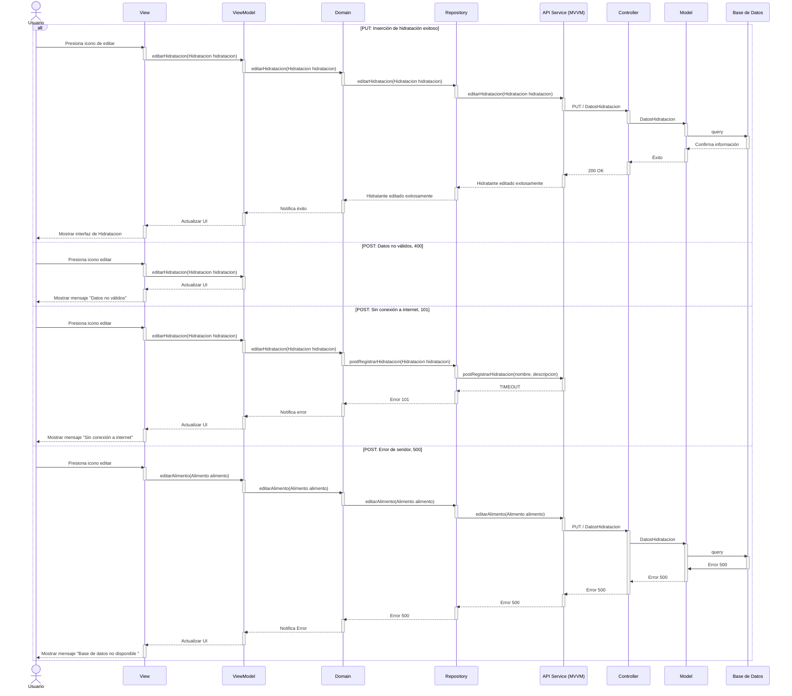
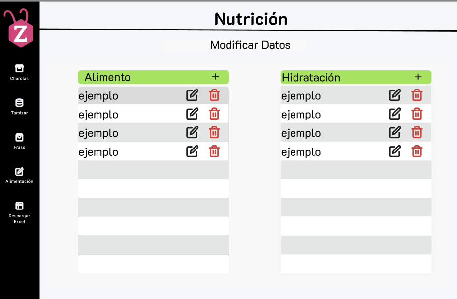

# RF40: Editar un tipo de hidratación en el sistema

### Historia de Usuario
Como administrador del sistema, quiero editar la información general de un tipo de hidratación registrado en el sistema, para actualizar sus características, cantidades recomendadas o cualquier ajuste necesario en la hidratación.

  **Criterios de Aceptación:**
  - El sistema debe permitir modificar los datos de un tipo de hidratación previamente registrado.
  - Los cambios deben reflejarse de inmediato y actualizarse en los registros históricos.

---

### Diagrama de Actividades

<a href="https://drive.google.com/file/d/15h4nlfh_J3wBD_Ik7ffYfvSzoWUFdwn7/view?usp=sharing" target="_blank" rel="noopener noreferrer">Editar un tipo de hidratación en el sistema</a>

---

### Diagrama de Secuencia

---

### Mockup

---

# Historial de cambios
| **Tipo de Versión** | **Descripción**                      | **Fecha**  | **Colaborador**   |
| ------------------- | ------------------------------------ | ---------- | ----------------- |
| **1.0**             | Se agregó historia de usuario        | 17/05/2025 | Mariana Juárez    |
| **1.1**             | Se agregó diagrama de secuencia y mockup        | 19/05/2025 | Mariana Juárez    |
