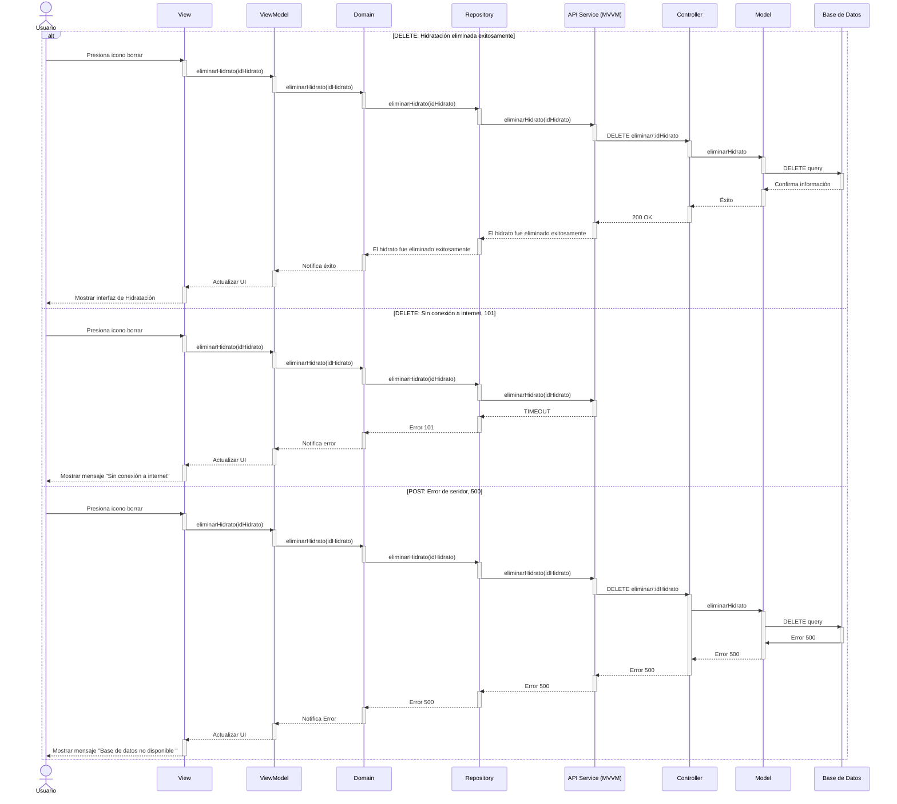

# RF41: Eliminar un tipo de hidratación en el sistema

### Historia de Usuario
Como usuario del sistema, quiero eliminar la información de un tipo de comida registrado en el sistema, para depurar la base de datos y mantener solo los tipos de comida que realmente se utilizan.

  **Criterios de Aceptación:**
  - El sistema debe permitir eliminar un tipo de hidratación de la lista de registros.
  - Antes de eliminar, se debe mostrar una advertencia de confirmación.
  - La eliminación no debe afectar registros históricos donde se haya utilizado ese tipo de comida.

---

### Diagrama de Actividades

<a href="https://drive.google.com/file/d/11t_hSiiQWYuzQU8yxgHYBLtnJxA5Tz87/view?usp=sharing" target="_blank" rel="noopener noreferrer">Eliminar un tipo de hidratación en el sistema</a>

---

### Diagrama de Secuencia

---

### Mockup

---

# Historial de cambios
| **Tipo de Versión** | **Descripción**                      | **Fecha**  | **Colaborador**   |
| ------------------- | ------------------------------------ | ---------- | ----------------- |
| **1.0**             | Se agregó historia de usuario        | 18/05/2025 | Mariana Juárez    |
| **1.1**             | Agregar diagrama de secuencia y mockup        | 20/05/2025 | Sofía Osorio    |
| **1.2**             | Diagramas de actividades   | 23/5/2025  | Juan Eduardo Rosas Cerón |