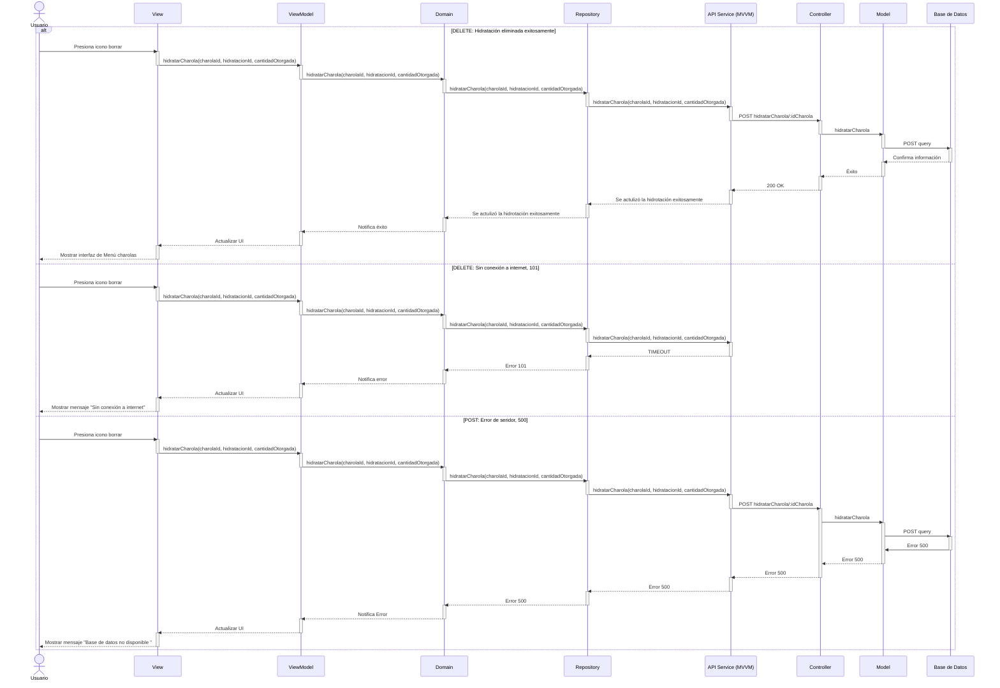

# RF42: Registrar la hidratación de la charola 

### Historia de Usuario
Como usuario, quiero registrar la hidratación que se le va a dar en ese momento a la charola registrada en el sistema, para tener el registro del ciclo de la hidratación que se le da a la charola.

  **Criterios de Aceptación:**
  - El sistema debe permitir ingresar el tipo y cantidad hidratación proporcionada.
  - La información ingresada debe actualizarse en el historial de la charola.
  - Solo debe aceptarse caracteres numéricos en la parte de registrar la cantidad de hidratación.
  - No puede sobrepasarse de 4 carácteres la cantidad de hidratación.
  - De la interfaz de nutrición, lo que hay en la tabla de hidratación debe de tener lo mismo el desplegable de hidratación.
  - Mandar mensaje de retroalimentación cuando se agrego exitosamente la hidratación.

---

### Diagrama de Actividades

<a href="https://drive.google.com/drive/folders/1S6EjpH0dzzVuZtqfK6w0zMcbWXG85rzk" target="_blank" rel="noopener noreferrer">Agregar hidratación a la charola</a>

---

### Diagrama de Secuencia

### Pull Request

<a href="https://github.com/CodeAnd-Co/TECH-NEBRIOS-BACKEND/pull/48" target="_blank" rel="noopener noreferrer"> PR de Agregar hidratación a la charola Backend</a>

<a href="https://github.com/CodeAnd-Co/TECH-NEBRIOS-FLUTTER/pull/62" target="_blank" rel="noopener noreferrer"> PR de Agregar hidratación a la charola Frontend</a>
---

### Mockup

---

# Historial de cambios
| **Tipo de Versión** | **Descripción**                      | **Fecha**  | **Colaborador**   |
| ------------------- | ------------------------------------ | ---------- | ----------------- |
| **1.0**             | Se agregó historia de usuario        | 27/05/2025 | Sofía Osorio      |
| **1.1**             | Agregar diagrama de actividad, secuencia y mockup | 27/05/2025 | Sofía Osorio    |
| **1.2**             | Se agregaron los pull request de front y back | 29/5/2025  | Sofía Osorio |
