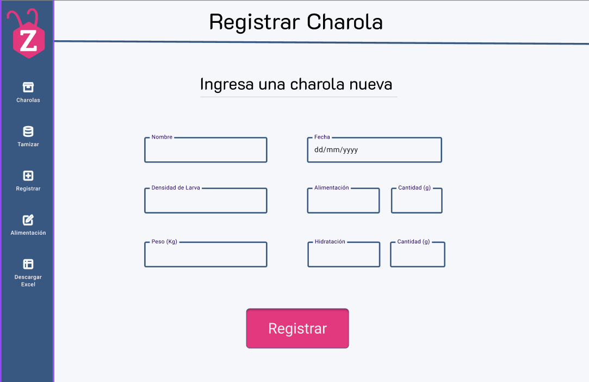

# RF5: Registrar Charola

### Historia de Usuario

Como usuario del sistema, quiero ingresar la información de una charola nueva en el sistema y guardarla en la base de datos, para llevar un registro digital preciso de la producción y rastrear la trazabilidad de las charolas.

**Criterios de Aceptación:**

- El sistema debe permitir el ingreso de una nueva charola con su identificador único.
- Se debe registrar la fecha de creación, peso y estado de la charola.
- Si hay un error en el ingreso, el sistema debe proporcionar un mensaje de error, indicando qué campo requiere corrección.
- La información ingresada debe guardarse correctamente en la base de datos de manera segura y consistente.
- El sistema debe confirmar el registro exitoso mediante una notificación o mensaje visual.

---

### Diagrama de Secuencia

```mermaid
sequenceDiagram
    actor Usuario
    participant View as View
    participant ViewModel as ViewModel
    participant Domain as Domain
    participant Repository as Repository
    participant APIService as APIService
    participant Controller as Controller
    participant Model as Model
    participant Database as Base de Datos

    alt GET Comida (200)
    Usuario->>View: (GET) do Obtener Comida
    activate View
    View->>ViewModel: cargarAlimentos()
    deactivate View
    activate ViewModel
    ViewModel->>Domain: charolaRequirement.getAlimentos()
    deactivate ViewModel
    activate Domain
    Domain->>Repository: repository.getAlimentos()
    deactivate Domain
    activate Repository
    Repository->>APIService: apiService.getAlimentos()
    deactivate Repository
    activate APIService
    APIService->>Controller: @GET("/comida/obtener-comida")
    deactivate APIService
    activate Controller
    Controller->>Controller: exports.obtenerComida = async(req, res)
    Controller->>Model: charolaModel.obtenerComida()
    deactivate Controller
    activate Model
    Model->>Database: obtenerComidas(query)
    deactivate Model
    activate Database
    Database-->>Model: listaComidas
    deactivate Database
    activate Model
    Model-->>Controller: listaComidas
    deactivate Model
    activate Controller
    Controller-->>APIService: listaComidas
    deactivate Controller
    activate APIService
    APIService-->>Repository: listaComidas
    deactivate APIService
    activate Repository
    Repository-->>Domain: listaComidas
    deactivate Repository
    activate Domain
    Domain-->>ViewModel: listaComidas
    deactivate Domain
    activate ViewModel
    ViewModel-->>View: listaComidas
    deactivate ViewModel
    activate View
    View-->>Usuario: Mostrar lista de comidas
    deactivate View
    end

    alt ERROR al obtener comida (500)
    Usuario->>View: (GET) do Obtener Comida
    activate View
    View->>ViewModel: cargarAlimentos()
    deactivate View
    activate ViewModel
    ViewModel->>Domain: charolaRequirement.getAlimentos()
    deactivate ViewModel
    activate Domain
    Domain->>Repository: repository.getAlimentos()
    deactivate Domain
    activate Repository
    Repository->>APIService: apiService.getAlimentos()
    deactivate Repository
    activate APIService
    APIService->>Controller: @GET("/comida/obtener-comida")
    deactivate APIService
    activate Controller
    Controller->>Model: charolaModel.obtenerComida()
    deactivate Controller
    activate Model
    Model->>Database: obtenerComidas(query)
    deactivate Model
    activate Database
    Database--XModel: Error al consultar comidas
    deactivate Database
    activate Model
    Model--XController: Error inesperado en DB de comidas
    deactivate Model
    activate Controller
    Controller-->>APIService: 500 Error obteniendo comida
    deactivate Controller
    activate APIService
    APIService-->>Repository: 500 Error obteniendo comida
    deactivate APIService
    activate Repository
    Repository-->>Domain: 500 Error obteniendo comida
    deactivate Repository
    activate Domain
    Domain-->>ViewModel: Error al obtener comida
    deactivate Domain
    activate ViewModel
    ViewModel-->>View: No se pudo cargar la comida. Intenta más tarde.
    deactivate ViewModel
    activate View
    View-->>Usuario: Error al obtener la lista de comidas.
    deactivate View
    end

    alt ERROR al obtener hidratación (500)
    Usuario->>View: (GET) do Obtener Hidratación
    activate View
    View->>ViewModel: cargarHidratacion()
    deactivate View
    activate ViewModel
    ViewModel->>Domain: charolaRequirement.getHidratacion()
    deactivate ViewModel
    activate Domain
    Domain->>Repository: repository.getHidratacion()
    deactivate Domain
    activate Repository
    Repository->>APIService: apiService.getHidratacion()
    deactivate Repository
    activate APIService
    APIService->>Controller: @GET("/hidratacion/obtener-hidratacion")
    deactivate APIService
    activate Controller
    Controller->>Model: charolaModel.obtenerHidratacion()
    deactivate Controller
    activate Model
    Model->>Database: obtenerHidrataciones(query)
    deactivate Model
    activate Database
    Database--XModel: Error al consultar hidratación
    deactivate Database
    activate Model
    Model--XController: Error inesperado en DB de hidratación
    deactivate Model
    activate Controller
    Controller-->>APIService: 500 Error obteniendo hidratación
    deactivate Controller
    activate APIService
    APIService-->>Repository: 500 Error obteniendo hidratación
    deactivate APIService
    activate Repository
    Repository-->>Domain: 500 Error obteniendo hidratación
    deactivate Repository
    activate Domain
    Domain-->>ViewModel: Error al obtener hidratación
    deactivate Domain
    activate ViewModel
    ViewModel-->>View: No se pudo cargar la hidratación. Intenta más tarde.
    deactivate ViewModel
    activate View
    View-->>Usuario: Error al obtener la lista de hidrataciones.
    deactivate View
    end

    alt GET Hidratacion (200)
    Usuario->>View: (GET) do Obtener Hidratación
    activate View
    View->>ViewModel: cargarHidratacion()
    deactivate View
    activate ViewModel
    ViewModel->>Domain: charolaRequirement.getHidratacion()
    deactivate ViewModel
    activate Domain
    Domain->>Repository: repository.getHidratacion()
    deactivate Domain
    activate Repository
    Repository->>APIService: apiService.getHidratacion()
    deactivate Repository
    activate APIService
    APIService->>Controller: @GET("/hidratacion/obtener-hidratacion")
    deactivate APIService
    activate Controller
    Controller->>Controller: exports.obtenerHidratacion = async(req, res)
    Controller->>Model: charolaModel.obtenerHidratacion()
    deactivate Controller
    activate Model
    Model->>Database: obtenerHidrataciones(query)
    deactivate Model
    activate Database
    Database-->>Model: listaHidratacion
    deactivate Database
    activate Model
    Model-->>Controller: listaHidratacion
    deactivate Model
    activate Controller
    Controller-->>APIService: listaHidratacion
    deactivate Controller
    activate APIService
    APIService-->>Repository: listaHidratacion
    deactivate APIService
    activate Repository
    Repository-->>Domain: listaHidratacion
    deactivate Repository
    activate Domain
    Domain-->>ViewModel: listaHidratacion
    deactivate Domain
    activate ViewModel
    ViewModel-->>View: listaHidratacion
    deactivate ViewModel
    activate View
    View-->>Usuario: Mostrar lista de hidrataciones
    deactivate View
    end

    alt POST Registrar Charola(200)
    Usuario->>View: (POST) do Registrar Charola
    activate View
    View->>ViewModel: do RegistrarCharola(Datos)
    deactivate View
    activate ViewModel
    ViewModel->>Domain: charolaRequirement.registrar(charola)
    deactivate ViewModel
    activate Domain
    Domain->>Repository: repository.registrar(charola)
    deactivate Domain
    activate Repository
    Repository->>APIService: apiService.registrar(charola)
    deactivate Repository
    activate APIService
    APIService->>Controller: @POST ("/charola/registrarCharola")
    deactivate APIService
    activate Controller
    Controller->>Controller: exports.registrarCharola = async(req, res)
    Controller->>Model: charolaModel.registrarCharola(datos)
    deactivate Controller
    activate Model
    Model->>Database: crearCharola(query)
    deactivate Model
    activate Database
    Database-->>Model: respuesta
    deactivate Database
    activate Model
    Model-->>Controller: respuesta
    deactivate Model
    activate Controller
    Controller-->>APIService: respuesta
    deactivate Controller
    activate APIService
    APIService-->>Repository: respuesta
    deactivate APIService
    activate Repository
    Repository-->>Domain: respuesta
    deactivate Repository
    activate Domain
    Domain-->>ViewModel: respuesta
    deactivate Domain
    activate ViewModel
    ViewModel-->>View: respuesta
    deactivate ViewModel
    activate View
    View-->>Usuario: ¡Charola registrada exitosamente!
    deactivate View
    end

    alt ERROR (400) - Petición incorrecta
    Usuario->>View: (POST) do Registrar Charola
    activate View
    View->>ViewModel: doRegistrarCharola(charola)
    deactivate View
    activate ViewModel
    ViewModel-->>View: Error: Datos inválidos
    deactivate ViewModel
    activate View
    View-->>Usuario: "Los datos ingresados son incorrectos. Por favor, revisa los campos obligatorios."
    deactivate View
    end

    alt ERROR (401) - Usuario no autenticado
    Usuario->>+View: Entra a la interfaz
        View->>-ViewModel: registrarCharola()
        activate ViewModel
        ViewModel->>Domain: registrarCharola()
        deactivate ViewModel
        activate Domain
        Domain->>Repository: registrarCharola()
        deactivate Domain
        activate Repository
        Repository->>APIService: registrarCharola()
        deactivate Repository
        activate APIService
        APIService->>Controller: POST /charola/registrarCharola
        deactivate APIService
        activate Controller

        Controller-->>APIService: 401 No Autorizado
        deactivate Controller
        activate APIService
        APIService-->>Repository: 401 No Autorizado
        deactivate APIService
        activate Repository
        Repository-->>Domain: 401 No Autorizado
        deactivate Repository
        activate Domain
        Domain-->>ViewModel: 401 No Autorizado
        deactivate Domain
        activate ViewModel
        ViewModel-->>View: Notificar falta de Inicio de sesión
        deactivate ViewModel
        activate View
        View-->>Usuario: Regresar al View de Inicio de sesión
        deactivate View
    end

    alt ERROR (500) - Error Interno en el Servidor
    Usuario->>+View: (POST) do Registrar Charola
    activate View
    View->>ViewModel: do RegistrarCharola(Datos)
    deactivate View
    activate ViewModel
    ViewModel->>Domain: charolaRequirement.registrar(charola)
    deactivate ViewModel
    activate Domain
    Domain->>Repository: repository.registrar(charola)
    deactivate Domain
    activate Repository
    Repository->>APIService: apiService.registrar(charola)
    deactivate Repository
    activate APIService
    APIService->>Controller: @POST ("/charola/registrarCharola")
    deactivate APIService
    activate Controller
    Controller->>Model: charolaModel.registrarCharola(datos)
    deactivate Controller
    activate Model
    Model->>Database: crearCharola(query)
    deactivate Model
    activate Database
    Database--XModel: Error en la consulta
    deactivate Database
    activate Model
    Model--XController: Error inesperado en la base de datos
    deactivate Model
    activate Controller
    Controller-->>APIService: 500 Error Interno en el Servidor
    deactivate Controller
    activate APIService
    APIService-->>Repository: 500 Error Interno en el Servidor
    deactivate APIService
    activate Repository
    Repository-->>Domain: 500 Error Interno en el Servidor
    deactivate Repository
    activate Domain
    Domain-->>ViewModel: 500 Error Interno en el Servidor
    deactivate Domain
    activate ViewModel
    ViewModel-->>View: Error interno en el servidor. Intenta más tarde.
    deactivate ViewModel
    activate View
    View-->>Usuario: Hubo un problema en el sistema. Intenta de nuevo más tarde.
    deactivate View
    end

    alt ERROR 101 - Sin conexión a Internet
    Usuario->>View: (POST) do Registrar Charola
    activate View
    View->>+ViewModel: do RegistrarCharola(Datos)
    deactivate View
    activate ViewModel
    ViewModel->>Domain: charolaRequirement.registrar(charola)
    deactivate ViewModel
    activate Domain
    Domain->>Repository: repository.registrar(charola)
    deactivate Domain
    activate Repository
    Repository->>APIService: APIService.registrar(charola)
    deactivate Repository
    activate APIService
    APIService--XViewModel: 101 Error: No hay conexión a Internet
    deactivate APIService
    activate ViewModel
    ViewModel-->>View: No pudo conectar con el servidor. Revisa tu conexión.
    deactivate ViewModel
    activate View
    View-->>Usuario: No tienes conexión a Internet.
    deactivate View
    end



```

---

### Mockup

---

## Historial de cambios

| **Tipo de Versión** | **Descripción**                            | **Fecha** | **Colaborador**         |
| ------------------- | ------------------------------------------ | --------- | ----------------------- |
| **1.0**             | Creacion de la historia de usuario         | 8/3/2025  | Armando Mendez          |
| **1.0**             | Verificación de los cambios                | 8/3/2025  | Miguel Angel            |
| **1.1**             | Creación del diagrama de secuencia         | 3/4/2025  | Emiliano Gomez Gonzalez |
| **1.2**             | Correciones del DS y agregacion del Mockup | 22/4/2025 | Emiliano Gomez Gonzalez |
