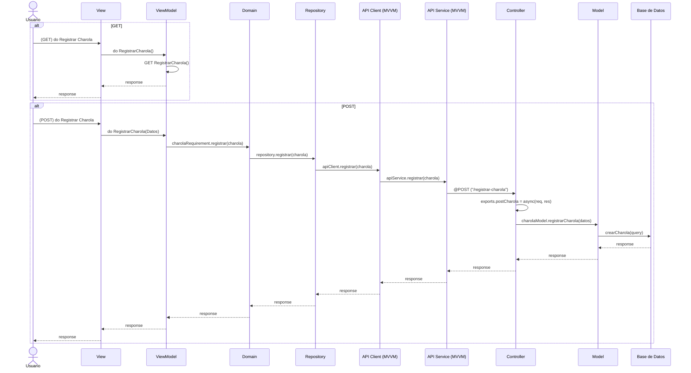

# RF5: Registrar Charola

**Última actualización:** 08 de marzo de 2025

### Historia de Usuario
Como usuario del sistema, quiero ingresar la información de una charola nueva en el sistema y guardarla en la base de datos, para llevar un registro digital preciso de la producción y rastrear la trazabilidad de las charolas.

  **Criterios de Aceptación:**
  - El sistema debe permitir el ingreso de una nueva charola con su identificador único.
  - Se debe registrar la fecha de creación, peso y estado de la charola.
  - Si hay un error en el ingreso, el sistema debe proporcionar un mensaje de error, indicando qué campo requiere corrección.
  - La información ingresada debe guardarse correctamente en la base de datos de manera segura y consistente.
  - El sistema debe confirmar el registro exitoso mediante una notificación o mensaje visual.

---

### Diagrama de Secuencia

> *Descripción*: El diagrama de secuencia muestra el flujo del proceso de creación de un nuevo empleado, con la interacción entre el Super Administrador, el formulario de ingreso y la base de datos.

---

### Mockup

> *Descripción*: El mockup presenta la interfaz donde el Super Administrador puede ingresar los datos de un nuevo empleado, con campos requeridos y botones de acción para crear al empleado.

### Pruebas Unitarias 
| ID Prueba  | Descripción                                               | Resultado Esperado  |
|------------|-----------------------------------------------------------|---------------------|
| PU-RF5-01  | Registrar una nueva charola con datos válidos.            | El sistema guarda la charola con su identificador único y muestra confirmación de éxito. |
| PU-RF5-02  | Intentar registrar una charola sin identificador único.    | El sistema muestra un mensaje de error indicando que el identificador es obligatorio. |
| PU-RF5-03  | Registrar una charola con datos incompletos.               | El sistema impide el registro y señala qué campos faltan. |
| PU-RF5-04  | Intentar ingresar datos inválidos en peso o estado de la charola. | El sistema valida los datos y muestra un error si no cumplen con el formato esperado. |
| PU-RF5-05  | Confirmar que la charola registrada se guarda en la base de datos. | La información ingresada se almacena de manera segura y es accesible para futuras consultas. |
| PU-RF5-06  | Probar el mensaje de confirmación tras un registro exitoso. | El sistema muestra una notificación confirmando que la charola fue registrada correctamente. |
