# RF5: Registrar Charola

**Última actualización:** 08 de marzo de 2025

### Historia de Usuario
Como usuario del sistema, quiero ingresar la información de una charola nueva en el sistema y guardarla en la base de datos, para llevar un registro digital preciso de la producción y rastrear la trazabilidad de las charolas.

  **Criterios de Aceptación:**
  - El sistema debe permitir el ingreso de una nueva charola con su identificador único.
  - Se debe registrar la fecha de creación, peso y estado de la charola.
  - Si hay un error en el ingreso, el sistema debe proporcionar un mensaje de error, indicando qué campo requiere corrección.
  - La información ingresada debe guardarse correctamente en la base de datos de manera segura y consistente.
  - El sistema debe confirmar el registro exitoso mediante una notificación o mensaje visual.

---

### Diagrama de Secuencia

> *Descripción*: El diagrama de secuencia muestra el flujo del proceso de creación de un nuevo empleado, con la interacción entre el Super Administrador, el formulario de ingreso y la base de datos.

```mermaid
sequenceDiagram  
      actor Usuario 
      participant View as View
      participant ViewModel as ViewModel
      participant Domain as Domain
      participant Repository as Repository
      participant APIClient as API Client (MVVM)
      participant APIService as API Service (MVVM)
      participant Controller as Controller
      participant Model as Model
      participant Database as Base de Datos

    alt GET (200)
    Usuario->>View: (GET) do Registrar Charola
    View->>ViewModel: do RegistrarCharola()
    ViewModel->>ViewModel: GET RegistrarCharola()
    ViewModel-->>View: response
    View-->>Usuario: response
    end

    alt POST (200)
    Usuario->>View: (POST) do Registrar Charola
    View->>ViewModel: do RegistrarCharola(Datos)
    ViewModel->>Domain: charolaRequirement.registrar(charola)
    Domain->>Repository: repository.registrar(charola)
    Repository->>APIClient: apiClient.registrar(charola)
    APIClient->>APIService: apiService.registrar(charola)
    APIService->>Controller: @POST ("/registrar-charola")
    Controller->>Controller: exports.postCharola = async(req, res)
    Controller->>Model: charolaModel.registrarCharola(datos)
    Model->>Database: crearCharola(query)
    Database-->>Model: response
    Model-->>Controller: response
    Controller-->>APIService: response
    APIService-->>APIClient: response
    APIClient-->>Repository: response
    Repository-->>Domain: response
    Domain-->>ViewModel: response
    ViewModel-->>View: response
    View-->>Usuario: ✅ ¡Charola registrada exitosamente!
    end

    alt ERROR (400) - Bad Request
    Usuario->>View: (POST) do Registrar Charola (Datos inválidos)
    View->>ViewModel: do RegistrarCharola(Datos inválidos)
    ViewModel->>Domain: charolaRequirement.registrar(charola)
    Domain->>Repository: repository.registrar(charola)
    Repository->>APIClient: apiClient.registrar(charola)
    APIClient->>APIService: apiService.registrar(charola)
    APIService->>Controller: @POST ("/registrar-charola")
    Controller->>Controller: Validar datos
    Controller-->>APIService: ❌ 400 Bad Request (Faltan datos o formato incorrecto)
    APIService-->>APIClient: ❌ 400 Bad Request
    APIClient-->>Repository: ❌ 400 Bad Request
    Repository-->>Domain: ❌ 400 Bad Request
    Domain-->>ViewModel: ❌ 400 Bad Request
    ViewModel-->>View: ⚠️ Error: Datos inválidos. Verifica la información.
    View-->>Usuario: ⚠️ Los datos ingresados son incorrectos. Por favor, revisa los campos obligatorios.
    end

    alt ERROR (500) - Internal Server Error
    Usuario->>View: (POST) do Registrar Charola
    View->>ViewModel: do RegistrarCharola(Datos)
    ViewModel->>Domain: charolaRequirement.registrar(charola)
    Domain->>Repository: repository.registrar(charola)
    Repository->>APIClient: apiClient.registrar(charola)
    APIClient->>APIService: apiService.registrar(charola)
    APIService->>Controller: @POST ("/registrar-charola")
    Controller->>Model: charolaModel.registrarCharola(datos)
    Model->>Database: crearCharola(query)
    Database--X Model: ❌ Error en la consulta
    Model--X Controller: ❌ Error inesperado en la base de datos
    Controller-->>APIService: ❌ 500 Internal Server Error
    APIService-->>APIClient: ❌ 500 Internal Server Error
    APIClient-->>Repository: ❌ 500 Internal Server Error
    Repository-->>Domain: ❌ 500 Internal Server Error
    Domain-->>ViewModel: ❌ 500 Internal Server Error
    ViewModel-->>View: ❌ Error interno en el servidor. Intenta más tarde.
    View-->>Usuario: 🚨 Hubo un problema en el sistema. Intenta de nuevo más tarde.
    end

    alt ERROR 101 - Sin conexión a Internet
    Usuario->>View: (POST) do Registrar Charola
    View->>ViewModel: do RegistrarCharola(Datos)
    ViewModel->>Domain: charolaRequirement.registrar(charola)
    Domain->>Repository: repository.registrar(charola)
    Repository->>APIClient: apiClient.registrar(charola)
    APIClient--X ViewModel: ❌ 101 Error: No hay conexión a Internet
    ViewModel-->>View: ❌ No se pudo conectar al servidor.
    View-->>Usuario: 🌐 No hay conexión a Internet. Revisa tu red e intenta nuevamente.
    end
    
```

---

### Mockup

> *Descripción*: El mockup presenta la interfaz donde el Super Administrador puede ingresar los datos de un nuevo empleado, con campos requeridos y botones de acción para crear al empleado.

### Pruebas Unitarias 
| ID Prueba  | Descripción                                               | Resultado Esperado  |
|------------|-----------------------------------------------------------|---------------------|
| PU-RF5-01  | Registrar una nueva charola con datos válidos.            | El sistema guarda la charola con su identificador único y muestra confirmación de éxito. |
| PU-RF5-02  | Intentar registrar una charola sin identificador único.    | El sistema muestra un mensaje de error indicando que el identificador es obligatorio. |
| PU-RF5-03  | Registrar una charola con datos incompletos.               | El sistema impide el registro y señala qué campos faltan. |
| PU-RF5-04  | Intentar ingresar datos inválidos en peso o estado de la charola. | El sistema valida los datos y muestra un error si no cumplen con el formato esperado. |
| PU-RF5-05  | Confirmar que la charola registrada se guarda en la base de datos. | La información ingresada se almacena de manera segura y es accesible para futuras consultas. |
| PU-RF5-06  | Probar el mensaje de confirmación tras un registro exitoso. | El sistema muestra una notificación confirmando que la charola fue registrada correctamente. |

## Historial de cambios

| **Tipo de Versión** | **Descripción**                      | **Fecha** | **Colaborador**   |
| ------------------- | ------------------------------------ | --------- | ----------------- |
| **1.0**             | Creacion de la historia de usuario   | 8/3/2025  | Armando Mendez    |
| **1.0**             | Verificación de los cambios          | 8/3/2025  | Miguel Angel      |
| **1.1**             | Creación del diagrama de secuencia   | 3/4/2025  | Emiliano Gomez Gonzalez      |