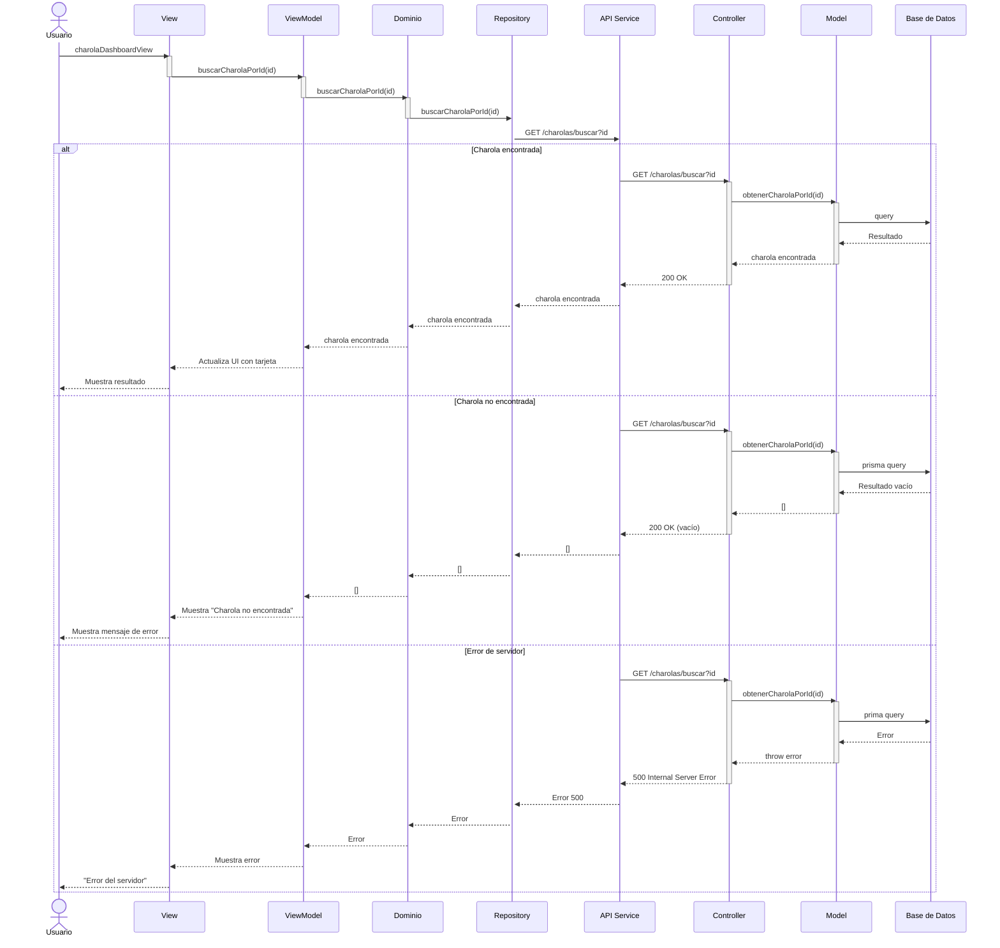
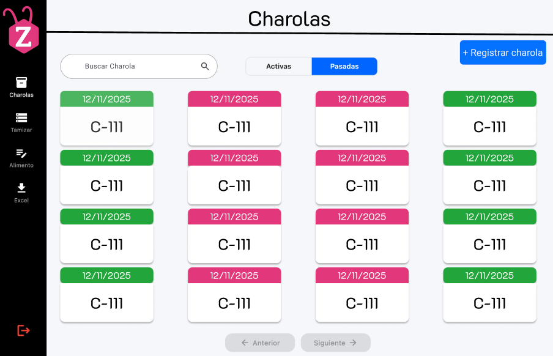

# RF6: Buscar charola

### Historia de Usuario

Como usuario, quiero buscar una charola específica mediante una barra de búsqueda introduciendo su nombre, para localizar rápidamente su información sin tener que revisar manualmente todos los registros.

**Criterios de Aceptación:**

- El sistema debe permitir la búsqueda de charolas por nombre.
- La búsqueda debe ser rápida y sin afectar el rendimiento del sistema.
- Si el nombre no existe, debe mostrarse el mensaje: "Charola no encontrada. Verifica el nombre ingresado.
- La búsqueda debe devolver los resultados en menos de 2 segundos bajo condiciones normales de uso.
- El campo de búsqueda debe aceptar un máximo de 20 caracteres alfanuméricos sin espacios.
- Los guiones medios están permitidos.

🧪 Casos de Entrada (Esperadas y No Esperadas)
| Tipo | Ejemplo de Entrada | Resultado Esperado |
| -------- | ------------------ | ----------------------------------------------------------- |
| Válida | `C-456-1` | Muestra información de la charola |
| Inválida | `C1234567890` | Mensaje de error por exceder el número máximo de caracteres |
| Inválida | `123456` | Mensaje de "Charola no encontrada" si no existe |

---

### Diseño de Algoritmo

[Diseño de Algoritmo - Buscar Charola](https://docs.google.com/document/d/1Ef40Ooi7pbUakXvT18mWl6LQqTsvpiZlf8SyNWzdDvY/edit?usp=sharing)

---

### Diagrama de Secuencia

---

### Pull Request

<a href="" target="_blank" rel="noopener noreferrer"> PR de Buscar charola Backend</a>

<a href="https://github.com/CodeAnd-Co/TECH-NEBRIOS-FLUTTER/pull/97" target="_blank" rel="noopener noreferrer"> PR de Buscar charola Frontend</a>

---

### Mockup

## 

### Pull Request

### Pruebas

[Matriz pruebas de funcionamiento](https://docs.google.com/spreadsheets/d/1-EwSa6HMrU9eqEvx9wWw8HCH9tba0EpWPCBFGSmpnu4/edit?gid=550147549#gid=550147549)

## Historial de cambios

| **Tipo de Versión** | **Descripción**                                                                                                         | **Fecha**  | **Colaborador**         |
| ------------------- | ----------------------------------------------------------------------------------------------------------------------- | ---------- | ----------------------- |
| **1.0**             | Creacion de la historia de usuario                                                                                      | 8/3/2025   | Armando Mendez          |
| **1.1**             | Modificar historial de cambio                                                                                           | 17/05/2025 | Mariaa Juárez           |
| **1.2**             | Actualiza criterios de aceptación y casos esperados y no esperados, mockup, diagrama de secuencia y diseño de algoritmo | 05/06/2025 | Emiliano Gomez Gonzalez |
| **1.2.1**           | Máximo de caracteres                                                                                                    | 06/06/2025 | Emiliano Gomez Gonzalez |
| **1.2.2**           | Agregar Pull Request y Pruebas                                                                                          | 06/06/2025 | Emiliano Gomez Gonzalez |
