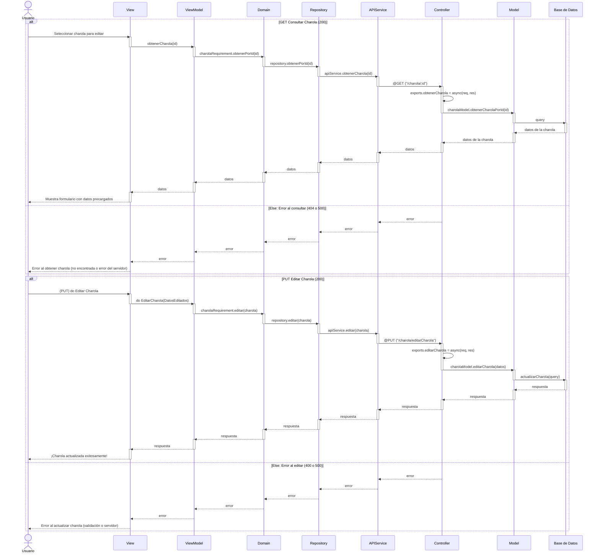

# RF7: Modificar datos generales Charola

### Historia de Usuario

Como usuario del sistema, quiero modificar los datos de una charola que están guardados en la base de datos, para corregir errores o actualizar su información y mantener registros precisos.

**Criterios de Aceptación:**

- El sistema debe permitir la edición de los datos de una charola previamente registrada.
- La actualización de datos debe reflejarse de inmediato en la base de datos.

---

### Diagrama de Actividades

<a href="https://drive.google.com/file/d/1fBtWBZdEJXJS6EgMfcuVWJjD4JW90CD7/view?usp=sharing" target="_blank" rel="noopener noreferrer">Modificar datos generales dl Charola</a>

---

### Diagrama de Secuencia

---

### Pull Request

<a href="https://github.com/CodeAnd-Co/TECH-NEBRIOS-BACKEND/pull/25" target="_blank" rel="noopener noreferrer"> PR de Modificar datos generales dl Charola Backend</a>

<a href="https://github.com/CodeAnd-Co/TECH-NEBRIOS-FLUTTER/pull/27" target="_blank" rel="noopener noreferrer"> PR de Modificar datos generales dl Charola Frontend</a>

---

### Mockup

---
## Historial de cambios

| **Tipo de Versión** | **Descripción**                            | **Fecha** | **Colaborador**         |
| ------------------- | ------------------------------------------ | --------- | ----------------------- |
| **1.0**             | Creacion de la historia de usuario         | 8/3/2025  | Armando Mendez          |
| **1.1**             | Modificar historial de cambio              | 17/05/2025| Mariaa Juárez           |
| **1.3**             | Diagramas de actividades   | 23/5/2025  | Juan Eduardo Rosas Cerón |
| **1.4**             | Se corrigió mockup  | 29/5/2025  | Mariana Juárez |
| **1.5**             | Se agregaron los pull request de front y back | 29/5/2025  | Sofía Osorio |