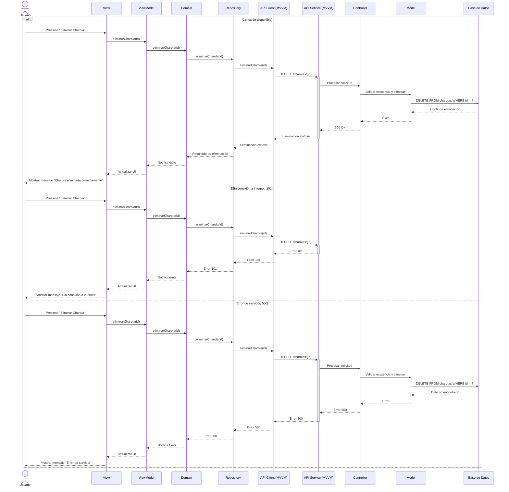

# RF8: Eliminar Charola

### Historia de Usuario
Como usuario del sistema, quiero borrar los datos de una charola en la base de datos, para eliminar registros obsoletos o incorrectos y mantener la base de datos actualizada y ordenada.

  **Criterios de Aceptación:**
  - El sistema debe permitir la eliminación de charolas solo a usuarios autorizados.
  - Antes de eliminar una charola, se debe mostrar un mensaje de confirmación.
  - La eliminación debe reflejarse de inmediato en la base de datos sin afectar otros registros.

---

### Diagrama de Secuencia

> *Descripción*: El diagrama de secuencia muestra el flujo de eliminación de un empleado, donde el Super Administrador solicita la eliminación y el sistema confirma la acción antes de proceder.

# Eliminar charola

---

### Mockup

> *Descripción*: El mockup muestra la interfaz donde el Super Administrador puede eliminar un empleado, con un botón de confirmación para realizar la eliminación.

### Pruebas Unitarias 
| ID Prueba  | Descripción                                               | Resultado Esperado  |
|------------|-----------------------------------------------------------|---------------------|
| PU-RF8-01  | Eliminar una charola existente con permisos adecuados.    | El sistema elimina la charola y muestra un mensaje de confirmación. |
| PU-RF8-02  | Intentar eliminar una charola sin permisos.               | El sistema bloquea la acción e informa que se requieren permisos adecuados. |
| PU-RF8-03  | Intentar eliminar una charola inexistente.                | El sistema muestra un mensaje de error indicando que la charola no existe. |
| PU-RF8-04  | Verificar que la eliminación se refleje inmediatamente en la base de datos. | La charola eliminada ya no aparece en consultas posteriores. |
| PU-RF8-05  | Confirmar que la eliminación de una charola no afecta otros registros. | Los demás datos en la base permanecen intactos tras la eliminación. |
| PU-RF8-06  | Validar que el sistema solicite confirmación antes de eliminar. | Se muestra un mensaje de confirmación antes de ejecutar la acción de eliminación. |

## Historial de cambios

| **Tipo de Versión** | **Descripción**                      | **Fecha** | **Colaborador**   |
| ------------------- | ------------------------------------ | --------- | ----------------- |
| **1.0**             | Creacion de la historia de usuario   | 8/3/2025  | Armando Mendez    |
| **1.0**             | Verificación de los cambios          | 8/3/2025  | Miguel Angel      |
| **1.1**             | Creación del diagrama de secuencia   | 3/4/2025  | Juan Eduardo      |