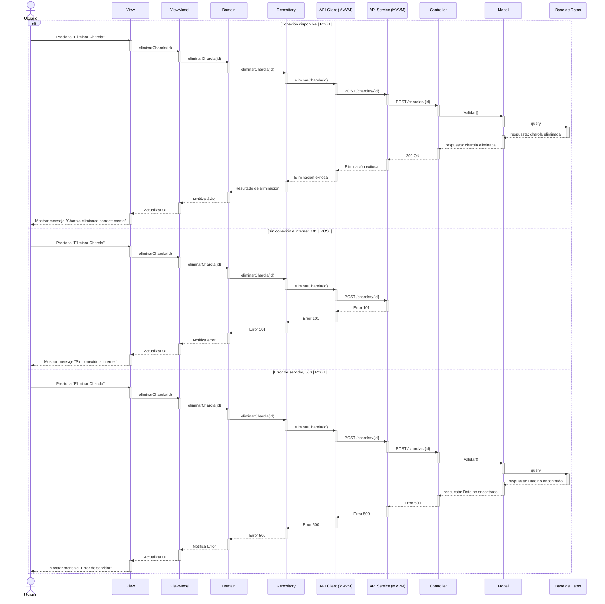

# RF8: Eliminar Charola

### Historia de Usuario
Como usuario del sistema, quiero borrar los datos de una charola en la base de datos, para eliminar registros obsoletos o incorrectos y mantener la base de datos actualizada y ordenada.

  **Criterios de Aceptación:**
  - Antes de eliminar una charola, se debe mostrar un mensaje de confirmación.
  - La eliminación debe reflejarse de inmediato en la base de datos sin afectar otros registros.

---

### Diagrama de Actividades

<a href="https://drive.google.com/file/d/1vQI5exhxIFS7IrY4KmKrz5jEx54D7FlS/view?usp=sharing" target="_blank" rel="noopener noreferrer">Eliminar Charola</a>

---

### Diagrama de Secuencia

---

### Pull Request

<a href="https://github.com/CodeAnd-Co/TECH-NEBRIOS-BACKEND/pull/17" target="_blank" rel="noopener noreferrer"> PR de Eliminar Charola Backend</a>

<a href="https://github.com/CodeAnd-Co/TECH-NEBRIOS-FLUTTER/pull/12" target="_blank" rel="noopener noreferrer"> PR de Eliminar Charola Frontend</a>

---

### Mockup

---

## Historial de cambios

| **Tipo de Versión** | **Descripción**                      | **Fecha** | **Colaborador**   |
| ------------------- | ------------------------------------ | --------- | ----------------- |
| **1.0**             | Creacion de la historia de usuario   | 8/3/2025  | Armando Mendez    |
| **1.0**             | Verificación de los cambios          | 8/3/2025  | Miguel Angel      |
| **1.1**             | Creación del diagrama de secuencia   | 3/4/2025  | Juan Eduardo      |
| **1.2**             | Mockup y correcciones del diagrama   | 3/4/2025  | Juan Eduardo      |
| **1.3**             | Correciones del query                | 17/5/2025 | Mariana Juárez    |
| **1.3**             | Diagramas de actividades   | 23/5/2025  | Juan Eduardo Rosas Cerón |
| **1.4**             | Se corrigió mockup  | 29/5/2025  | Mariana Juárez |
| **1.5**             | Se agregaron los pull request de front y back | 29/5/2025  | Sofía Osorio |