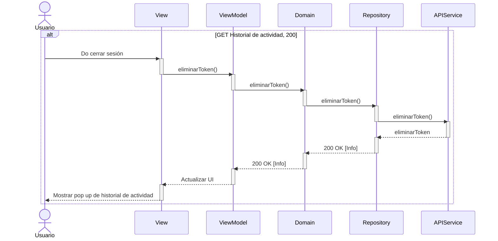
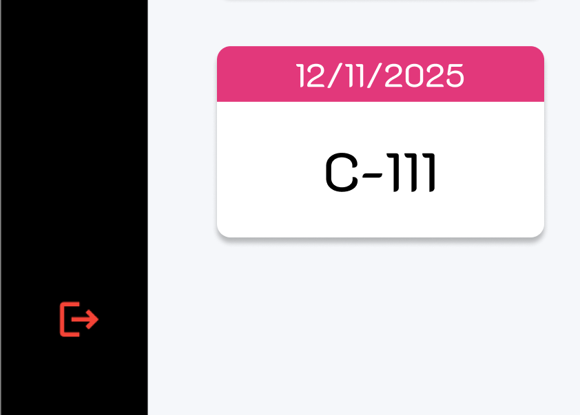
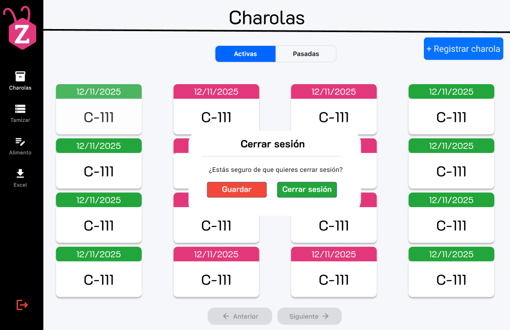

# RF9: Cerrar sesión

### Historia de Usuario
Como usuario, quiero cerrar mi sesión en la aplicación, para asegurar el cierre de mi cuenta y prevenir accesos no autorizados.

  **Criterios de Aceptación:**
  - El sistema debe proporcionar un botón de "Cerrar Sesión" accesible en la sidebar.
  - Al cerrar sesión, el usuario debe ser redirigido a la pantalla de inicio de sesión.
  - Se debe invalidar la sesión activa para evitar que otra persona acceda sin autenticación.
  - El cierre de sesión debe ser rápido y no afectar la usabilidad del sistema.

---

### Diagrama de Actividades

<a href="https://drive.google.com/file/d/12x_zfxa1QmTsGL5XsYHaTIIvdtvq-ioz/view?usp=sharing" target="_blank" rel="noopener noreferrer">Cerrar sesión</a>

---

### Diagrama de Secuencia

---

### Pull Request

<a href="https://github.com/CodeAnd-Co/TECH-NEBRIOS-FLUTTER/pull/20" target="_blank" rel="noopener noreferrer"> PR de Cerrar Sesión Frontend</a>
---

### Mockup

---

| **Tipo de Versión** | **Descripción**                      | **Fecha** | **Colaborador**   |
| ------------------- | ------------------------------------ | --------- | ----------------- |
| **1.0**             | Creacion de la historia de usuario   | 8/3/2025  | Armando Mendez    |
| **1.2**             | Diagramas de actividades   | 23/5/2025  | Juan Eduardo Rosas Cerón |
| **1.3**             | Se agregaron los pull request de front  | 29/5/2025  | Sofía Osorio |
| **1.4**             | Actualización | 03/06/2025  | Armando Méndez Catro |
| **1.5**             |  Correción | 03/06/2025  | Mariana Juárez |