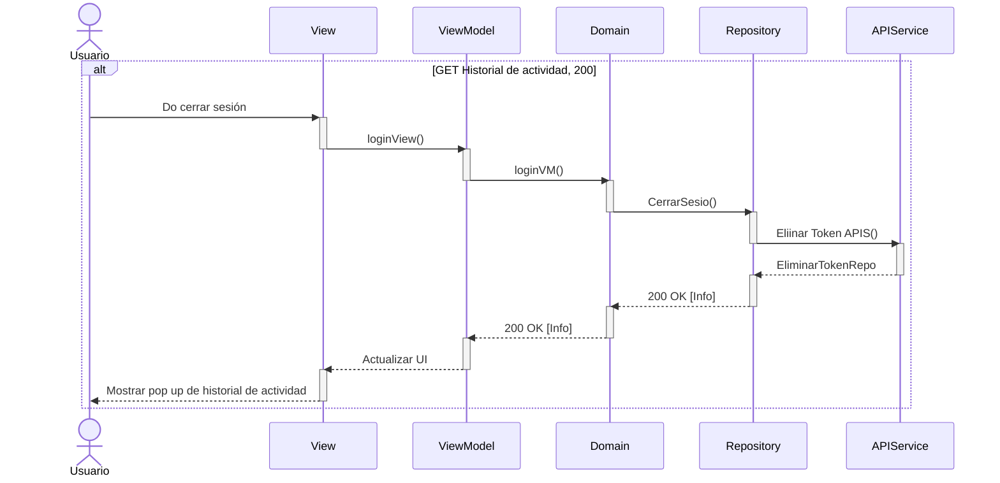

# RF9: Cerrar sesión

**Última actualización:** 09 de marzo de 2025

### Historia de Usuario
Como usuario de la aplicación, quiero cerrar mi cuenta de usuario en la aplicación, para finalizar mi sesión de manera segura y evitar accesos no autorizados en mi cuenta.

  **Criterios de Aceptación:**
  - El sistema debe proporcionar un botón de "Cerrar Sesión" accesible en la interfaz.
  - Al cerrar sesión, el usuario debe ser redirigido a la pantalla de inicio de sesión.
  - Se debe invalidar la sesión activa para evitar que otra persona acceda sin autenticación.
  - El cierre de sesión debe ser rápido y no afectar la usabilidad del sistema.

---

### Diagrama de Actividades

<a href="https://drive.google.com/file/d/12x_zfxa1QmTsGL5XsYHaTIIvdtvq-ioz/view?usp=sharing" target="_blank" rel="noopener noreferrer">Cerrar sesión</a>

---

### Diagrama de Secuencia

### Diagrama de Secuencia

> Descripción: El diagrama de secuencia muestra cómo los usuarios salen del sistema.

---

### Pull Request

<a href="https://github.com/CodeAnd-Co/TECH-NEBRIOS-FLUTTER/pull/20" target="_blank" rel="noopener noreferrer"> PR de Cerrar Sesión Frontend</a>
---

### Mockup

---
### Pruebas Unitarias 
| ID Prueba  | Descripción | Resultado Esperado |
|------------|-------------|--------------------|
| PU-RF-01  | Verificar la existencia y visibilidad del botón "Cerrar Sesión". Se debe ingresar a la aplicación con un usuario válido y ubicar el botón en la interfaz. | El botón "Cerrar Sesión" se muestra en una ubicación visible y acorde al diseño, cumpliendo con los criterios de accesibilidad. |
| PU-RF-02  | Probar el proceso de cierre de sesión al hacer clic en el botón "Cerrar Sesión". | La sesión actual se finaliza correctamente y el usuario es redirigido a la pantalla de inicio de sesión inmediatamente. |
| PU-RF-03  | Verificar la invalidación de la sesión tras cerrar sesión. Se debe cerrar la sesión y luego intentar acceder a una ruta protegida (por ejemplo, perfil de usuario). | El sistema impide el acceso a áreas restringidas y solicita nuevamente el inicio de sesión para acceder a rutas protegidas. |
| PU-RF-04  | Evaluar el tiempo de respuesta al cerrar sesión realizando el proceso de cierre. | El proceso se completa en un tiempo adecuado (por ejemplo, menos de 2 segundos) sin bloqueos ni errores durante la transición. |
| PU-RF-05  | Validar la experiencia de usuario durante el proceso de cierre de sesión, asegurando que no se muestren pantallas en blanco ni errores inesperados. | La transición es fluida y consistente con el resto de la aplicación, sin afectar la experiencia de usuario. |

| **Tipo de Versión** | **Descripción**                      | **Fecha** | **Colaborador**   |
| ------------------- | ------------------------------------ | --------- | ----------------- |
| **1.0**             | Creacion de la historia de usuario   | 8/3/2025  | Armando Mendez    |
| **1.2**             | Diagramas de actividades   | 23/5/2025  | Juan Eduardo Rosas Cerón |
| **1.3**             | Se agregaron los pull request de front  | 29/5/2025  | Sofía Osorio |
| **1.3**             | Actualización | 03/06/2025  | Armando Méndez Catro |