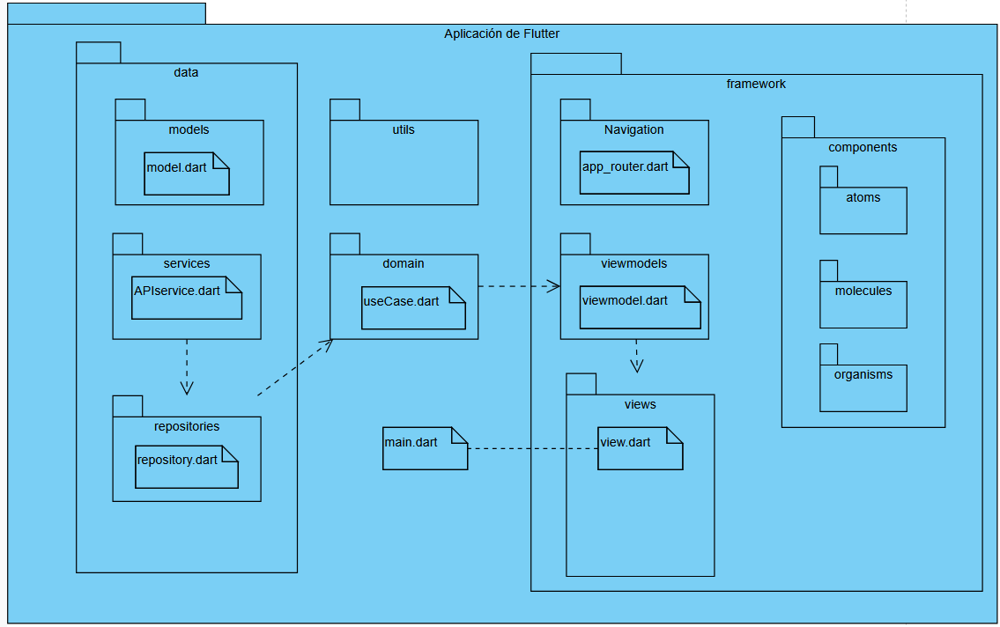
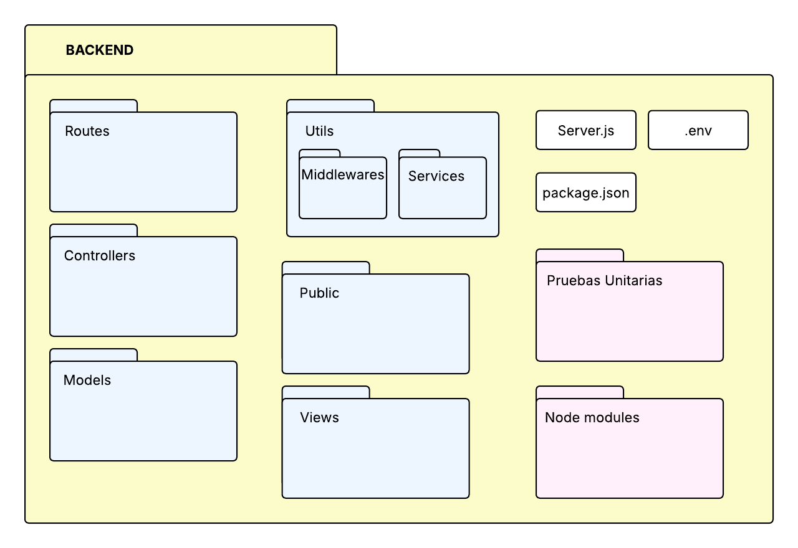
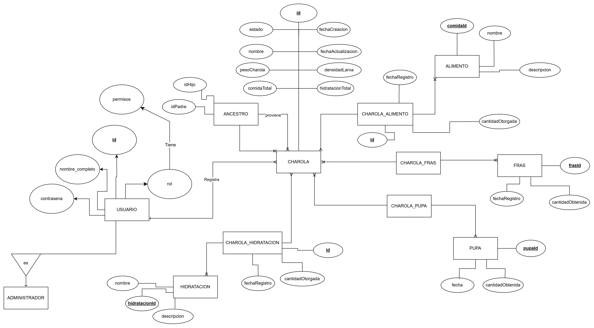

### **Proveedores de Requisitos**

- **Internos**: Personas dentro de Code & Co.
- **Externos**: Cliente.

### **Lista de Proveedores de Requisitos**

| Proveedor          | Rol     | Autoridad | Tipo de Requisitos             | Método de Comunicación                           |
| ------------------ | ------- | --------- | ------------------------------ | ------------------------------------------------ |
| Product Owner      | Interno | Alta      | Funcionales y de negocio       | Reuniones diarias en equipo, Whatsapp y Discord. |
| Socio Formador     | Externo | Alta      | Funcionales, de negocio y UX   | Reuniones 2 veces por semana, Whatsapp.          |
| Architecture Owner | Interno | Alta      | No funcionales, de información | Reuniones diarias en equipo, Whatsapp y Discord. |
| UX/UI              | Interno | Alta      | de Interfaz                    | Reuniones diarias en equipo, Whatsapp y Discord. |
| Team Members       | Interno | Media     | Funcionales y No funcionales   | Reuniones diarias en equipo, Whatsapp y Discord. |

## Requisitos Funcionales

### Descripción General

Los requisitos funcionales del sistema describen una variedad de acciones que los usuarios, administradores y empleados pueden realizar dentro del sistema, como la creación, lectura, actualización y eliminación de clientes, productos, pedidos y otros elementos clave. Además, incluyen el manejo de roles, grupos, cuotas y pagos, así como la capacidad del sistema para gestionar solicitudes. Estos requisitos funcionales también contemplan la administración de seguridad, roles y permisos para garantizar que cada usuario pueda realizar únicamente las acciones que le corresponden.

---

### Requisitos Específicos

- [**RF1**](RF1.md): Iniciar Sesión - `Done`
- [**RF3**](RF3.md): Consultar historial de ancestros de una charola - `Done`
- [**RF5**](RF5.md): Registrar Charola - `Done`
- [**RF6**](RF6.md): Buscar charola
- [**RF7**](RF7.md): Modificar datos generales Charola - `Done`
- [**RF8**](RF8.md): Eliminar Charola - `Done`
- [**RF9**](RF9.md): Cerrar sesión - `Done`
- [**RF10**](RF10.md): Consultar información detallada de una charola - `Done`
- [**RF11**](RF11.md): Descargar reportes - `Done`
- [**RF13**](RF13.md): Registrar usuario
- [**RF14**](RF14.md): Borrar usuario
- [**RF15**](RF15.md): Filtrar las charolas por escarabajo y larva
- [**RF16**](RF16.md): Visualizar todas las charolas registradas en el sistema - `Done`
- [**RF18**](RF18.md): Historial de actividad de charola - `Done`
- [**RF19**](RF19.md): Editar Usuario
- [**RF20**](RF20.md): Seleccionar charolas para tamizar y registrar sus datos - `Ready`
- [**RF21**](RF21.md): Consultar charolas de cambios pasados - `Done`
- [**RF23**](RF23.md): Registrar un nuevo tipo de comida en el sistema - `Done`
- [**RF24**](RF24.md): Editar un tipo de comida en el sistema - `Done`
- [**RF25**](RF25.md): Eliminar un tipo de comida - `Done`
- [**RF26**](RF26.md): Registrar la alimentación de la charola - `Done`
- [**RF29**](RF29.md): Registar la información del Frass obtenido
- [**RF30**](RF30.md): Editar la información del Frass obtenido
- [**RF34**](RF34.md): Sidebar - `Done`
- [**RF35**](RF35.md): Recuperar contraseña
- [**RF36**](RF36.md): Registrar un nuevo tipo de hidratación al sistema - `Ready`
- [**RF38**](RF38.md): Registrar nuevas charolas del tamizado - `Done`
- [**RF39**](RF39.md): Visualizar charolas eliminadas
- [**RF40**](RF40.md): Editar un tipo de hidratación en el sistema - `Ready`
- [**RF41**](RF41.md): Eliminar un tipo de hidratación en el sistema `Ready`
- [**RF42**](RF42.md):Registrar la hidratación de la charola - `Ready`

---

## Matriz de dependencias

[Enlace a Matriz de dependencias](https://docs.google.com/spreadsheets/d/1DETlaHYkIngbagI5yVmuYLXdmrzeVkXcPYewIm-6G0g/edit?usp=sharing )

## Requisitos No Funcionales

#### Descripción General

Los requisitos no funcionales establecen las expectativas en términos de tiempo de respuesta, capacidad de carga, compatibilidad con diferentes plataformas, accesibilidad para los usuarios, disponibilidad, entre otros aspectos. También incluyen criterios de seguridad, como el cifrado de datos y la protección contra ataques, así como la facilidad de mantenimiento y escalabilidad del sistema, asegurando que pueda adaptarse a nuevas necesidades y crecimiento sin comprometer la estabilidad del sistema.

---

### Requisitos Específicos

**Rendimiento**

- El sistema debe responder a las solicitudes del usuario dentro de un tiempo de respuesta aceptable; menos de 2 segundos para la mayoría de las operaciones.

**Escalabilidad**

- El sistema debe ser escalable para manejar un aumento de hasta 20 usuarios simultáneos sin que exista una decadencia significativa del rendimiento ya que Zuustento pretende una expansión a futuro en los próximos 2 años. En este plazo el límite de colaboradores es de 20, sin embargo, aunque no es mucho, es importante hacer el sistema escalable para futuros cambios.

**Diagrama de paquetes Frontend:**

**Diagrama de paquetes Backend:**

**Disponibilidad**

- Desde la perspectiva del tiempo debe estar disponible entre semana la mayoría del tiempo, sin embargo, en fines de semana se pueden hacer servicios de mantenimiento.
- El sistema tolerará un máximo de 48 horas fuera de servicio (preferentemente en un fin de semana).

**Usabilidad**

- La interfaz debe ser intuitiva, permitiendo a los usuarios navegar con facilidad. Los botones deben ofrecer una interacción sencilla y las gráficas presentar los datos relevantes de forma clara y comprensible. El diseño debe ser minimalista y limpio, evitando un aspecto desordenado, y estar optimizado para su uso en tabletas.
- El sistema deberá adaptarse a una interfaz de tableta
- La capacitación debe ser de un máximo de 24 horas.

**Portabilidad**

- La aplicación debe funcionar en Windows 10, 11 y macOS 14, macOS 15

**Seguridad**

- El sistema debe realizar copias de seguridad de datos automáticas cada 7 días. Debido a que es muy importante realizar respaldos.
- Información sensible (credenciales) deben estar cifradas con un método confiable.

**Mantenibilidad**

- La documentación del código debe seguir el estándar establecido en el equipo Tech-Nebrios.
- Todo el código debe estar documentado adecuadamente utilizando comentarios explicativos y convenciones de documentación estándar para facilitar la comprensión por parte de otros desarrolladores.
- El código debe ser acompañado por pruebas unitarias con al menos un 80% de cobertura en Backend.

**Interoperabilidad**

- El sistema debe ser capaz de integrarse con servicios de almacenamiento en la nube AWS debido a que el cliente cuenta con este servicio.

---

## Requisitos de información

Diagrama MER

import Tabs from '@theme/Tabs';
import TabItem from '@theme/TabItem';

<Tabs>
<TabItem value="usuarios" label="Usuarios y Roles" default>

## 🧑‍💼 Usuario

- id
- nombre_completo
- contraseña
- rol

## 🧑‍💼 Administrador

- (hereda de Usuario)

## 🧑‍💼 Rol

- permisos

</TabItem>
<TabItem value="charolas" label="Charolas">

## 🧬 Ancestro

- idPadre
- idHijo

## 🧬 Charola

- id
- estado
- nombre
- pesoCharola
- comidaTotal
- densidadLarva
- hidratacionTotal
- fechaCreacion
- fechaActualizacion

</TabItem>
<TabItem value="alimento" label="Alimento e Hidratación">

## 🥗 Alimento

- comidaId
- nombre
- descripcion

## 🥗 Charola_Alimento

- id
- fechaRegistro
- cantidadOtorgada

## 💧 Hidratación

- hidratacionId
- nombre
- descripcion

## 💧 Charola_Hidratación

- id
- fechaRegistro
- cantidadOtorgada

</TabItem>
<TabItem value="frass" label="Frass">

## 🪱 Frass

- frasId
- fechaRegistro
- cantidadObtenida

## 🪱 Charola_Frass

- id (o ids relacionados)

</TabItem>
<TabItem value="pupas" label="Pupa">

## 🐛 Pupa

- pupaId
- fecha
- cantidadObtenida

## 🐛 Charola_Pupa

- id charola
- id pupa

</TabItem>
</Tabs>

---

## Reglas de negocio

#### Descripción General

Las reglas de negocio son un conjunto de condiciones, restricciones y procedimientos que definen cómo debe operar un sistema de acuerdo con los objetivos y necesidades de una organización. Estas reglas dictan el comportamiento del software en aspectos como validaciones, cálculos, flujos de trabajo y permisos de usuario. Su correcta implementación garantiza que el sistema refleje con precisión los procesos y políticas del negocio, asegurando coherencia y cumplimiento con los requisitos establecidos.

## 🪲 Reglas y Nomenclatura de Charolas de Escarabajos

- Se lleva una **nomenclatura secuencial** para las charolas de escarabajos.
- **No se puede registrar una nueva charola sin un identificador único**.
- Si en el **mismo nivel de tamizado** se obtiene una charola con más de **800 g**, se debe **separar en varias charolas** para no exceder el gramaje máximo permitido.
- Cada generación de escarabajos **no puede exceder la puesta de 10 camadas de huevos por charola**.
- Dentro de la nomenclatura del negocio:
  - La letra **“E”** al inicio del número de la charola significa **incubación**.
  - La letra **“C”** significa que es una **charola con escarabajos**.
- **No se pueden modificar los datos de charolas pasadas**.
- Los datos recolectados de todas las charolas deben ser **transformados en gráficas y estadísticas** para:
  - Uso de **predicciones a futuro**.
  - **Control de registros**.
  - **Observación de la evolución** de las larvas.

### 📛 Composición del Identificador de la Charola

El identificador de cada charola está compuesto por **tres partes**, y se complementa con la **fecha de creación**.

1. **Primera parte**: Una letra que indica el tipo de charola:

   - `"C"` para charolas de escarabajos.
   - `"E"` para charolas en proceso de incubación.

2. **Segunda parte**:

   - Si es una charola de escarabajos (`"C"`), representa su **número secuencial de charola**.
   - Si es una charola en incubación (`"E"`), indica el **número de la charola de escarabajos de la que proviene**.

3. **Tercera parte**:
   - Para una charola en incubación (`"E"`), refleja el **número del cambio específico** del escarabajo del que proviene.
   - Una charola de escarabajos (`"C"`) **no tiene este número**.

---

## Requisitos de Interfaz

### Descripción General

Diseñaremos una interfaz minimalista con una paleta de tonos grises y una disposición clara que garantice una buena separación de elementos. No incluirá sonidos ni animaciones.
El tamaño de la letra será ajustable para asegurar una lectura cómoda en todo momento. La interfaz será responsiva, adaptándose a distintas resoluciones, con un mínimo de 400 x 600 píxeles.
La aplicación ofrecerá retroalimentación visual inmediata ante cualquier acción del usuario. Además, los elementos interactivos tendrán un tamaño mínimo de 16 x 16 píxeles para facilitar su uso.

Los **mockups** de la interfaz están disponibles en el siguiente enlace:  
[Figma – Interfaz Technebrios](https://www.figma.com/design/lqQ3dRCvCJIVRzJ3zI0dM7/Larvas?node-id=0-1&p=f&t=qQ3NVxfadZBf3P9b-0)

### Historial de cambios

| **Versión** | **Descripción del cambio**                       | **Fecha**  | **Colaborador**             |
| ----------- | ------------------------------------------------ | ---------- | --------------------------- |
| **1.0**     | Historias de usuario y requisitos no funcionales | 6/03/2025  | Armando Méndez Castro       |
| **1.0**     | Reviewer y autorizador                           | 6/03/2025  | Miguel Angel Uribe Esquivel |
| **1.1**     | Descripción de pruebas unitarias del MVP         | 6/03/2025  | Armando Méndez Castro       |
| **2.0**     | Actualizacion de las historias en Ready          | 28/04/2025 | Miguel Angel Uribe          |
| **2.1**     | Se agregaron y eliminaron historias              | 09/05/2025 | Juan Eduardo Rosas          |
| **2.2**     | Modificación de los requisiton no funcionales    | 26/05/2025 | Juan Eduardo Rosas          |
| **2.3**     | Se agrega requisitos del SRS                     | 26/05/2025 | Emiliano Gomez Gonzalez     |
