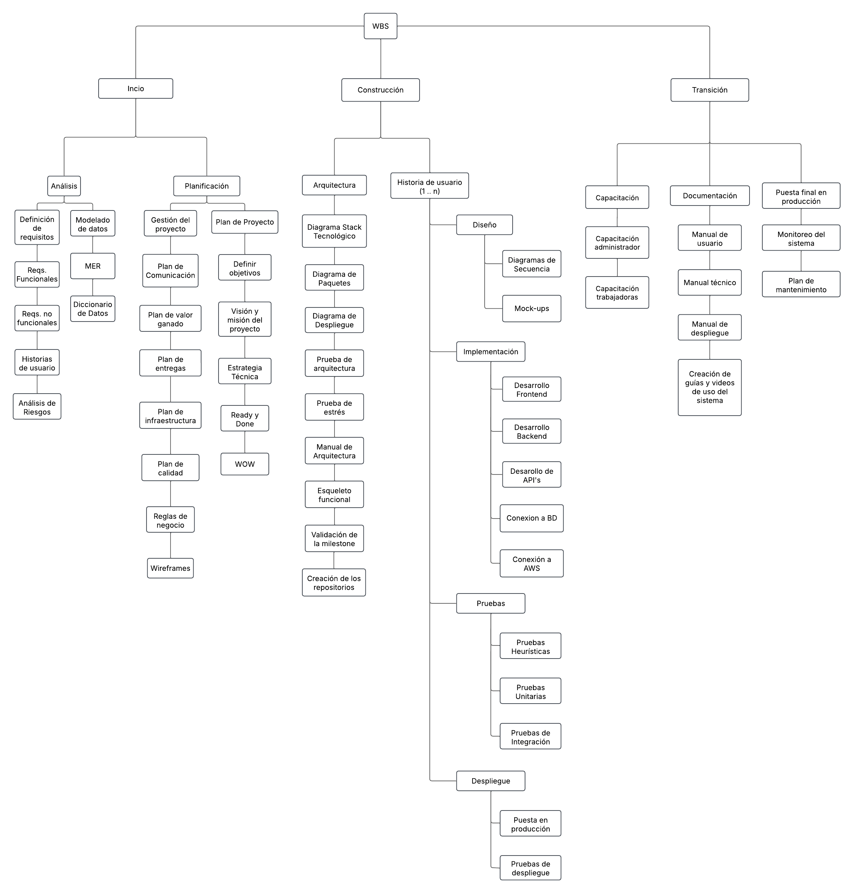

# Work Breakdown Structure

| **Versión** | **Descripción**                               | **Fecha** | **Colaborador**                 |
| ------------------- | --------------------------------------------- | --------- | ------------------------------- |
| **1.0**             | Creación del WBS.   | 9/03/2025  | Armando Méndez Castro, Emiliano Valdivia Lara, Miguel Angel Uribe Esquivel |
| **2.0**             | Actualización con más tareas en diferentes etapas del ciclo de vida de historias de usuario.   | 22/04/2025  | Emiliano Valdivia Lara |