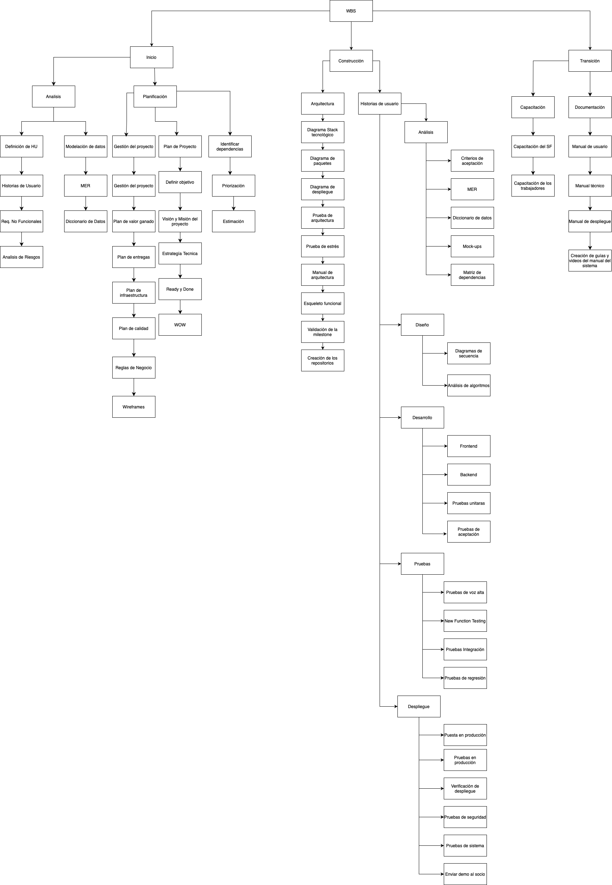

# Work Breakdown Structure

# Historial de cambios

| **Versión** | **Descripción**                               | **Fecha** | **Colaborador**                 |
| ------------------- | --------------------------------------------- | --------- | ------------------------------- |
| **1.0**             | Creación del WBS.   | 9/03/2025  | Armando Méndez Castro, Emiliano Valdivia Lara, Miguel Angel Uribe Esquivel |
| **2.0**             | Actualización con más tareas en diferentes etapas del ciclo de vida de historias de usuario.   | 28/04/2025  | Emiliano Valdivia Lara |
| **3.0**             | Actualización de las tareas del WBS   | 22/05/2025  | Ethan Luna Cadó y Juan Eduardo Rosas Ceron|
| **3.1**             | Actualización de las tareas del análisis y desarrollo  | 02/06/2025  | Sofía Osorio|