# Diagrama MER

**Última actualización:** 10 de marzo de 2025

**Nombre de la Empresa:** Altertex US

[Requisitos de Información](/docs/proyectos/textiles/documentacion/requisitos/#requisitos-de-información)

```mermaid

erDiagram
    %% %% Entidades principales de usuario
    %% USUARIO {
    %%     NumberInt userId
    %%     String fullName
    %%     String emailAddress
    %%     String password
    %%     String phoneNumber
    %%     String address
    %%     Date dateOfBirth
    %%     String gender
    %%     Boolean status
    %% }
    %% CLIENTE {
    %%     NumberInt clientId
    %%     String imageURL
    %%     String commercialName
    %%     String fiscalName
    %% }
    %% EMPLEADO {
    %%     NumberInt employeeId
    %%     NumberInt userId
    %%     String emergencyNumber
    %%     String workArea
    %%     String position
    %%     NumberDecimal pointAmount
    %%     Date seniority
    %% }
    %% GRUPO_EMPLEADO {
    %%     NumberInt groupId
    %%     String nombre
    %%     String descripcion
    %% }
    %% ROL {
    %%     NumberInt roleId
    %%     String nombre
    %%     String descripcion
    %% }
    %% PERMISO {
    %%     NumberInt permissionId
    %%     String nombre
    %%     String descripcion
    %% }
    %% USUARIO_CLIENTE {
    %%     NumberInt userId
    %%     NumberInt clientId
    %% }

    %% %% Entidades de productos y categorización
    %% PRODUCTO {
    %%     NumberInt productId
    %%     NumberInt clientId
    %%     NumberInt providerId
    %%     String commonName
    %%     String commercialName
    %%     String description
    %%     String brand
    %%     String model
    %%     String productType
    %%     NumberInt pointPrice
    %%     NumberDecimal clientPrice
    %%     NumberDecimal salePrice
    %%     NumberDecimal cost
    %%     NumberDecimal taxes
    %%     NumberDecimal discount
    %%     Boolean status
    %%     Boolean shipping
    %% }
    %% CATEGORIA {
    %%     NumberInt categoryId
    %%     String categoryName
    %%     String description
    %% }
    %% DATOS_ENVIO {
    %%     NumberInt shippingDataId
    %%     NumberInt productId
    %%     NumberDecimal weight
    %%     NumberDecimal length
    %%     NumberDecimal width
    %%     NumberDecimal height
    %%     NumberDecimal volume
    %%     String packagingType
    %% }
    %% VARIANTE {
    %%     NumberInt variantId
    %%     NumberInt productId
    %%     String variantName
    %%     String description
    %% }
    %% OPCION {
    %%     NumberInt optionId
    %%     NumberInt variantId
    %%     NumberInt quantity
    %%     String optionValue
    %%     String automaticSKU
    %%     String commercialSKU
    %%     NumberDecimal additionalCost
    %%     NumberDecimal discount
    %%     Boolean status
    %% }
    %% IMAGEN_OPCION {
    %%     NumberInt imageId
    %%     NumberInt optionId
    %% }
    %% IMAGEN {
    %%     NumberInt imageId
    %%     NumberInt productId
    %%     String imageURL
    %%     String imageType
    %%     String altText
    %% }
    %% PROVEEDOR {
    %%     NumberInt providerId
    %%     String name
    %%     String companyName
    %%     String contactPhone
    %%     String contactEmail
    %%     String address
    %%     String postalCode
    %%     String country
    %%     Boolean status
    %% }
    %% SET_PRODUCTO {
    %%     NumberInt setProductId
    %%     String nombre
    %%     String descripcion
    %% }
    %% PRODUCTO_SET_PRODUCTO {
    %%     NumberInt productId
    %%     NumberInt setProductId
    %% }
    %% PRODUCTO_SET_GRUPO {
    %%     NumberInt productSetGroupId
    %%     NumberInt setProductId
    %%     NumberInt groupId
    %%     String name
    %%     String displayName
    %%     String description
    %%     Boolean isActive
    %% }
    %% QUOTA_SET {
    %%     NumberInt quotaSetId
    %%     String name
    %%     String displayName
    %%     NumberInt renewalPeriod
    %%     Boolean renewalEnabled
    %% }
    %% QUOTA_SET_GROUP {
    %%     NumberInt quotaSetGroupId
    %%     String name
    %%     String displayName
    %%     String startRule
    %%     Boolean rollOver
    %% }
    %% QUOTA_SET_GROUP_EMPLEADO {
    %%     NumberInt quotaSetGroupId
    %%     NumberInt employeeId
    %% }
    %% QUOTA_SET_GROUP_QUOTA_SET {
    %%     NumberInt quotaSetGroupId
    %%     NumberInt quotaSetId
    %% }
    %% QUOTA_SET_PRODUCTO {
    %%     NumberInt quotaSetId
    %%     NumberInt productId
    %%     NumberInt limit
    %% }

    %% %% Entidades de pedidos y solicitudes
    %% PEDIDO {
    %%     NumberInt orderId
    %%     NumberInt shippingId
    %%     NumberInt paymentId
    %%     Date orderDate
    %%     String status
    %%     NumberDecimal totalPrice
    %% }
    %% CARRITO {
    %%     NumberInt cartId
    %%     NumberInt userId
    %%     Boolean status
    %% }
    %% CARRITO_OPCION {
    %%     NumberInt cartOptionId
    %%     NumberInt cartId
    %%     NumberInt optionId
    %%     NumberInt quantity
    %% }
    %% ENVIO {
    %%     NumberInt shippingId
    %%     NumberInt orderId
    %%     String address
    %%     String city
    %%     String state
    %%     String postalCode
    %%     String country
    %%     NumberDecimal shippingCost
    %%     String status
    %% }
    %% PAGO {
    %%     NumberInt paymentId
    %%     NumberInt orderId
    %%     String status
    %%     NumberDecimal amount
    %% }
    %% TIPO_PAGO {
    %%     NumberInt paymentMethodId
    %%     NumberInt clientId
    %%     String method
    %% }
    %% TIPO_PAGO_EMPLEADO {
    %%     NumberInt paymentId
    %%     NumberInt employeeId
    %% }

    %% %% Tablas intermedias para relaciones muchos a muchos
    %% USUARIO_ROL {
    %%     NumberInt userId
    %%     NumberInt roleId
    %% }
    %% ROL_PERMISO {
    %%     NumberInt roleId
    %%     NumberInt permissionId
    %% }
    %% EMPLEADO_GRUPO {
    %%     NumberInt employeeId
    %%     NumberInt groupId
    %% }
    %% PEDIDO_OPCION {
    %%     NumberInt orderId
    %%     NumberInt optionId
    %%     NumberInt quantity
    %%     NumberDecimal unitPrice
    %% }

    %% PUNTO {
    %%     NumberInt pointId
    %%     NumberInt amount
    %%     String description
    %% }

    %% EMPLEADO_PUNTO {
    %%     NumberInt employeePointId
    %%     NumberInt employeeId
    %%     NumberInt pointId
    %%     Date assignedDate
    %% }

    %% EVENTO {
    %%     NumberInt eventId
    %%     String name
    %%     String description
    %%     NumberDecimal points
    %%     String periodicity
    %%     Boolean rollOver
    %% }

    %% PUNTO_EVENTO {
    %%     NumberInt pointEventId
    %%     NumberInt pointId
    %%     NumberInt eventId
    %% }

    USUARIO ||--o{ EMPLEADO : "es un"
    USUARIO ||--o{ USUARIO_ROL: tiene
    USUARIO ||--|{ USUARIO_CLIENTE: "administra"
    USUARIO_ROL }|--|| ROL: asigna
    ROL ||--o{ ROL_PERMISO: asocia
    ROL_PERMISO }|--|| PERMISO: requiere

    EMPLEADO ||--o{ PEDIDO : "realiza"
    EMPLEADO ||--o{ CARRITO : "posee"

    CLIENTE ||--o{ EMPLEADO : "emplea"
    CLIENTE ||--o{ TIPO_PAGO : "define"
    CLIENTE ||--o{ PRODUCTO : "ofrece"
    CLIENTE ||--o{ PEDIDO : "consulta"
    CLIENTE ||--o{ GRUPO_EMPLEADO : "organiza"
    CLIENTE ||--o{ QUOTA_SET_PRODUCTO : "asigna"
    CLIENTE ||--o{ QUOTA_SET : "establece"
    CLIENTE ||--o{ QUOTA_SET_GROUP : "configura"
    CLIENTE ||--o{ EVENTO : "organiza"
    CLIENTE ||--o{ SET_PRODUCTO : "administra"
    CLIENTE ||--o{ PRODUCTO_SET_GRUPO : "crea"
    CLIENTE ||--o{ CATEGORIA : "administra"
    CLIENTE ||--|{ USUARIO_CLIENTE: "pertenece"

    EMPLEADO ||--o{ EMPLEADO_GRUPO : "pertenece a"
    EMPLEADO }|--|{ TIPO_PAGO_EMPLEADO : "realiza pago con"

    TIPO_PAGO_EMPLEADO }|--|| TIPO_PAGO : "usa"
    EMPLEADO_GRUPO }|--|| GRUPO_EMPLEADO : "se agrupa en"

    PRODUCTO ||--o{ VARIANTE : "tiene"
    PRODUCTO ||--|{ DATOS_ENVIO : "requiere"
    VARIANTE ||--o{ OPCION : "define"

    CATEGORIA ||--|{ PRODUCTO : "clasifica"

    PROVEEDOR ||--o{ PRODUCTO : "suministra"

    OPCION ||--o{ IMAGEN_OPCION : "incluye"
    IMAGEN_OPCION }o--|| IMAGEN : "muestra"
    PRODUCTO ||--o{ IMAGEN : "tiene"
    PRODUCTO ||--|{ PRODUCTO_SET_PRODUCTO : "pertenece a"
    PRODUCTO_SET_PRODUCTO }|--|| SET_PRODUCTO : "forma parte de"
    SET_PRODUCTO ||--|{ PRODUCTO_SET_GRUPO : "agrupa en"
    GRUPO_EMPLEADO ||--|{ PRODUCTO_SET_GRUPO : "se asigna a"

    PEDIDO ||--|| ENVIO : "incluye"
    PEDIDO ||--|| PAGO : "procesa"
    PEDIDO ||--|{ TIPO_PAGO : "tiene"
    PEDIDO ||--|{ PEDIDO_OPCION : "contiene"
    PEDIDO_OPCION }|--|| OPCION : "especifica"

    CARRITO ||--|{ CARRITO_OPCION : "almacena"
    CARRITO_OPCION }|--|| OPCION : "contiene"

    EMPLEADO ||--|{ QUOTA_SET_GROUP_EMPLEADO: "asigna"
    QUOTA_SET_GROUP_EMPLEADO }|--|| QUOTA_SET_GROUP: "pertenece"
    QUOTA_SET_GROUP ||--|{ QUOTA_SET_GROUP_QUOTA_SET: "agrupa"
    QUOTA_SET_GROUP_QUOTA_SET }|--|| QUOTA_SET: "asocia"
    QUOTA_SET ||--|{ QUOTA_SET_PRODUCTO: "aplica"
    QUOTA_SET_PRODUCTO }|--|| PRODUCTO: "pertenece"

    EMPLEADO ||--|{ EMPLEADO_PUNTO: "recibe"
    EMPLEADO_PUNTO }|--|| PUNTO: "asigna"
    PUNTO ||--|{ PUNTO_EVENTO: "se genera por"
    PUNTO_EVENTO }|--|| EVENTO: "define"
```

