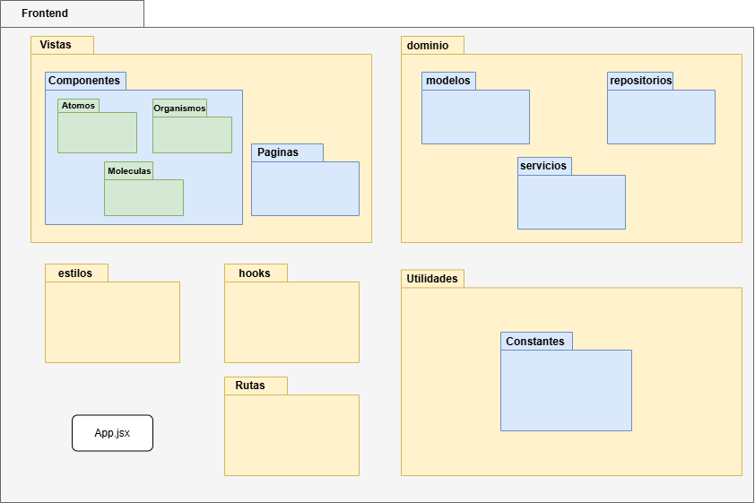

**Última actualización por:** Hiram Mendoza , 24 de abril de 2025

---

# Estrategia tecnica

## Objetivo

Establecer lineamientos claros para el desarrollo, asegurando calidad y consistencia.

---

## Repositorios

Utilizaremos 2 repositorios separados, tanto para el backend como para el frontend de la aplicación, de esta manera nuestro sistema puede ser modular.

## Estrategia de Ramas


Utilizaremos 3 ramas principales:

- **Main**: Contiene el código que será desplegado en producción y sobre el que se maneja el versionamiento de la aplicación.
  - El código no debe tener problemas de integración o ejecución.
  - El código debe haber sido probado.
- **Staging**: Rama pre-productiva usada para preparar el release de las versiones y realizar pruebas de aceptación.
- **Develop**: Rama de desarrollo donde se mantiene la integración de todos los desarrollos del equipo.
- **Feature**: Ramas temporales destinadas para el código de uno o varios developers que trabajan en una característica.

## Estrategia de commits

Se utilizaran los llamados **"conventional commits"**.

Se puede encontrar la informacion de como crear los conventionals commits en este [link](https://www.conventionalcommits.org/en/v1.0.0/)

---

## Gestión de Requerimientos

### Objetivo

Alinear las decisiones técnicas con los objetivos de negocio.

### Priorización basada en valor y riesgos

La priorización de requerimientos se puede encontrar aquí:

[_Priorizacion de requisitos_](https://docs.google.com/spreadsheets/d/1ToxcYLMjoZ0dPXlb2eTesLf_YXg8q86tE7bredXapYk/edit?gid=1686427669#gid=1686427669)

---

## Gestión de Calidad y Pruebas

### Objetivo

Garantizar un software confiable a través de buenas prácticas de aseguramiento de calidad.

---

### Estrategia de Pruebas

Seguiremos una estrategia de pruebas detallada en el documento llamado [*STP*](Agregar link al stp de textiles)

---

## Documentación del código

### Objetivo

Documentar claramente las funcionalidades y código del sistema para lectura en caso de confusiones.

- Se agregaran espacios alrededor de operadores y comas.
- Se agregan punto y coma al final de definiciones simples.
- Para documentar el código utilizaremos el estándar de documentación JS docs.
- Para ver mas informacion de el estandar de codificacion ver el documento: [_Estandar de codificación_](/docs/standards/general).
- Para la documentacion de los endpoints, usaremos SwaggerUI. Se puede encontrar un manual de su uso [*aqui*](Agregar el link al manual de swagger).

---

## Patrones de diseño y diagrama de paquetes

### Backend


Este diagrama de paquetes representa la organización de un backend. Se divide en varias secciones principales:

### 1. Módulos

Cada módulo contiene:

- **Data**: Manejo de los datos estructurados en:
  - `Repositorios` Gestión de la base de datos.
  - `Modelos` Creacion de los modelos de datos.
- **Controladores**: Manejo de solicitudes HTTP, estructurado en:
  - `IndexControladores`: Archivo que contiene todos los controladores del modulo
  - `Controladores`: Implementación de la lógica de negocio de una sola funcionalidad.
- **Rutas**: Manejo de las rutas estructuradas en:
  - `IndiceRutas`: Punto de entrada de las rutas de todo el modulo.
  - `Rutas`: Definición de rutas de cada funcionalidad.

### 2. Util

- **Middlewares**: Funciones intermedias para procesar solicitudes.
- **Servicios**: Lógica reutilizable independiente de los controladores.

### 3. Views

Sección opcional para manejar vistas en caso de ser necesario.

### 4. Pruebas Unitarias

Cada módulo puede incluir pruebas unitarias para garantizar su correcto funcionamiento.

### 5. Archivos Principales

- app.js: Punto de entrada del servidor.
- node_modules: Dependencias del proyecto.

### Frontend



Este diagrama de paquetes representa la organización de un frontend. Se divide en varias secciones principales:

### 1. estilos

Contiene los archivos de estilos globales del proyecto.

### 2. hooks

Incluye hooks personalizados de React que encapsulan lógica para ser utilizada en distintos componentes de la aplicación.

### 3. Rutas

Contiene la configuración de rutas del proyecto, para definir la navegación entre páginas y componentes.

### 4. Utilidades

Incluye utilidades generales que no pertenecen a una parte específica del dominio o la interfaz, como validaciones, constantes, etc.

- **Constantes**: Conjunto de componentes organizados por nivel de complejidad:

### 5. Vistas

La carpeta de vistas contiene:

- **Componentes**: Conjunto de componentes organizados por nivel de complejidad:

  - `Atomos` : Componentes más pequeños e indivisibles como botones, iconos, etiquetas.
  - `Moleculas` : Combinación de átomos que forman unidades funcionales simples, como formularios, inputs con etiqueta, etc.
  - `Organismos` : Combinaciones de moléculas y/o átomos que conforman secciones completas reutilizables, como encabezados o tarjetas de usuario.

- **Paginas**: Vistas completas que representan pantallas enteras del sistema, construidas a partir de los organismos y otros componentes.

### 6. dominio

El dominio contiene:

- **modelos**: Definiciones de los modelos de datos utilizados en el frontend, como clases o interfaces que representan la estructura de la información.

- **repositorios**: Encapsulan la lógica de acceso a datos, conectándose con APIs u otras fuentes para obtener o enviar información.

- **servicios**: Contienen funciones que implementan la lógica de negocio relacionada con el dominio, trabajando con los repositorios y modelos para realizar operaciones más complejas como la obtención de permisos.

---

## Plantilla Pull Requests equipo textiles

```

## Plantilla PR FrontEnd

Última actualización 26/03/25

---

# Descripción

---

## Tipo de cambio

- [ ] Corrección de error (cambio no disruptivo que soluciona un problema)
- [ ] Nueva función (cambio no disruptivo que agrega funcionalidad)
- [ ] Cambio disruptivo (corrección o función que afecta la compatibilidad existente)
- [ ] Este cambio requiere una actualización en la documentación
- [ ] Camio mínimo (Visual o de bajo impacto, sin afectcar lógica )

---

# ¿Qué archivo fue el que modifiqué?

Ejemplo:

- Componente1.jsx
- Estilos.css

---

# ¿Cómo se ha probado?

Describe resumidamente cómo lo probaste y funciona. Ejemplo:

- "Se probó manualmente en Chrome y Safari. Se validó que el botón 'Guardar' guarda correctamente la información y se muestra una alerta de éxito."
  _En caso de cambio mínimo:_
- "El cambio fue visualmente unicamente (color del boton). Se validó en los navegadores principales. No se requirieron pruebas funcionales."

---

### Cambios menores

- [ ] Este PR realiza un cambio mínimo que no afecta la lógica del sistema
- [ ] Se validó visualmente el componente afectado
- [ ] No se realizaron pruebas unitarias porque no aplica

---

Versión: V1
Rodrigo Antonio Benítez De La Portilla
Arutro Sanchez Rodriguez

```

```
## Plantilla PR BackEnd
Última actualización 26/03/25

---

### Autores

| Nombre                         | Rol   |
| ------------------------------ | ----- |
| Rodrigo Antonio Benítez De La Portilla          | Autor |
| Arturo Sánchez Rodríguez | Autor |

---

# Descripción

Incluye un resumen del cambio y el problema que se ha solucionado. También proporciona el contexto relevante y la motivación para este cambio. Lista cualquier dependencia requerida para esta modificación.

---

## Tipo de cambio

- [ ] Corrección de error (fix sin romper funcionalidades existentes)
- [ ] Nueva funcionalidad (feature sin romper funcionalidades existentes)
- [ ] Cambio disruptivo (rompe compatibilidad o modifica comportamiento actual )
- [ ] Actualización de documentación requerida
- [ ] Cambio mínimo (cambio visual o estructural que no afecta la lógica del sistema)

---

# ¿Qué archivo fue el que modifique?
Ejemplo:
- UserController.js
- api.js

---

# ¿Cómo se ha probado?
Describe berevemente cómo se probó esta funcionalidad. Ejemplo:
- "Se probaron los endpoints '/api/login' y '/api/profile' con Postman. Las respuestas fueron correctas y sin errores en consola."
- "Se realizaron pruebas visuales/manuales. No se detectaron impactos en lógica ni funcionalidad."

---

# Notas para cambios menores
- [ ] Este PR realiza un cambio mínimo que no afecta la lógica del sistema.
- [ ] Se validó el comportamiento básico y no se detectaron efectos colaterales.
- [ ] No se realizaron pruebas automatizadas porque no aplica

---

# Lista de verificación del autor

- [ ] El código sigue las normas de estilo del proyecto
- [ ] He realizado una autoevaluación del código
- [ ] El código estña comentado en las secciones complejas o no obvias
- [ ] Documentación actualizada aplica
- [ ] El código no genera nuevas advertencias o errores
- [ ] Se añadieron pruebas relevantes

---

# Lista de Verificación de Pruebas
- [ ] Las pruebas unitarias nuevas y existentes pasan correctamente con mis cambios
- [ ] Las pruebas de estrés nuevas y existentes pasan correctamente con mis cambios
- [ ] Las pruebas de volumen nuevas y existentes pasan correctamente con mis cambios
- [ ] Las pruebas de seguridad nuevas y existentes pasan correctamente con mis cambios
- [ ] Las pruebas de conectividad nuevas y existentes pasan correctamente con mis cambios
- [ ] Las pruebas de integración nuevas y existentes pasan correctamente con mis cambios
- [ ] Las pruebas heurísticas nuevas y existentes pasan correctamente con mis cambios
- [ ] Los cambios dependientes han sido combinados y publicados en los módulos descendentes

---

## Checklist del evaluador:

- [ ] La descripción del Pull Request es clara y específica
- [ ] No se introducen errores ni inconsistencias
- [ ] Ortografía y gramática correctas en documentación
- [ ] El código es entendible y cumple con los estándares
- [ ] Notifiqué al autor del PR si encontré errores, dudas o sugerencias
- [ ] (Si se aprueba) Procedo a eliminar la rama correspondiente

---

# Versión: V1
```

## CI / CD

### CD

Para el despliegue continuo del backend utilizaremos un script de [_github actions_](../../../plantillas/plantilla-github-actions.md) paa hacer pull automaticamente y desplegar las ramas de produccion (main) y pruebas (staging), por lo que no tendremos que manejar estas acciones manualmente.

# Historial de cambios

| **Tipo de Versión** | **Descripción**                            | **Fecha**  | **Colaborador**                                |
| ------------------- | ------------------------------------------ | ---------- | ---------------------------------------------- |
| **1.0**             | Creacion de la estrategia tecnica textiles | 6/03/2025  | Diego Alfaro, Daniel Contreras, Emiliano Gomez |
| **1.1**             | Documentación de la estructura de frontend | 01/05/2025 | Angélica Ríos                                  |
